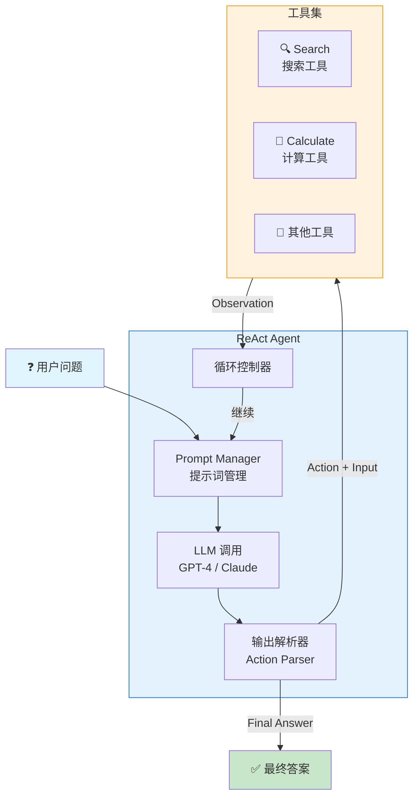
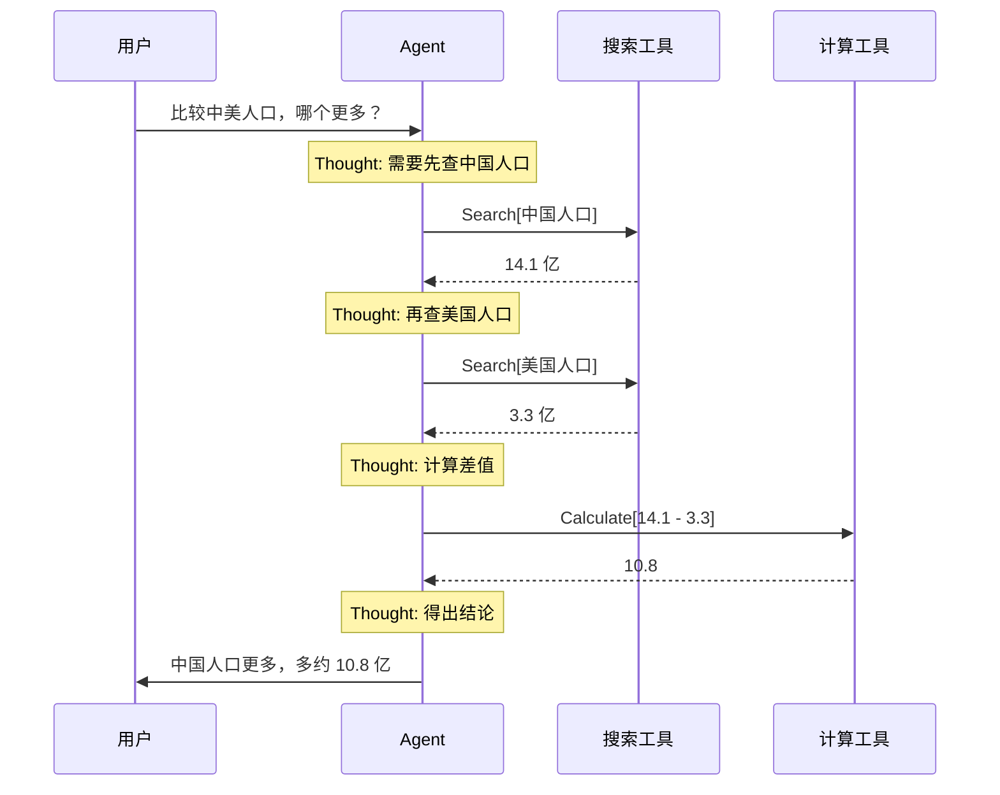

> 如果你还不了解 ReAct 的基本概念，建议先阅读 [ReAct 模式入门：让 AI 学会思考与行动](/posts/react-agent-introduction/)。

理解了 ReAct 的原理后，是时候动手实现了。本文将带你从零构建一个能够推理和行动的 AI Agent，包括两种实现方式：纯 Prompt 实现和使用 LangChain 框架。

## 实现方式对比

| 方式 | 优点 | 缺点 | 适用场景 |
|------|------|------|----------|
| 纯 Prompt | 完全可控、无依赖、便于理解原理 | 需要手写解析逻辑、工具管理繁琐 | 学习原理、轻量级应用 |
| LangChain | 开箱即用、工具生态丰富、内置错误处理 | 学习成本、抽象层带来调试难度 | 生产环境、快速开发 |

建议先理解纯 Prompt 实现，再过渡到框架。

## 方式一：纯 Prompt 实现

### 1. 设计 ReAct Prompt 模板

ReAct 的核心是让模型按照 Thought → Action → Observation 的格式输出。下面展示两种 Prompt 设计方式：

- **Zero-shot**：只描述格式，依赖模型自身能力理解如何推理
- **Few-shot**：提供具体示例，效果更稳定，推荐用于生产环境

#### Zero-shot 版本

<details markdown="1">
<summary><b>点击展开代码：Zero-shot Prompt 模板</b></summary>

```python
REACT_PROMPT = """Answer the following questions as best you can. You have access to the following tools:

{tools}

Use the following format:

Question: the input question you must answer
Thought: you should always think about what to do
Action: the action to take, should be one of [{tool_names}]
Action Input: the input to the action
Observation: the result of the action
... (this Thought/Action/Action Input/Observation can repeat N times)
Thought: I now know the final answer
Final Answer: the final answer to the original input question

Begin!

Question: {question}
Thought:"""
```

</details>

Zero-shot 版本简洁，适合 GPT-4 等能力较强的模型。对于简单任务效果足够。

<details markdown="1">
<summary><b>Few-shot 版本（点击展开，推荐用于生产环境）</b></summary>

```python
REACT_PROMPT = """Answer the following questions as best you can. You have access to the following tools:

{tools}

Use the following format:

Question: the input question you must answer
Thought: you should always think about what to do
Action: the action to take, should be one of [{tool_names}]
Action Input: the input to the action
Observation: the result of the action
... (this Thought/Action/Action Input/Observation can repeat N times)
Thought: I now know the final answer
Final Answer: the final answer to the original input question

Here is an example:

Question: What is the capital of the country where the Eiffel Tower is located?
Thought: I need to find where the Eiffel Tower is located first.
Action: Search
Action Input: Eiffel Tower location
Observation: The Eiffel Tower is a wrought-iron lattice tower on the Champ de Mars in Paris, France.
Thought: The Eiffel Tower is in France. Now I need to find the capital of France.
Action: Search
Action Input: capital of France
Observation: Paris is the capital and largest city of France.
Thought: I now know the final answer.
Final Answer: Paris

Now answer this question:

Question: {question}
Thought:"""
```

Few-shot 版本通过示例教会模型"如何思考"，输出更稳定可控，推荐用于生产环境。

</details>

### 2. 定义工具

工具需要有统一的接口：名称、描述和执行函数。

<details markdown="1">
<summary><b>点击展开代码：工具定义</b></summary>

```python
import requests
import re

class Tool:
    def __init__(self, name: str, description: str, func):
        self.name = name
        self.description = description
        self.func = func

    def run(self, input_text: str) -> str:
        return self.func(input_text)

# 定义一个简单的搜索工具（模拟）
def search(query: str) -> str:
    """模拟搜索功能，实际应用中可接入搜索 API"""
    # 这里用 Wikipedia API 作为示例
    url = f"https://zh.wikipedia.org/api/rest_v1/page/summary/{query}"
    try:
        response = requests.get(url, timeout=5)
        if response.status_code == 200:
            data = response.json()
            return data.get("extract", "未找到相关信息")
        return "搜索无结果"
    except Exception as e:
        return f"搜索出错: {e}"

# 定义计算工具
def calculate(expression: str) -> str:
    """执行数学计算"""
    try:
        # 注意：eval 在生产环境有安全风险，这里仅作演示
        result = eval(expression)
        return str(result)
    except Exception as e:
        return f"计算错误: {e}"

# 创建工具列表
tools = [
    Tool("Search", "搜索维基百科获取信息。输入应为搜索关键词。", search),
    Tool("Calculate", "执行数学计算。输入应为数学表达式。", calculate),
]
```

</details>

### 3. 解析模型输出

模型会按照我们指定的格式输出，需要解析出 Action 和 Action Input：

<details markdown="1">
<summary><b>点击展开代码：输出解析器</b></summary>

```python
def parse_action(text: str) -> tuple[str, str] | None:
    """从模型输出中解析 Action 和 Action Input"""
    # 匹配 Action: xxx
    action_match = re.search(r"Action:\s*(.+?)(?:\n|$)", text)
    # 匹配 Action Input: xxx
    action_input_match = re.search(r"Action Input:\s*(.+?)(?:\n|$)", text)

    if action_match and action_input_match:
        return action_match.group(1).strip(), action_input_match.group(1).strip()
    return None

def parse_final_answer(text: str) -> str | None:
    """解析最终答案"""
    match = re.search(r"Final Answer:\s*(.+?)(?:\n|$)", text, re.DOTALL)
    if match:
        return match.group(1).strip()
    return None
```

</details>

### 4. 实现 ReAct 循环

将所有组件组合成完整的 Agent：

<details markdown="1">
<summary><b>点击展开代码：ReAct Agent 主循环</b></summary>

```python
from openai import OpenAI

client = OpenAI()  # 需要设置 OPENAI_API_KEY 环境变量

def run_react_agent(question: str, tools: list[Tool], max_iterations: int = 10) -> str:
    """运行 ReAct Agent"""

    # 构建工具描述
    tool_descriptions = "\n".join([
        f"{tool.name}: {tool.description}" for tool in tools
    ])
    tool_names = ", ".join([tool.name for tool in tools])
    tool_map = {tool.name: tool for tool in tools}

    # 初始化 Prompt
    prompt = REACT_PROMPT.format(
        tools=tool_descriptions,
        tool_names=tool_names,
        question=question
    )

    for i in range(max_iterations):
        # 调用 LLM
        response = client.chat.completions.create(
            model="gpt-4o-mini",
            messages=[{"role": "user", "content": prompt}],
            temperature=0,
            stop=["Observation:"]  # 在 Observation 前停止，等待我们填入结果
        )

        output = response.choices[0].message.content
        prompt += output  # 累积上下文

        # 检查是否有最终答案
        final_answer = parse_final_answer(output)
        if final_answer:
            return final_answer

        # 解析并执行 Action
        action_result = parse_action(output)
        if action_result:
            action, action_input = action_result

            if action in tool_map:
                observation = tool_map[action].run(action_input)
            else:
                observation = f"未知工具: {action}"

            # 将观察结果添加到 Prompt
            prompt += f"\nObservation: {observation}\nThought:"
        else:
            # 无法解析，可能是格式问题
            prompt += "\nObservation: 请按照正确格式输出 Action 和 Action Input\nThought:"

    return "达到最大迭代次数，未能得出答案"

# 运行测试
if __name__ == "__main__":
    question = "中国最高的山峰海拔多少米？换算成英尺是多少？"
    answer = run_react_agent(question, tools)
    print(f"问题: {question}")
    print(f"答案: {answer}")
```

</details>

下图展示了我们实现的 ReAct Agent 的组件架构：



## 方式二：使用 LangChain 实现

LangChain 已经封装好了 ReAct Agent，使用起来更加简洁。

### 1. 安装依赖

```bash
pip install langchain langchain-openai
```

### 2. 定义工具

<details markdown="1">
<summary><b>点击展开代码：LangChain 工具定义</b></summary>

```python
from langchain_core.tools import tool
from langchain_openai import ChatOpenAI
from langchain.agents import create_react_agent, AgentExecutor
from langchain import hub

# 使用装饰器定义工具
@tool
def search(query: str) -> str:
    """搜索维基百科获取信息。输入应为搜索关键词。"""
    import requests
    url = f"https://zh.wikipedia.org/api/rest_v1/page/summary/{query}"
    try:
        response = requests.get(url, timeout=5)
        if response.status_code == 200:
            return response.json().get("extract", "未找到相关信息")
        return "搜索无结果"
    except Exception as e:
        return f"搜索出错: {e}"

@tool
def calculate(expression: str) -> str:
    """执行数学计算。输入应为数学表达式，如 '2 + 2' 或 '100 * 3.14'。"""
    try:
        return str(eval(expression))
    except Exception as e:
        return f"计算错误: {e}"

tools = [search, calculate]
```

</details>

### 3. 创建并运行 Agent

<details markdown="1">
<summary><b>点击展开代码：创建并运行 Agent</b></summary>

```python
# 初始化 LLM
llm = ChatOpenAI(model="gpt-4o-mini", temperature=0)

# 从 LangChain Hub 获取 ReAct Prompt 模板
prompt = hub.pull("hwchase17/react")

# 创建 ReAct Agent
agent = create_react_agent(llm, tools, prompt)

# 创建 Agent 执行器
agent_executor = AgentExecutor(
    agent=agent,
    tools=tools,
    verbose=True,  # 打印详细执行过程
    max_iterations=10,
    handle_parsing_errors=True  # 自动处理解析错误
)

# 运行
result = agent_executor.invoke({
    "input": "中国最高的山峰海拔多少米？换算成英尺是多少？"
})
print(result["output"])
```

</details>

设置 `verbose=True` 后，你可以看到完整的 Thought → Action → Observation 过程：

```
> Entering new AgentExecutor chain...
Thought: 我需要先搜索中国最高的山峰是什么，以及它的海拔。
Action: search
Action Input: 珠穆朗玛峰
Observation: 珠穆朗玛峰是世界第一高峰，海拔 8848.86 米...
Thought: 我知道海拔是 8848.86 米，现在需要换算成英尺。1米 = 3.28084 英尺。
Action: calculate
Action Input: 8848.86 * 3.28084
Observation: 29031.69...
Thought: I now know the final answer
Final Answer: 中国最高的山峰是珠穆朗玛峰，海拔 8848.86 米，约合 29031.69 英尺。
```

## 实战案例：构建一个研究助手

让我们构建一个更实用的例子——一个能够搜索信息并进行分析的研究助手。

下图展示了研究助手处理复杂问题的执行流程：



<details markdown="1">
<summary><b>点击展开代码：研究助手完整实现</b></summary>

```python
from langchain_core.tools import tool
from langchain_openai import ChatOpenAI
from langchain.agents import create_react_agent, AgentExecutor
from langchain_core.prompts import PromptTemplate
import requests

# 定义工具集
@tool
def web_search(query: str) -> str:
    """搜索网络获取最新信息。用于查找事实、新闻、数据等。"""
    # 实际项目中可以接入 Google Search API、Bing API 或 SerpAPI
    url = f"https://zh.wikipedia.org/api/rest_v1/page/summary/{query}"
    try:
        response = requests.get(url, timeout=10)
        if response.status_code == 200:
            return response.json().get("extract", "未找到相关信息")[:500]
        return "搜索无结果"
    except Exception as e:
        return f"搜索出错: {e}"

@tool
def calculator(expression: str) -> str:
    """执行数学计算。支持加减乘除、幂运算等。示例：'2**10' 计算 2 的 10 次方。"""
    try:
        # 只允许基本数学运算
        allowed_chars = set("0123456789+-*/.() ")
        if not all(c in allowed_chars for c in expression):
            return "表达式包含不允许的字符"
        return str(eval(expression))
    except Exception as e:
        return f"计算错误: {e}"

@tool
def compare_numbers(input_str: str) -> str:
    """比较两个数字的大小。输入格式：'数字1, 数字2'。"""
    try:
        parts = input_str.split(",")
        a, b = float(parts[0].strip()), float(parts[1].strip())
        if a > b:
            return f"{a} 大于 {b}"
        elif a < b:
            return f"{a} 小于 {b}"
        else:
            return f"{a} 等于 {b}"
    except Exception as e:
        return f"比较错误: {e}"

# 自定义 Prompt（中文优化版）
CUSTOM_REACT_PROMPT = """你是一个专业的研究助手，能够通过搜索和计算来回答问题。

你可以使用以下工具：
{tools}

请严格按照以下格式回答：

Question: 需要回答的问题
Thought: 思考该如何解决这个问题
Action: 要使用的工具名称，必须是 [{tool_names}] 中的一个
Action Input: 传给工具的输入
Observation: 工具返回的结果
... (Thought/Action/Action Input/Observation 可以重复多次)
Thought: 我现在知道最终答案了
Final Answer: 对原始问题的最终回答

注意：
- 每次只执行一个 Action
- 如果搜索结果不够，可以尝试不同的关键词
- 最终答案要完整、准确

开始！

Question: {input}
Thought: {agent_scratchpad}"""

prompt = PromptTemplate.from_template(CUSTOM_REACT_PROMPT)

# 创建 Agent
llm = ChatOpenAI(model="gpt-4o-mini", temperature=0)
tools = [web_search, calculator, compare_numbers]
agent = create_react_agent(llm, tools, prompt)

agent_executor = AgentExecutor(
    agent=agent,
    tools=tools,
    verbose=True,
    max_iterations=15,
    handle_parsing_errors="请检查输出格式，确保包含 Action 和 Action Input。"
)

# 测试复杂问题
questions = [
    "比较一下中国和美国的人口，哪个更多？多多少？",
    "如果我有 1000 美元，年利率 5%，复利计算 10 年后有多少钱？",
]

for q in questions:
    print(f"\n{'='*60}")
    print(f"问题: {q}")
    print('='*60)
    result = agent_executor.invoke({"input": q})
    print(f"\n最终答案: {result['output']}")
```

</details>

## 常见问题与调试技巧

### 问题 1：Agent 陷入循环

**症状**：Agent 不断重复相同的 Action，无法得出结论。

**解决方法**：
- 设置 `max_iterations` 限制最大迭代次数
- 在 Prompt 中明确要求"如果多次搜索无果，给出基于已有信息的最佳答案"
- 检查工具是否返回了有效信息

<details markdown="1">
<summary><b>点击展开代码：AgentExecutor 配置</b></summary>

```python
agent_executor = AgentExecutor(
    agent=agent,
    tools=tools,
    max_iterations=10,  # 限制迭代次数
    early_stopping_method="generate"  # 达到限制时生成最终答案
)
```

</details>

### 问题 2：工具选择错误

**症状**：Agent 使用了错误的工具，或传入了错误的参数格式。

**解决方法**：
- 优化工具的 description，更清楚地说明用途和输入格式
- 在 description 中给出具体示例
- 减少工具数量，避免选择困难

<details markdown="1">
<summary><b>点击展开代码：工具描述优化示例</b></summary>

```python
@tool
def calculator(expression: str) -> str:
    """执行数学计算。

    输入：数学表达式字符串
    示例输入：'2 + 2'、'100 * 3.14'、'2 ** 10'

    注意：只支持基本运算，不支持变量。
    """
    ...
```

</details>

### 问题 3：上下文长度超限

**症状**：对话过长后报错 `context_length_exceeded`。

**解决方法**：
- 使用支持长上下文的模型（如 GPT-4-turbo）
- 限制每个 Observation 的长度
- 在累积一定轮次后进行总结压缩

<details markdown="1">
<summary><b>点击展开代码：截断观察结果</b></summary>

```python
def truncate_observation(obs: str, max_length: int = 500) -> str:
    """截断过长的观察结果"""
    if len(obs) > max_length:
        return obs[:max_length] + "...(内容已截断)"
    return obs
```

</details>

### 问题 4：解析失败

**症状**：模型输出格式不符合预期，导致解析失败。

**解决方法**：
- 使用 `handle_parsing_errors=True` 让 Agent 自动重试
- 提供更清晰的格式说明和 few-shot 示例
- 降低 temperature 增加输出稳定性

## 总结

本文介绍了两种实现 ReAct Agent 的方式：

1. **纯 Prompt 实现**：适合学习原理，完全可控
2. **LangChain 实现**：适合快速开发，工具生态丰富

关键要点：
- Prompt 设计是核心，格式要清晰明确
- 工具定义要准确，description 影响模型选择
- 注意处理边界情况（循环、解析失败、上下文超限）

下一步，你可以：
- 接入更强大的搜索 API（如 SerpAPI、Tavily）
- 添加更多工具（代码执行、文件读写、数据库查询）
- 探索 ReAct 的变体模式，处理更复杂的任务

---

> 想了解 ReAct 的局限性以及更强大的变体模式？
> 请阅读 [ReAct 进阶：变体模式与前沿发展](/posts/react-agent-variants/)
