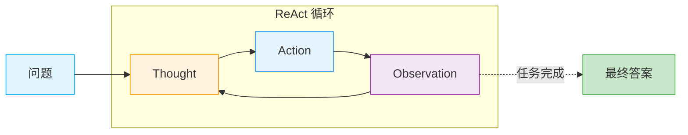

问它今天的天气，它说"我无法获取实时信息"；让它帮你查个网页，它说"我无法访问外部链接"。用过早期 ChatGPT 的你，一定对这些回答不陌生。这正是大语言模型（LLM）的原生局限：**它的核心能力是文本生成，而非与外部世界交互**。

ReAct 的提出，正是为了打破这一局限。

## 背景：ReAct 要解决什么问题？

在 ReAct 论文发表之前（2022 年），让 LLM 完成复杂任务主要有两种思路，但都存在明显缺陷。

### 思路一：Chain-of-Thought（只推理）

[Chain-of-Thought（CoT）](/posts/chain-of-thought-introduction/)通过提示模型"一步步思考"，显著提升了推理能力。但它有一个致命问题：**推理过程完全在模型内部进行，无法与外界交互**。

如果推理的前提本身就是错的呢？CoT 只能基于已有知识继续"脑补"，无法查证事实。

### 思路二：Act-only（只行动）

另一种思路是让模型直接调用工具——搜索、计算、执行代码。这就是 [Act-only 模式](/posts/act-only-function-calling/)。但这种方式的问题是：**缺乏规划和反思，行动盲目**。

模型不知道为什么要调用某个工具，也不会根据结果调整策略，只是机械地执行。

### ReAct：推理与行动的结合

2022 年，Yao 等人在论文《ReAct: Synergizing Reasoning and Acting in Language Models》中提出了一个简洁而有效的解决方案：**让推理和行动交替进行**。

- 推理（Reasoning）指导行动方向
- 行动（Acting）获取真实信息
- 两者相互增强，形成闭环

在 HotpotQA、FEVER 等基准测试上，ReAct 显著超越了纯 CoT 和 Act-only 方法，成为后续 Agent 研究的重要基石。

## 什么是 ReAct？

**ReAct** 是 "**Re**asoning + **Act**ing" 的缩写。

核心思想可以用一句话概括：**让 LLM 在思考的同时，也能采取行动；在行动之后，继续思考**。

这两者不是割裂的，而是交替进行、相互增强：
- **推理**帮助模型决定该采取什么行动
- **行动的结果**为下一步推理提供新的信息

## 核心机制：Thought-Action-Observation 循环

ReAct 的工作流程由三个核心组件构成，形成一个循环：

### Thought（思考）

模型对当前情况进行推理分析：
- 当前问题是什么？目标是什么？
- 已有信息够不够？还缺什么？
- 下一步应该做什么？
- 上一步行动的结果说明了什么？

### Action（行动）

基于思考结论，模型执行一个具体动作：
- `Search[query]`：搜索信息
- `Lookup[term]`：查找特定内容
- `Calculate[expression]`：执行计算
- `Finish[answer]`：给出最终答案

### Observation（观察）

执行动作后，环境返回结果。模型将这个新信息纳入下一轮思考。



## 实例演示

来看一个具体例子：

**问题**：苹果公司现任 CEO 的本科学校在哪个城市？

这个问题需要多步推理：先找出 CEO 是谁，再查他的学校，最后确认学校位置。

```text
Thought 1: 我需要先找出苹果公司现任 CEO 是谁。
Action 1: Search[苹果公司 CEO]
Observation 1: 蒂姆·库克（Tim Cook）自 2011 年起担任苹果公司 CEO...

Thought 2: CEO 是蒂姆·库克。现在我需要查找他的本科学校。
Action 2: Search[蒂姆·库克 本科 大学]
Observation 2: 蒂姆·库克于 1982 年获得奥本大学工业工程学士学位...

Thought 3: 本科学校是奥本大学。我需要确认这所大学的位置。
Action 3: Search[奥本大学 位置]
Observation 3: 奥本大学位于美国阿拉巴马州奥本市...

Thought 4: 我已经得到了完整答案。
Action 4: Finish[阿拉巴马州奥本市]
```

注意这个过程的几个特点：
1. **逐步推进**：每次思考只解决一个子问题
2. **动态调整**：根据搜索结果决定下一步
3. **透明可追溯**：整个推理过程清晰可见

## 为什么 ReAct 有效？

| 特性 | Chain-of-Thought | Act-only | ReAct |
|------|------------------|----------|-------|
| 推理过程 | 有 | 无 | 有 |
| 外部工具调用 | 无 | 有 | 有 |
| 可解释性 | 中 | 低 | 高 |
| 动态调整能力 | 低 | 低 | 高 |
| 减少幻觉 | 有限 | 有限 | 显著 |

### 四个核心优势

**1. 推理与行动相互增强**
- 推理指导行动：不盲目调用工具，先分析需要什么
- 行动支撑推理：基于真实信息推理，而非凭空猜测

**2. 可解释性强**

每一步思考都被显式记录，出错时可以追溯到具体环节。

**3. 减少幻觉**

通过与外部环境交互获取真实信息，模型不再需要"编造"答案。

**4. 灵活适应**

模型可以根据中间结果动态调整策略，而非机械执行预设步骤。

## 总结

ReAct 通过将**推理（Reasoning）**和**行动（Acting）**交织在一起，解决了早期 Agent 面临的两难困境：

- CoT 只推理不行动 → 无法验证，易幻觉
- Act-only 只行动不推理 → 缺乏规划，盲目执行

其核心是 **Thought-Action-Observation** 循环，让 AI 能够像人类一样：边思考、边行动、边调整。

这种模式为后续的 Agent 研究奠定了基础，是理解现代 AI Agent 设计的重要起点。

---

> 本文介绍了 ReAct 的基本概念。想要动手实现？
> 请阅读 [ReAct 实战：从零构建一个能推理的 AI Agent](/posts/react-agent-implementation/)
