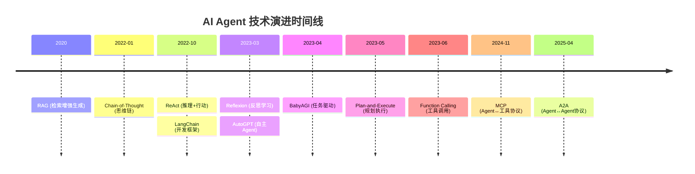
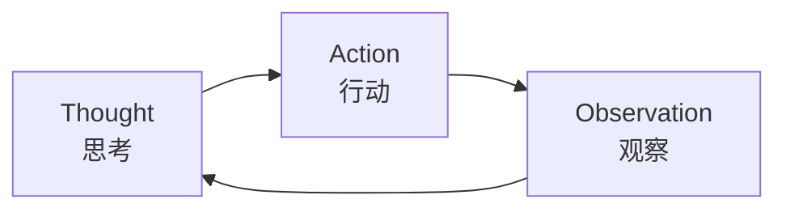
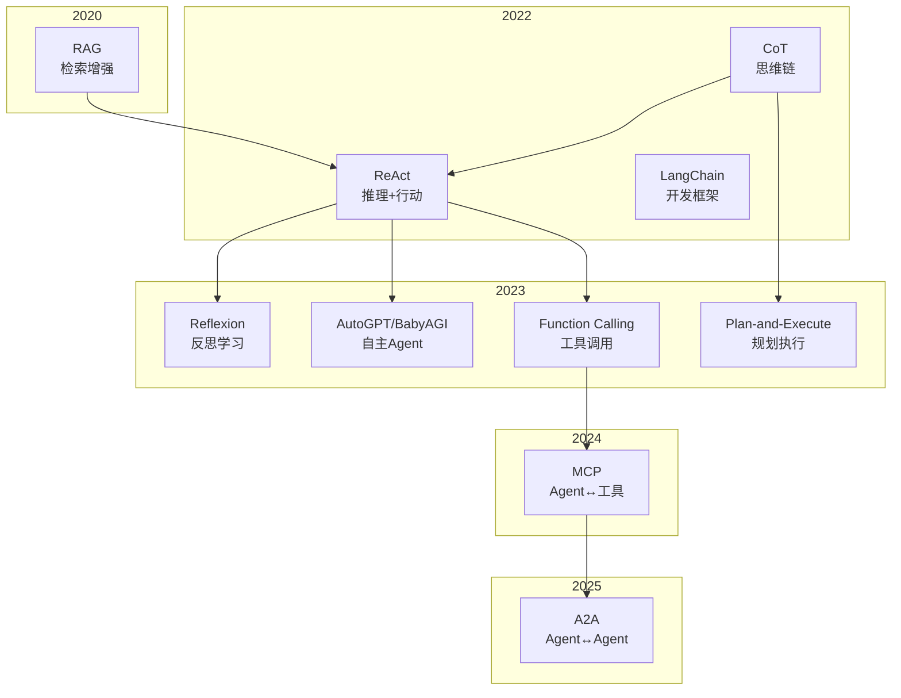

从 2020 年到 2025 年，AI Agent 技术经历了爆发式发展。本文梳理关键技术的发展脉络，帮助你快速建立全局视角。

## 时间线总览



## 关键技术速览

| 时间 | 技术 | 核心思想 | 论文/来源 |
|------|------|----------|----------|
| 2020.05 | RAG | 结合检索与生成 | [arXiv:2005.11401](https://arxiv.org/abs/2005.11401) |
| 2022.01 | CoT | 展示推理步骤 | [arXiv:2201.11903](https://arxiv.org/abs/2201.11903) |
| 2022.10 | ReAct | 思考-行动-观察循环 | [arXiv:2210.03629](https://arxiv.org/abs/2210.03629) |
| 2022.10 | LangChain | LLM 应用开发框架 | [GitHub](https://github.com/langchain-ai/langchain) |
| 2023.03 | Reflexion | 语言反馈自我改进 | [arXiv:2303.11366](https://arxiv.org/abs/2303.11366) |
| 2023.03 | AutoGPT | 完全自主的 Agent | [GitHub](https://github.com/Significant-Gravitas/AutoGPT) |
| 2023.04 | BabyAGI | 任务驱动自主 Agent | [GitHub](https://github.com/yoheinakajima/babyagi) |
| 2023.05 | Plan-and-Execute | 先规划后执行 | [arXiv:2305.04091](https://arxiv.org/abs/2305.04091) |
| 2023.06 | Function Calling | 结构化工具调用 | [OpenAI](https://openai.com/index/function-calling-and-other-api-updates/) |
| 2024.11 | MCP | Agent↔工具标准协议 | [Anthropic](https://www.anthropic.com/news/model-context-protocol) |
| 2025.04 | A2A | Agent↔Agent通信协议 | [Google](https://developers.googleblog.com/en/a2a-a-new-era-of-agent-interoperability/) |

---

## 推理增强技术

### RAG：检索增强生成（2020）

**RAG**（Retrieval-Augmented Generation）由 Facebook AI 在 2020 年提出。

**LLM 的局限性**：
- **知识截止**：训练数据有截止日期，无法获取最新信息
- **幻觉问题**：可能生成看似合理但实际错误的内容
- **无法引用来源**：难以追溯答案的依据

**RAG 的解决方案**：先检索相关文档，再结合检索结果生成回答。

```
用户问题 → 检索相关文档 → 将文档作为上下文 → LLM 生成回答
```

**适用场景**：
- 需要最新信息的问答系统
- 企业知识库查询
- 需要引用来源的场景

### Chain-of-Thought：思维链（2022.01）

**CoT** 由 Google 在 2022 年 1 月提出，是提升 LLM 推理能力的关键技术。

**核心思想**：让模型在给出答案前，先展示中间推理步骤。

```text
# 传统方式
问：小明有 5 个苹果，给了小红 2 个，又买了 3 个，现在有几个？
答：6 个

# CoT 方式
问：...请一步步思考。
答：
1. 最初有 5 个
2. 给了 2 个，剩 5-2=3 个
3. 又买 3 个，现在 3+3=6 个
所以答案是 6 个。
```

**局限**：只能推理，无法与外界交互。

> **延伸阅读**：[Chain-of-Thought：让 AI 学会"一步步思考"](/posts/chain-of-thought-introduction/)

---

## 工具调用模式

### Act-only：纯工具调用

**Act-only** 是一种实践模式：LLM 直接调用工具，不显式展示推理过程。

```
用户请求 → LLM 选择工具 → 执行工具 → 返回结果
```

**与 CoT 和 ReAct 的关系**：

| 模式 | 推理 | 行动 | 特点 |
|------|------|------|------|
| CoT | ✓ | ✗ | 只思考，不行动 |
| Act-only | ✗ | ✓ | 只行动，不显式推理 |
| ReAct | ✓ | ✓ | 思考与行动交替进行 |

Act-only 适合简单、明确的任务；ReAct 适合需要多步推理的复杂任务。

> **延伸阅读**：[Act-only 模式：让 AI 调用工具](/posts/act-only-function-calling/)

---

## 行动与推理结合

### ReAct：推理+行动（2022.10）

**ReAct** 由普林斯顿大学的 Yao 等人提出，将推理（Reasoning）与行动（Acting）结合。

**核心思想**：Thought-Action-Observation 循环。



**工作流程**：
1. **Thought**：分析当前情况，决定下一步
2. **Action**：执行具体操作（如搜索、计算）
3. **Observation**：获取执行结果
4. 重复直到完成任务

**相比 CoT 的优势**：
- 可以调用外部工具
- 可以获取实时信息
- 可以验证中间结果

> **延伸阅读**：
> - [ReAct 模式入门：让 AI 学会思考与行动](/posts/react-agent-introduction/)
> - [ReAct 实战：从零构建一个能推理的 AI Agent](/posts/react-agent-implementation/)

---

## 自我改进技术

### Reflexion：反思学习（2023.03）

**Reflexion** 在 ReAct 基础上增加了自我反思机制。

**核心思想**：任务失败后进行反思，将经验存入记忆，下次避免同样错误。

```
┌─────────────────────────────────────┐
│           Reflexion 架构             │
├─────────────────────────────────────┤
│  Actor    → 执行任务（基于 ReAct）    │
│  Evaluator → 评估执行结果            │
│  Reflection → 分析失败原因           │
│  Memory   → 存储反思经验             │
└─────────────────────────────────────┘
```

**示例**：
```
第一次尝试：
  搜索 "function calculate" → 未找到
  反思："搜索词过于具体"

第二次尝试（带记忆）：
  记忆："使用更宽泛的关键词"
  搜索 "calculate" → 找到多个匹配
```

> **延伸阅读**：[ReAct 进阶：变体模式与前沿发展](/posts/react-agent-variants/)

---

## 规划技术

### Plan-and-Execute：先规划后执行（2023.05）

**Plan-and-Execute** 模式将任务分为规划和执行两个阶段，显著提升复杂任务的完成率。

**核心思想**：先制定完整计划，再按计划逐步执行。

| 特性 | ReAct | Plan-and-Execute |
|------|-------|------------------|
| 规划范围 | 只看下一步 | 全局规划 |
| 步骤生成 | 边做边想 | 先全部规划好 |
| 调整时机 | 每步都可能变 | 按需重规划 |

**架构**：

```
┌─────────────────────────────────────┐
│        Plan-and-Execute 架构         │
├─────────────────────────────────────┤
│  Planner    → 分析任务，生成计划      │
│  Executor   → 逐步执行计划           │
│  Re-planner → 根据结果动态调整       │
└─────────────────────────────────────┘
```

---

## 工具调用

### Function Calling（2023.06）

OpenAI 在 2023 年 6 月发布 Function Calling，让 LLM 能够结构化地调用工具。

**核心思想**：定义函数 schema，让模型输出结构化的调用参数。

```json
{
  "name": "get_weather",
  "arguments": {
    "location": "Beijing",
    "unit": "celsius"
  }
}
```

**与 ReAct 的关系**：

ReAct (2022) 中已经有"Action"的概念，为什么 Function Calling 在 2023 年才出现？

| 层面 | ReAct (2022) | Function Calling (2023) |
|------|-------------|------------------------|
| 定位 | Agent 架构模式 | API 基础设施 |
| 输出 | 自然语言描述 Action | 结构化 JSON |
| 解析 | 需要正则/字符串解析 | 直接可用 |
| 可靠性 | 依赖 prompt 质量 | API 层面保证格式 |

**关系**：ReAct 是"怎么设计 Agent"，Function Calling 是"怎么可靠地调用工具"。Function Calling 让 ReAct 等模式的实现更加可靠和规范。

### MCP：模型上下文协议（2024.11）

**MCP**（Model Context Protocol）由 Anthropic 在 2024 年 11 月发布，是 AI 工具调用的标准化协议。

**解决的问题**：M 个 LLM × N 个工具 = M×N 种适配 → 统一为 1 种标准协议

**定位**：Agent 与工具之间的"垂直"连接层。

### A2A：Agent 间协议（2025.04）

**A2A**（Agent2Agent）由 Google 在 2025 年 4 月发布，解决 Agent 之间的通信问题。

**与 MCP 的区别**：

| 协议 | 解决的问题 | 连接方向 |
|------|-----------|---------|
| MCP | Agent ↔ 工具 | 垂直（Agent 调用工具）|
| A2A | Agent ↔ Agent | 水平（Agent 间协作）|

**A2A 的意义**：让不同厂商、不同框架的 Agent 能够相互协作，共同完成复杂任务。

**生态发展**：
- 150+ 组织支持（Google、Adobe、Salesforce 等）
- 2025 年 6 月：捐赠给 Linux 基金会
- 2025 年 9 月：IBM 的 ACP 协议与 A2A 合并

### AAIF：Agentic AI 基金会（2025）

**AAIF**（Agentic AI Foundation）是由 Anthropic、OpenAI、Block 共同创立的开放基金会，隶属于 Linux Foundation。

**贡献的项目**：
- Anthropic：MCP（模型上下文协议）
- OpenAI：AGENTS.md（Agent 行为规范）
- Block：Goose（开源 Agent）

**意义**：AI Agent 生态从竞争走向协作，形成统一的开放标准。

---

## 自主 Agent 框架

### LangChain（2022.10）

**LangChain** 由 Harrison Chase 创建，是目前最流行的 LLM 应用开发框架。

**核心功能**：
- 链式调用（Chains）
- Agent 实现
- 记忆管理
- 工具集成

### AutoGPT（2023.03）

**AutoGPT** 是第一个广受关注的完全自主 Agent，发布后迅速成为 GitHub 热门项目。

**特点**：
- 给定高层目标，自动分解任务
- 自主执行，无需人工干预
- 支持长期记忆

**局限**：容易陷入循环、成本高、易偏离目标。

### BabyAGI（2023.04）

**BabyAGI** 由 Yohei Nakajima 创建，是一个简洁的任务驱动自主 Agent。

**核心循环**：
1. 创建任务
2. 确定优先级
3. 执行任务
4. 根据结果生成新任务

---

## 技术演进脉络



**演进逻辑**：

1. **RAG (2020)** 解决了知识获取问题
2. **CoT (2022.01)** 解决了推理展示问题
3. **ReAct (2022.10)** 将推理与行动结合
4. **Reflexion (2023.03)** 加入自我反思能力
5. **Plan-and-Execute (2023.05)** 增强规划能力
6. **Function Calling (2023.06)** 标准化工具调用
7. **MCP (2024.11)** 统一 Agent↔工具协议
8. **A2A (2025.04)** 统一 Agent↔Agent 协议

---

## 如何选择？

| 场景 | 推荐技术 |
|------|----------|
| 需要外部知识 | RAG |
| 复杂推理问题 | CoT |
| 需要调用工具 | ReAct / Function Calling |
| 需要从失败中学习 | Reflexion |
| 复杂多步骤任务 | Plan-and-Execute |
| 完全自动化 | AutoGPT（谨慎使用）|

实际应用中，这些技术往往**组合使用**。例如：RAG + ReAct 可以构建能检索外部知识并执行操作的 Agent。

---

## 延伸阅读

本系列其他文章：

1. [Chain-of-Thought：让 AI 学会"一步步思考"](/posts/chain-of-thought-introduction/) - CoT 基础
2. [Act-only 模式：让 AI 调用工具](/posts/act-only-function-calling/) - 工具调用入门
3. [ReAct 模式入门：让 AI 学会思考与行动](/posts/react-agent-introduction/) - ReAct 核心概念
4. [ReAct 实战：从零构建一个能推理的 AI Agent](/posts/react-agent-implementation/) - 代码实现
5. [ReAct 进阶：变体模式与前沿发展](/posts/react-agent-variants/) - Reflexion、Plan-and-Execute 等

**推荐阅读顺序**：CoT → Act-only → ReAct 入门 → ReAct 实战 → ReAct 进阶
