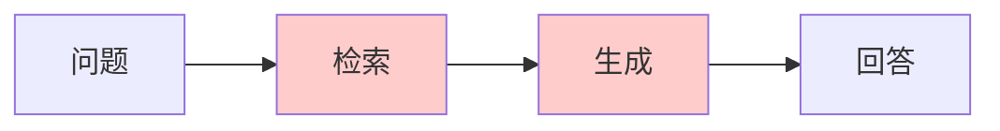
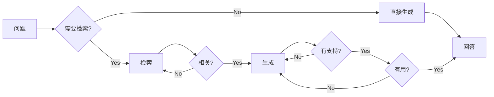
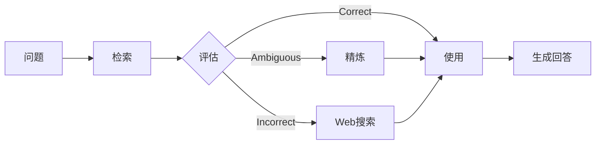
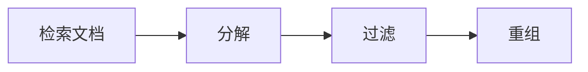
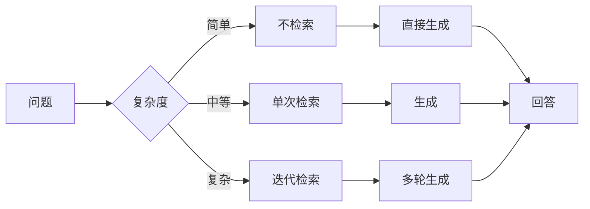
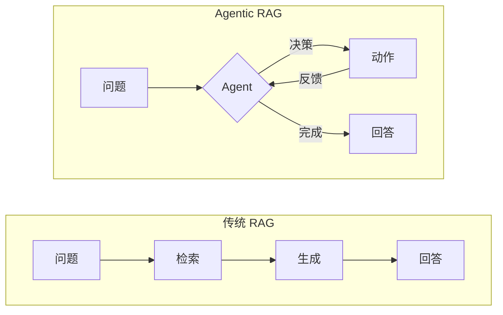
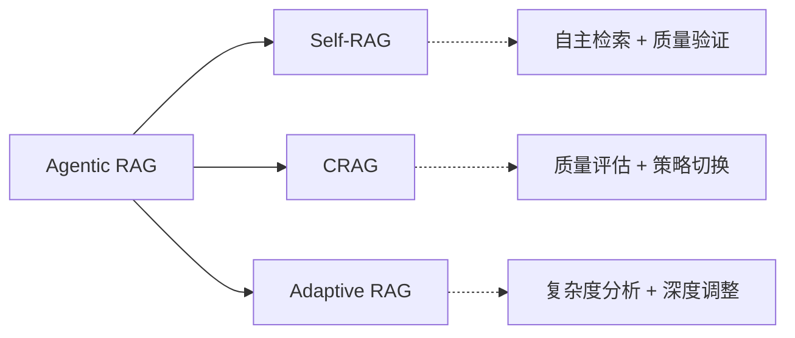

传统 RAG 采用固定的"检索-生成"流程，但这种方式存在局限：检索内容可能不相关、答案可能与检索结果矛盾。本文介绍三种前沿 RAG 变体及 Agentic RAG 的概念，它们通过引入自我反思和动态决策机制来解决这些问题。

> 如果你还不了解 RAG 优化技术，建议先阅读 [RAG 优化：检索质量提升全攻略](/posts/rag-optimization/)。

## 传统 RAG 的局限



| 问题 | 描述 |
|------|------|
| 无差别检索 | 所有问题都触发检索，即使不需要 |
| 检索噪声 | 检索到的内容可能不相关或有错误 |
| 无法自我纠错 | 生成后不检查答案是否与检索内容一致 |
| 不知道何时检索 | 无法判断何时需要外部知识 |

---

## 一、Self-RAG：自我反思的 RAG

### 论文概述

**Self-RAG: Learning to Retrieve, Generate, and Critique through Self-Reflection**
- 发表：ICLR 2024
- 机构：华盛顿大学 + AI2
- 论文：[arXiv:2310.11511](https://arxiv.org/abs/2310.11511)

### 核心思想

Self-RAG 引入**反思标记（Reflection Tokens）**，让模型在生成过程中自我评估：

1. **是否需要检索**（Retrieve）
2. **检索内容是否相关**（IsRel）
3. **生成内容是否有检索支持**（IsSup）
4. **生成内容是否有用**（IsUse）



### 反思标记详解

| 标记 | 含义 | 取值 |
|------|------|------|
| **Retrieve** | 是否需要检索 | yes / no / continue |
| **IsRel** | 文档是否相关 | relevant / irrelevant |
| **IsSup** | 生成是否有文档支持 | fully / partially / no |
| **IsUse** | 回答是否有用 | 1-5 分 |

### 工作流程示例

```text
问题：谁是现任美国总统？

1. [Retrieve=yes] → 需要检索外部信息

2. 检索结果：
   "Joe Biden 于 2021 年 1 月就任美国第 46 任总统..."

3. [IsRel=relevant] → 文档相关

4. 生成：
   "现任美国总统是 Joe Biden。"

5. [IsSup=fully supported] → 完全有文档支持

6. [IsUse=5] → 回答有用

7. 输出最终答案
```

### 简化实现

**核心流程伪代码**：

```text
function self_rag(query):
    // 1. 判断是否需要检索 [Retrieve]
    if not need_retrieval(query):
        return LLM.generate(query)

    // 2. 检索文档
    documents = retrieve(query, top_k=5)

    // 3. 过滤不相关文档 [IsRel]
    relevant_docs = filter(doc => is_relevant(query, doc), documents)
    if relevant_docs is empty:
        return LLM.generate(query)  // 回退到直接生成

    // 4. 基于相关文档生成
    answer = LLM.generate(query, context=relevant_docs)

    // 5. 检查支持度 [IsSup]
    support = check_support(answer, relevant_docs)
    if support == "no":
        answer = LLM.generate(query, context=relevant_docs, strict=true)

    // 6. 评估有用性 [IsUse]
    usefulness = check_usefulness(query, answer)

    return answer
```

**四个反思 Prompt**：

**1. Retrieve - 是否需要检索**：

```text
判断以下问题是否需要检索外部信息来回答。
对于需要实时信息、专业知识或事实性问题，回答"yes"。
对于常识问题或创意写作，回答"no"。

问题：{query}

只回答 yes 或 no：
```

**2. IsRel - 文档是否相关**：

```text
判断以下文档是否与问题相关。

问题：{query}
文档：{document}

只回答 relevant 或 irrelevant：
```

**3. IsSup - 回答是否有文档支持**：

```text
判断以下回答是否有参考文档的支持。

参考文档：{context}
回答：{answer}

选择一个：fully（完全支持）/ partially（部分支持）/ no（无支持）
```

**4. IsUse - 回答是否有用**：

```text
评估以下回答对问题的有用程度，给出 1-5 分。

问题：{query}
回答：{answer}

只返回一个数字（1-5）：
```

---

## 二、Corrective RAG (CRAG)：纠错式 RAG

### 论文概述

**Corrective Retrieval Augmented Generation**
- 发表：2024
- 论文：[arXiv:2401.15884](https://arxiv.org/abs/2401.15884)

### 核心思想

CRAG 在检索后增加一个**知识精炼**步骤，对检索结果进行评估和纠正：

1. **评估检索质量**：判断检索结果是正确、模糊还是错误
2. **根据评估结果采取不同策略**：
   - 正确：直接使用
   - 模糊：知识精炼后使用
   - 错误：转向 Web 搜索



### 三种评估结果的处理

| 评估结果 | 含义 | 处理策略 |
|---------|------|---------|
| **Correct** | 检索结果准确相关 | 直接用于生成 |
| **Ambiguous** | 部分相关或不确定 | 知识精炼：分解、重组、过滤 |
| **Incorrect** | 检索结果不相关 | 丢弃检索结果，转向 Web 搜索 |

### 知识精炼过程



**知识精炼伪代码**：

```text
function knowledge_refinement(query, documents):
    // 1. 分解：将文档拆成独立知识条
    all_statements = []
    for doc in documents:
        statements = decompose_to_statements(doc)
        all_statements.extend(statements)

    // 2. 过滤：只保留与问题相关的条目
    relevant = filter(stmt => is_relevant(query, stmt), all_statements)

    // 3. 重组：合并为精炼后的知识
    return join(relevant, "\n")
```

**分解 Prompt**：

```text
将以下文档分解为独立的知识条目，每条包含一个完整的事实。

文档：{document}

以 JSON 数组格式返回知识条目：
```

**过滤 Prompt**：

```text
判断以下知识条是否与问题相关。

问题：{query}
知识条：{statement}

只回答 yes 或 no：
```

### CRAG 完整实现

**核心流程伪代码**：

```text
function crag(query):
    // 1. 检索
    documents = retrieve(query, top_k=5)

    // 2. 评估检索质量
    evaluation = evaluate_retrieval(query, documents)

    // 3. 根据评估结果处理
    switch evaluation:
        case "correct":
            context = documents                    // 直接使用
        case "ambiguous":
            context = knowledge_refinement(query, documents)  // 精炼
        case "incorrect":
            context = web_search(query)            // 转向 Web 搜索

    // 4. 生成回答
    return LLM.generate(query, context)
```

**评估检索结果 Prompt**：

```text
评估以下检索结果对回答问题的帮助程度。

问题：{query}

检索结果：
[1] {doc1_preview}
[2] {doc2_preview}
...

选择一个评估结果：
- correct：检索结果准确相关，可以直接回答问题
- ambiguous：部分相关，需要进一步处理
- incorrect：不相关或有错误，无法帮助回答问题

只返回一个词（correct/ambiguous/incorrect）：
```

---

## 三、Adaptive RAG：自适应 RAG

### 论文概述

**Adaptive-RAG: Learning to Adapt Retrieval-Augmented Large Language Models through Question Complexity**
- 发表：NAACL 2024
- 论文：[arXiv:2403.14403](https://arxiv.org/abs/2403.14403)

### 核心思想

Adaptive RAG 根据**问题复杂度**动态选择检索策略：

- **简单问题**：不检索，直接生成
- **中等问题**：单次检索
- **复杂问题**：多次迭代检索



### 问题复杂度分类

| 复杂度 | 特征 | 示例 | 策略 |
|--------|------|------|------|
| **简单** | 常识、直接事实 | "水的化学式是什么？" | 不检索 |
| **中等** | 单一事实查询 | "谁是现任美国总统？" | 单次检索 |
| **复杂** | 多跳推理、综合分析 | "比较 Python 和 Java 的优缺点" | 迭代检索 |

### 实现

**核心流程伪代码**：

```text
function adaptive_rag(query):
    // 1. 分类问题复杂度
    complexity = classify_complexity(query)

    switch complexity:
        case "simple":
            return LLM.generate(query)              // 不检索
        case "medium":
            docs = retrieve(query, top_k=3)         // 单次检索
            return LLM.generate(query, context=docs)
        case "complex":
            return iterative_retrieval(query)       // 迭代检索
```

**复杂度分类 Prompt**：

```text
分析以下问题的复杂度。

问题：{query}

复杂度分类：
- simple：常识问题，不需要外部信息
- medium：需要查询单一事实
- complex：需要综合多个信息或多步推理

只返回一个词（simple/medium/complex）：
```

**迭代检索伪代码**：

```text
function iterative_retrieval(query, max_iterations=3):
    all_context = []
    current_query = query

    for i in range(max_iterations):
        // 检索当前查询
        docs = retrieve(current_query, top_k=3)
        all_context.extend(docs)

        // 检查信息是否足够
        if has_sufficient_info(query, all_context):
            break

        // 生成后续查询
        follow_up = generate_follow_up_query(query, all_context)
        if follow_up is empty:
            break

        current_query = follow_up

    return LLM.generate(query, context=all_context)
```

**迭代检索相关 Prompt**：

**判断信息是否足够**：

```text
判断以下上下文是否足够回答问题。

问题：{query}
上下文：{context}

是否足够回答？只回答 yes 或 no：
```

**生成后续查询**：

```text
基于原始问题和当前收集的信息，生成一个后续查询来补充缺失的信息。
如果信息已经足够，返回空字符串。

原始问题：{original_query}
已收集信息：{current_context}

后续查询（如果需要）：
```

---

## 三种变体对比

| 特性 | Self-RAG | CRAG | Adaptive RAG |
|------|----------|------|--------------|
| **核心机制** | 反思标记自我评估 | 检索结果质量评估 | 问题复杂度分类 |
| **是否检索** | 动态判断 | 总是检索 | 根据复杂度决定 |
| **检索后处理** | 相关性过滤 | 知识精炼/Web 搜索 | 可能迭代检索 |
| **生成后验证** | 支持度检查 | 无 | 无 |
| **适用场景** | 通用 QA | 知识库可能有噪声 | 问题复杂度差异大 |

---

## 四、Agentic RAG：更广阔的视角

### 什么是 Agentic RAG

Agentic RAG 不是一个特定的算法，而是一种**设计理念**：让 RAG 系统具备 Agent 的自主决策能力。

传统 RAG 是一个固定流水线：检索 → 生成。而 Agentic RAG 将 RAG 视为一个能够：
- **自主判断**：决定是否需要检索、何时检索
- **动态规划**：根据情况选择不同策略
- **自我纠错**：评估结果并调整行为
- **多轮迭代**：必要时进行多次检索



### 三种技术与 Agentic RAG 的关系

Self-RAG、CRAG、Adaptive RAG 都是 Agentic RAG 理念的具体实现：

| 技术 | Agent 能力体现 |
|------|---------------|
| **Self-RAG** | 自主判断是否检索 + 自我验证生成质量 |
| **CRAG** | 评估检索质量 + 动态选择处理策略 |
| **Adaptive RAG** | 分析问题复杂度 + 选择匹配的检索策略 |



### 实践中的 Agentic RAG

在工程实践中，Agentic RAG 通常结合 Agent 框架实现更复杂的能力：

```text
Agentic RAG 的典型能力：

1. 工具调用：RAG 作为 Agent 的工具之一
   - Agent 可以选择使用 RAG、Web 搜索、数据库查询等

2. 多源检索：根据问题选择不同知识源
   - 技术文档 → 内部知识库
   - 实时信息 → Web 搜索
   - 结构化数据 → SQL 查询

3. 规划与分解：复杂问题拆解为子问题
   - 每个子问题独立检索
   - 综合多个结果生成答案

4. 记忆与学习：记录历史交互
   - 利用上下文优化检索
   - 从反馈中改进策略
```

**简单来说**：Self-RAG、CRAG、Adaptive RAG 是学术论文提出的具体技术方案，而 Agentic RAG 是工程实践中的设计趋势，前者是后者的组成部分。

---

## 总结

本文介绍了三种前沿 RAG 变体及 Agentic RAG 的概念：

| 变体 | 核心贡献 | 适用场景 |
|------|---------|---------|
| **Self-RAG** | 反思标记，自我评估 | 需要高质量、可验证的回答 |
| **CRAG** | 检索结果质量评估和纠正 | 知识库可能存在噪声 |
| **Adaptive RAG** | 根据问题复杂度选择策略 | 问题类型多样 |
| **Agentic RAG** | 赋予 RAG 自主决策能力 | 复杂场景、多源检索 |

**实践建议**：
1. 对于大多数场景，先尝试基础 RAG + Rerank
2. 如果检索结果不稳定，加入 CRAG 的评估机制
3. 如果问题类型多样，使用 Adaptive RAG 的复杂度分类
4. 对于高要求场景，使用 Self-RAG 的完整验证流程

---

## 延伸阅读

**RAG 系列**：

1. [RAG 入门：让 AI 拥有外部知识](/posts/rag-introduction/) - RAG 基础概念
2. [RAG 核心组件：Embedding 与向量数据库](/posts/rag-embedding-vector-database/) - Embedding 原理与向量数据库选型
3. [RAG 优化：检索质量提升全攻略](/posts/rag-optimization/) - Query 重写、扩展、Rerank 等技术
4. **本文**：RAG 进阶：Self-RAG、CRAG、Adaptive RAG 与 Agentic RAG
5. [RAG 评估：如何衡量 RAG 系统效果](/posts/rag-evaluation/) - RAGAS 框架与评估指标

**相关论文**：

- [Self-RAG: Learning to Retrieve, Generate, and Critique through Self-Reflection](https://arxiv.org/abs/2310.11511)
- [Corrective Retrieval Augmented Generation](https://arxiv.org/abs/2401.15884)
- [Adaptive-RAG: Learning to Adapt Retrieval-Augmented Large Language Models through Question Complexity](https://arxiv.org/abs/2403.14403)
