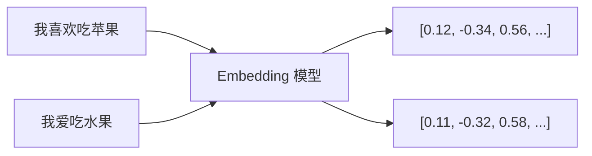

在 RAG 系统中，Embedding 和向量数据库是实现语义检索的核心组件。本文将深入讲解它们的工作原理，并对比主流向量数据库的特点与选型。

> 如果你还不了解 RAG 的基本概念，建议先阅读 [RAG 入门：让 AI 拥有外部知识](/posts/rag-introduction/)。

## 为什么需要 Embedding？

传统的关键词搜索只能匹配**字面相同**的词，无法理解语义。

```text
# 关键词搜索的局限
文档：我们公司支持 7 天无理由退款
搜索：退货政策
结果：未匹配（"退款" ≠ "退货"）
```

而 Embedding 可以将文本转换为**语义向量**，让"退款"和"退货"在向量空间中靠近。

---

## 什么是 Embedding？

**Embedding**（嵌入）是将离散的文本转换为连续的数值向量的技术。



**关键特性**：

| 特性 | 说明 |
|------|------|
| 语义相似性 | 意思相近的文本，向量距离也近 |
| 固定维度 | 无论文本长短，输出向量维度固定（如 1536 维） |
| 稠密表示 | 与稀疏的 TF-IDF 不同，Embedding 是稠密向量 |

---

## Embedding 的工作原理

### 向量空间

Embedding 将文本映射到高维向量空间，语义相似的文本在空间中距离更近：

```
                    ↑ 维度2
                    │
         "水果"  ●  │  ● "苹果"
                    │      ● "香蕉"
        ────────────┼────────────→ 维度1
                    │
         "汽车"  ●  │  ● "轿车"
                    │
```

### 相似度计算

常用的相似度计算方法：

| 方法 | 公式 | 适用场景 |
|------|------|----------|
| 余弦相似度 | cos(A, B) = A·B / (\|A\| × \|B\|) | **文本语义检索**（RAG 首选）、推荐系统。只关注方向不关注长度，对文本长度不敏感 |
| 欧氏距离 | √Σ(Ai - Bi)² | **图像相似度**、聚类分析。需要考虑向量绝对位置差异的场景 |
| 点积 | A·B = ΣAi × Bi | **大规模检索**（向量已归一化时）。计算最快，Pinecone/Milvus 默认使用 |

**余弦相似度示例**：

- "我喜欢吃苹果" vs "我爱吃水果" → 相似度: 0.92（语义相近）
- "我喜欢吃苹果" vs "今天天气不错" → 相似度: 0.15（语义无关）

---

## 常用 Embedding 模型

### 商业模型

| 模型 | 提供商 | 维度 | 特点 |
|------|--------|------|------|
| text-embedding-3-small | OpenAI | 1536 | 性价比高，生态成熟 |
| text-embedding-3-large | OpenAI | 3072 | 精度更高，成本更高 |
| embed-v3 | Cohere | 1024 | 多语言支持好，有免费额度 |
| voyage-2 | Voyage AI | 1024 | 代码检索效果出色 |
| jina-embeddings-v2 | Jina AI | 768 | 支持 8K 长文本 |
| text-embedding-004 | Google | 768 | 与 Google Cloud 集成好 |

### 开源模型

| 模型 | 来源 | 维度 | 特点 |
|------|------|------|------|
| BGE-large-zh | 智源研究院 | 1024 | 中文效果出色 |
| BGE-M3 | 智源研究院 | 1024 | 多语言、多功能 |
| M3E | MokaAI | 768 | 中文通用 |
| text2vec-large-chinese | 句向量 | 1024 | 中文句向量 |
| all-MiniLM-L6-v2 | Sentence-Transformers | 384 | 轻量级，推理快 |

### 选择考虑因素

| 因素 | 说明 |
|------|------|
| **部署方式** | 云端 API 简单但有网络延迟；本地部署可控但需资源 |
| **语言支持** | 中文场景优先考虑中文优化模型；多语言场景选通用模型 |
| **成本** | API 按调用计费；开源模型需考虑 GPU 推理成本 |
| **向量维度** | 维度越高精度越好，但存储和计算成本也越高 |
| **上下文长度** | 长文本场景需关注模型的最大 token 限制 |

---

## 向量数据库概述

**向量数据库**是专门用于存储和检索向量的数据库，支持高效的相似度搜索。

### 为什么不用传统数据库？

| 特性 | 传统数据库 | 向量数据库 |
|------|-----------|-----------|
| 查询方式 | 精确匹配、模糊匹配、范围查询 | 语义相似度搜索（ANN） |
| 索引类型 | B-tree、Hash | HNSW、IVF、PQ |
| 数据类型 | 结构化数据 | 高维向量 |
| 典型查询 | WHERE id = 1 | 找最相似的 10 个向量 |

### 核心功能

1. **向量存储**：存储高维向量及其元数据
2. **索引构建**：建立高效的向量索引（如 HNSW、IVF）
3. **相似度搜索**：快速找到最相似的 Top-K 向量（ANN 近似最近邻）
4. **结果过滤**：支持元数据过滤（如时间、类别）

---

## 主流向量数据库对比

### 综合对比

| 特性 | Pinecone | Milvus | Chroma | Qdrant | Weaviate |
|------|----------|--------|--------|--------|----------|
| **类型** | 托管服务 | 分布式 | 嵌入式 | 独立服务 | 独立服务 |
| **开源** | ✗ | ✓ | ✓ | ✓ | ✓ |
| **云服务** | ✓ | Zilliz Cloud | ✓ | ✓ | ✓ |
| **开发语言** | - | Go/C++ | Python | Rust | Go |
| **向量规模** | 十亿级 | 十亿级 | 百万级 | 十亿级 | 十亿级 |
| **部署难度** | 零（托管） | 较复杂 | 极简 | 简单 | 中等 |
| **学习曲线** | 低 | 较陡 | 极低 | 低 | 中等 |
| **GPU 加速** | ✓ | ✓ | ✗ | ✗ | ✗ |
| **多模态** | ✗ | ✗ | ✗ | ✗ | ✓ |
| **混合搜索** | ✓ | ✓ | ✗ | ✓ | ✓ |

### 优缺点对比

| 数据库 | 优点 | 缺点 |
|--------|------|------|
| **Pinecone** | 完全托管零运维、性能稳定、免费层可用 | 不开源、大规模成本高、依赖网络 |
| **Milvus** | 支持十亿级向量、多种索引类型、GPU 加速 | 部署复杂、小规模使用偏重、学习曲线陡 |
| **Chroma** | 极易上手、嵌入式无需部署、LangChain 集成好 | 不适合大规模生产、性能有限 |
| **Qdrant** | Rust 高性能、过滤条件丰富、部署简单 | 生态较小、社区活跃度不如 Milvus |
| **Weaviate** | 多模态支持、GraphQL API、内置 Embedding | 学习曲线陡、资源占用高、配置复杂 |

---

## 总结

本文介绍了 RAG 系统中的两个核心组件：

**Embedding**：
- 将文本转换为语义向量
- 使语义相似的内容在向量空间中靠近
- 推荐模型：OpenAI text-embedding-3-small（商业）、BGE-large-zh（开源中文）

**向量数据库**：
- 专门用于存储和检索高维向量
- 支持高效的相似度搜索
- 选型建议：Chroma（开发）、Pinecone（托管）、Qdrant（自建）、Milvus（大规模）

---

## 延伸阅读

**RAG 系列**：

1. [RAG 入门：让 AI 拥有外部知识](/posts/rag-introduction/) - RAG 基础概念
2. **本文**：RAG 核心组件：Embedding 与向量数据库
3. [RAG 优化：检索质量提升全攻略](/posts/rag-optimization/) - Query 重写、扩展、Rerank 等技术
4. [RAG 进阶：Self-RAG、Corrective RAG 与 Adaptive RAG](/posts/rag-advanced-variants/) - 前沿 RAG 变体
5. [RAG 评估：如何衡量 RAG 系统效果](/posts/rag-evaluation/) - RAGAS 框架与评估指标

**相关技术**：

- [AI Agent 技术演进：从 RAG 到 MCP 的发展时间线](/posts/ai-agent-technology-timeline/) - 技术全景
