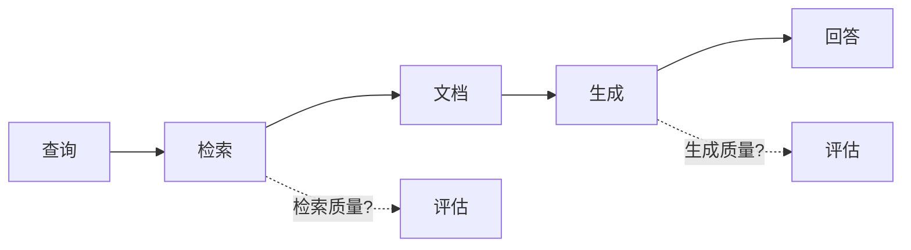

构建 RAG 系统后，如何知道效果好不好？本文介绍 RAG 评估的核心指标，帮助你理解评估维度。

> 如果你还没有了解 RAG 的优化技术，建议先阅读 [RAG 优化：检索质量提升全攻略](/posts/rag-optimization/)。

## 为什么需要评估？

RAG 系统涉及多个环节，每个环节都可能出问题：

| 环节   | 可能问题             | 需要评估           |
| ------ | -------------------- | ------------------ |
| 检索   | 召回率低、相关性差   | 检索准确率、召回率 |
| 生成   | 幻觉、与检索内容不符 | 忠实度、相关性     |
| 端到端 | 最终答案不正确       | 答案正确性         |

---

## 核心评估指标

RAG 评估主要围绕以下 5 个指标：

| 指标                   | 评估对象 | 定义                         | 关注点     |
| ---------------------- | -------- | ---------------------------- | ---------- |
| **Context Precision**  | 检索     | 检索结果中相关文档的比例     | 检索精准度 |
| **Context Recall**     | 检索     | 相关文档被检索到的比例       | 检索覆盖度 |
| **Faithfulness**       | 生成     | 回答是否忠实于检索内容       | 防止幻觉   |
| **Answer Relevance**   | 生成     | 回答与问题的相关程度         | 回答质量   |
| **Answer Correctness** | 端到端   | 回答与标准答案的一致程度     | 最终效果   |

**优先关注**：
- **Faithfulness**：防止幻觉，确保回答有据可查
- **Context Recall**：确保检索覆盖全面，不遗漏关键信息

---

## RAGAS 评估框架

**RAGAS**（Retrieval Augmented Generation Assessment）是专门用于评估 RAG 系统的开源框架，使用 LLM 进行自动化评估，无需人工标注。

- **GitHub**：[explodinggradients/ragas](https://github.com/explodinggradients/ragas)
- **官方文档**：[docs.ragas.io](https://docs.ragas.io/)

> 关于 RAGAS 的安装、使用方法、各指标的计算原理，请参考官方文档。

---

## 总结

| 主题         | 要点                                                     |
| ------------ | -------------------------------------------------------- |
| **评估维度** | 检索质量、生成质量、端到端效果                           |
| **核心指标** | Faithfulness、Answer Relevancy、Context Precision/Recall |
| **推荐工具** | RAGAS（开源、自动化、LLM 评估）                          |

---

## 延伸阅读

**RAG 系列**：

1. [RAG 入门：让 AI 拥有外部知识](/posts/rag-introduction/) - RAG 基础概念
2. [RAG 核心组件：Embedding 与向量数据库](/posts/rag-embedding-vector-database/) - Embedding 原理与向量数据库选型
3. [RAG 优化：检索质量提升全攻略](/posts/rag-optimization/) - Query 重写、扩展、Rerank 等技术
4. [RAG 进阶：Self-RAG、CRAG、Adaptive RAG 与 Agentic RAG](/posts/rag-advanced-variants/) - 前沿 RAG 变体
5. **本文**：RAG 评估：核心指标概览

**工具和资源**：

- [RAGAS GitHub](https://github.com/explodinggradients/ragas) - RAG 评估框架
- [RAGAS 官方文档](https://docs.ragas.io/) - 详细使用教程
