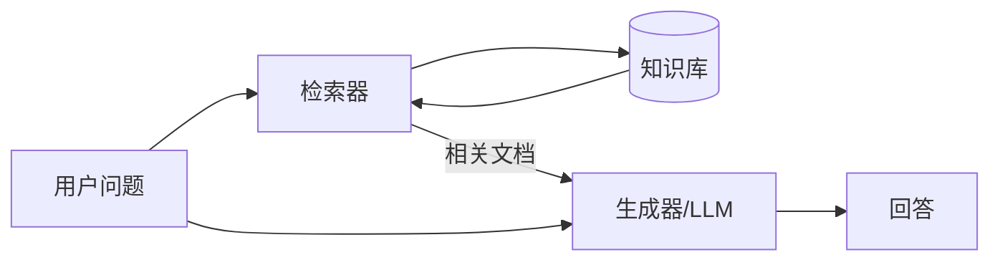
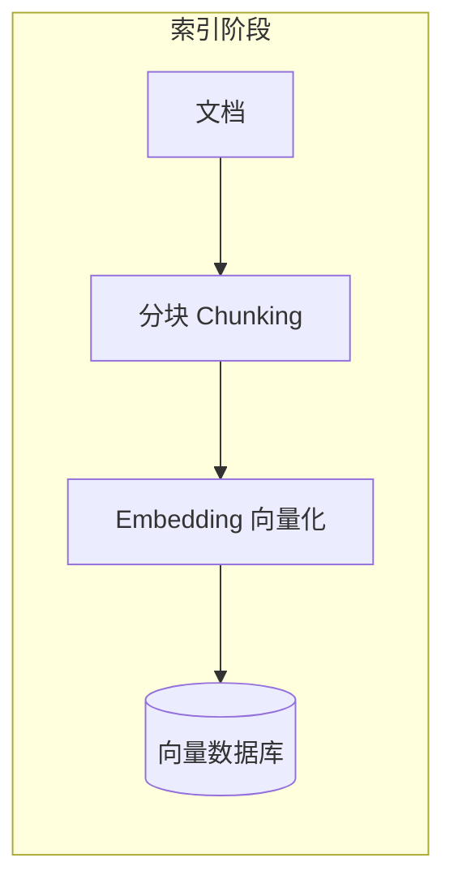
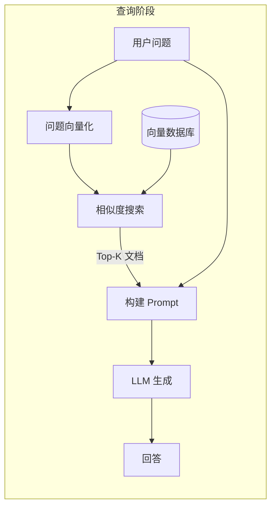

大语言模型（LLM）虽然强大，但它们的知识是有限的——训练数据有截止日期，无法获取最新信息，也容易产生"幻觉"。RAG（检索增强生成）正是为解决这些问题而生的技术。

## LLM 的三大局限

在了解 RAG 之前，我们先看看 LLM 面临的核心问题：

### 1. 知识截止

LLM 的知识来自训练数据，有明确的截止日期。

```text
用户：2024 年诺贝尔物理学奖是谁获得的？
LLM：抱歉，我的知识截止到 2023 年，无法回答这个问题。
```

### 2. 幻觉问题

当 LLM 不知道答案时，可能会"编造"看似合理但实际错误的内容。

```text
用户：你们公司的退款政策是什么？
LLM：我们公司支持 30 天无理由退款...（完全编造的内容）
```

### 3. 无法引用来源

LLM 生成的答案难以追溯依据，用户无法验证信息的准确性。

---

## 什么是 RAG？

**RAG**（Retrieval-Augmented Generation，检索增强生成）是一种将**信息检索**与**文本生成**相结合的技术架构。

**核心思想**：先从外部知识库检索相关信息，再将检索结果作为上下文，让 LLM 基于这些信息生成回答。



**一句话总结**：RAG = 检索（Retrieval） + 生成（Generation）

---

## RAG 如何解决 LLM 的局限？

| LLM 局限 | RAG 解决方案 |
|---------|-------------|
| 知识截止 | 知识库可随时更新，获取最新信息 |
| 幻觉问题 | 基于检索到的真实文档生成，减少编造 |
| 无法引用 | 可以返回信息来源，便于用户验证 |

---

## RAG 的核心流程

RAG 的工作流程可以分为两个阶段：**索引阶段**和**查询阶段**。

### 索引阶段（离线）

将知识库文档处理成可检索的格式：



1. **文档加载**：读取 PDF、网页、数据库等来源的文档
2. **分块（Chunking）**：将长文档切分成小块（如 500 字一块）
3. **向量化（Embedding）**：将文本块转换为向量表示
4. **存储**：将向量存入向量数据库

### 查询阶段（在线）

用户提问时，实时检索并生成回答：



1. **问题向量化**：将用户问题转换为向量
2. **相似度搜索**：在向量数据库中找到最相关的文档块
3. **构建 Prompt**：将问题和检索到的文档组合成提示词
4. **LLM 生成**：基于上下文生成最终回答

---

## RAG vs 微调：如何选择？

当需要让 LLM 掌握特定领域知识时，有两种主要方案：

| 维度 | RAG | 微调（Fine-tuning） |
|------|-----|-------------------|
| 知识更新 | 更新知识库即可，实时生效 | 需要重新训练模型 |
| 成本 | 低，只需维护知识库 | 高，需要 GPU 资源训练 |
| 可解释性 | 高，可追溯信息来源 | 低，知识"融入"模型 |
| 适用场景 | 知识频繁更新、需要引用来源 | 固定领域、追求极致性能 |
| 幻觉控制 | 较好，基于真实文档 | 可能仍有幻觉 |

**推荐策略**：

- **优先考虑 RAG**：大多数企业知识库、客服问答场景
- **考虑微调**：特定领域术语理解、风格定制
- **两者结合**：复杂场景下可以先微调再 RAG

---

## RAG 的典型应用场景

### 1. 企业知识库问答

```text
场景：员工查询公司内部政策
知识库：HR 政策文档、员工手册、流程规范
优势：信息准确、可追溯、实时更新
```

### 2. 智能客服

```text
场景：用户咨询产品问题
知识库：产品文档、FAQ、历史工单
优势：回答一致、覆盖面广、降低人工成本
```

### 3. 代码助手

```text
场景：开发者查询项目代码
知识库：项目源码、技术文档、API 说明
优势：理解项目上下文、给出准确建议
```

### 4. 学术研究助手

```text
场景：研究人员查阅文献
知识库：论文库、研究报告
优势：快速定位相关研究、生成综述
```

---

## RAG 系统的关键组件

一个完整的 RAG 系统包含以下核心组件：

```
┌─────────────────────────────────────────────────────────┐
│                      RAG 系统架构                        │
├─────────────────────────────────────────────────────────┤
│                                                         │
│  ┌─────────────┐    ┌─────────────┐    ┌─────────────┐  │
│  │  文档加载器  │    │   分块器    │    │  Embedding  │  │
│  │  Loader     │ → │  Chunker   │ → │   Model     │  │
│  └─────────────┘    └─────────────┘    └─────────────┘  │
│                                              ↓          │
│  ┌─────────────┐    ┌─────────────┐    ┌─────────────┐  │
│  │    LLM      │ ← │  检索器     │ ← │  向量数据库  │  │
│  │  Generator  │    │  Retriever │    │ Vector DB   │  │
│  └─────────────┘    └─────────────┘    └─────────────┘  │
│                                                         │
└─────────────────────────────────────────────────────────┘
```

| 组件 | 作用 | 常用选择 |
|------|------|---------|
| 文档加载器 | 读取各类文档格式 | LangChain Loaders、Unstructured |
| 分块器 | 将文档切分为小块 | 按字符/句子/语义分块 |
| Embedding 模型 | 文本向量化 | OpenAI Embedding、BGE、M3E |
| 向量数据库 | 存储和检索向量 | Pinecone、Milvus、Chroma、Qdrant |
| 检索器 | 查找相关文档 | 向量检索、混合检索 |
| LLM | 生成最终回答 | GPT-4、Claude、Qwen |

---

## 一个简单的 RAG 示例

以下是 RAG 工作流程的简化示例：

**知识库内容**（假设已索引）：
```text
文档1：我们公司支持 7 天无理由退款，超过 7 天需联系客服处理。
文档2：退款申请需在订单页面提交，审核时间为 1-3 个工作日。
文档3：部分商品（如定制商品）不支持无理由退款。
```

**用户提问**：
```text
问：你们的退款政策是什么？
```

**RAG 处理流程**：

```text
1. 向量化问题："退款政策"
2. 检索相关文档：找到文档1、文档2、文档3
3. 构建 Prompt：
   ---
   根据以下信息回答用户问题：

   [文档1] 我们公司支持 7 天无理由退款...
   [文档2] 退款申请需在订单页面提交...
   [文档3] 部分商品不支持无理由退款...

   用户问题：你们的退款政策是什么？
   ---
4. LLM 生成回答
```

**最终回答**：
```text
我们公司的退款政策如下：
1. 支持 7 天无理由退款，超过 7 天需联系客服
2. 退款申请在订单页面提交，审核需 1-3 个工作日
3. 定制商品等特殊商品不支持无理由退款

来源：退款政策文档
```

---

## RAG 的挑战与优化方向

虽然 RAG 很强大，但在实际应用中也面临挑战：

| 挑战 | 描述 | 优化方向 |
|------|------|---------|
| 检索质量 | 检索不到相关文档或检索到无关内容 | Query 重写、混合检索、Rerank |
| 分块策略 | 分块过大或过小影响效果 | 语义分块、递归分块 |
| 上下文长度 | 检索内容过多超出 LLM 限制 | Top-K 优化、压缩摘要 |
| 多跳推理 | 答案需要综合多个文档 | 迭代检索、知识图谱 |

> 这些优化技术将在后续文章中详细介绍。

---

## 总结

本文介绍了 RAG 的核心概念：

1. **RAG 解决的问题**：LLM 的知识截止、幻觉、无法引用来源
2. **核心思想**：检索 + 生成，用外部知识增强 LLM
3. **两阶段流程**：索引阶段（离线）和查询阶段（在线）
4. **关键组件**：文档加载、分块、Embedding、向量数据库、检索、LLM
5. **典型场景**：企业知识库、智能客服、代码助手

RAG 是构建企业级 AI 应用的基础技术，掌握它是迈向 AI Agent 开发的重要一步。

---

## 延伸阅读

**RAG 系列**：

1. **本文**：RAG 入门：让 AI 拥有外部知识
2. [RAG 核心组件：Embedding 与向量数据库](/posts/rag-embedding-vector-database/) - Embedding 原理与向量数据库选型
3. [RAG 优化：检索质量提升全攻略](/posts/rag-optimization/) - Query 重写、扩展、Rerank 等技术
4. [RAG 进阶：Self-RAG、Corrective RAG 与 Adaptive RAG](/posts/rag-advanced-variants/) - 前沿 RAG 变体
5. [RAG 评估：如何衡量 RAG 系统效果](/posts/rag-evaluation/) - RAGAS 框架与评估指标

**相关技术**：

- [AI Agent 技术演进：从 RAG 到 MCP 的发展时间线](/posts/ai-agent-technology-timeline/) - 技术全景
- [ReAct 模式入门：让 AI 学会思考与行动](/posts/react-agent-introduction/) - RAG + ReAct 组合使用
