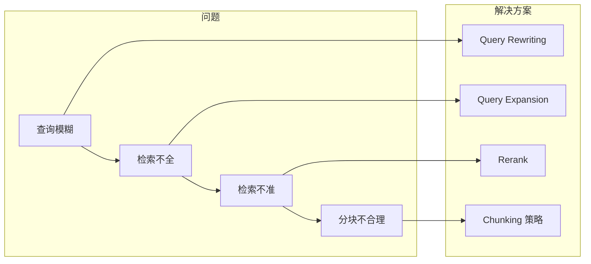
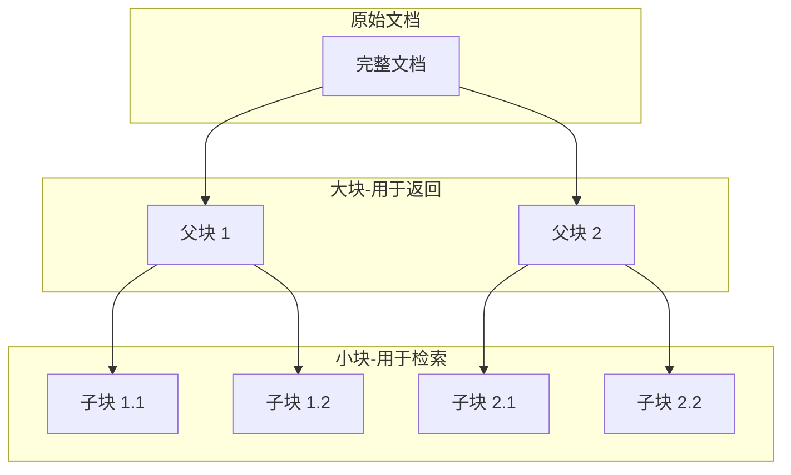
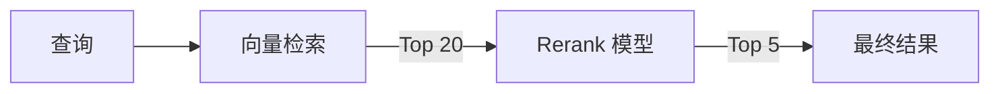
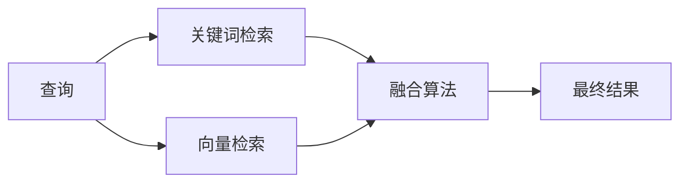
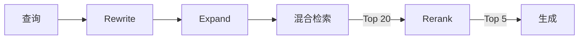

RAG 系统的效果很大程度上取决于检索质量。本文将介绍五种核心优化技术：Query Rewriting（查询重写）、Query Expansion（查询扩展）、Chunking 策略、Rerank（重排序）和混合检索。

## RAG 检索的常见问题

在实际应用中，RAG 检索经常遇到以下问题：

| 问题 | 表现 | 示例 |
|------|------|------|
| 查询表达模糊 | 用户问法与文档表达不一致 | "怎么请假" vs 文档"请假流程" |
| 检索不全面 | 遗漏相关文档 | 只检索到部分答案 |
| 检索不精准 | 返回无关文档 | 问退款返回报销文档 |
| 分块不合理 | 关键信息被切断 | 表格被截断失去意义 |



---

## 一、Query Rewriting（查询重写）

### 什么是 Query Rewriting？

用户的原始查询往往不够清晰或规范，通过 LLM 将其重写为更适合检索的形式。

```text
原始查询：怎么请假啊
重写后：公司请假流程是什么？请假需要哪些手续？
```

### 实现方式

**Prompt 模板**：

```text
请将以下用户查询重写为更适合搜索知识库的形式。
要求：
1. 更加清晰、具体
2. 使用正式的表达方式
3. 保持原意不变

原始查询：{original_query}

重写后的查询：
```

**伪代码**：

```text
function rewrite_query(original_query):
    prompt = 构建重写 Prompt（原始查询）
    rewritten = LLM.generate(prompt, temperature=0)
    return rewritten

# 示例
输入: "怎么请假啊"
输出: "公司的请假申请流程是怎样的？需要准备哪些材料？"
```

### 进阶：HyDE（假设文档嵌入）

HyDE（Hypothetical Document Embedding）是一种特殊的重写技术：让 LLM 生成一个**假设的答案文档**，用这个假设文档去检索真实文档。

**Prompt 模板**：

```text
请根据以下问题，写一段可能的答案内容（假设你知道答案）。
这段内容将用于搜索相关文档。

问题：{query}

假设的答案内容：
```

**伪代码**：

```text
function hyde_transform(query):
    prompt = 构建 HyDE Prompt（问题）
    hypothetical_doc = LLM.generate(prompt, temperature=0.7)
    embedding = Embed(hypothetical_doc)  # 用假设文档的 embedding 去检索
    return embedding

# 示例
输入: "公司年假有几天？"
假设文档: "根据公司规定，员工入职满一年后可享受年假。年假天数为5天..."
→ 用假设文档的 embedding 检索真实文档
```

**HyDE 的优势**：假设文档与真实文档的表达更接近，提高检索准确性。

---

## 二、Query Expansion（查询扩展）

### 什么是 Query Expansion？

将一个查询扩展为多个相关查询，增加检索的覆盖面。

```text
原始查询：退款政策
扩展查询：
  - 退款政策
  - 退货流程
  - 如何申请退款
  - 退款时间多久
```

### 实现方式

**Prompt 模板**：

```text
请将以下查询扩展为 {num_expansions} 个相关但不同的查询。
这些查询应该从不同角度覆盖用户可能想了解的信息。

原始查询：{original_query}

请以 JSON 数组格式返回扩展查询：
```

**伪代码**：

```text
function expand_query(original_query, num_expansions=3):
    prompt = 构建扩展 Prompt（原始查询, 扩展数量）
    expanded_queries = LLM.generate(prompt, temperature=0.7)
    return [original_query] + parse_json(expanded_queries)

# 示例
输入: "退款政策"
输出: ["退款政策", "如何申请退款", "退款需要多长时间", "哪些商品不支持退款"]
```

### 多查询检索

使用扩展查询进行多次检索，合并结果：

```text
function multi_query_retrieve(query, top_k=5):
    queries = expand_query(query)

    all_results = {}
    for q in queries:
        results = retrieve(q, top_k)
        for r in results:
            if r.id not in all_results:
                all_results[r.id] = r
                all_results[r.id].hit_count = 1
            else:
                all_results[r.id].score += r.score  // 累加分数
                all_results[r.id].hit_count += 1     // 增加命中次数

    return sort_by_score(all_results)[:top_k]
```

---

## 三、Chunking 策略

### 为什么 Chunking 很重要？

分块策略直接影响检索效果：
- **块太大**：包含过多无关信息，稀释相关性
- **块太小**：信息不完整，丢失上下文

### 常见分块策略

| 策略 | 描述 | 适用场景 |
|------|------|---------|
| 固定长度 | 按字符数切分 | 通用文本 |
| 句子分块 | 按句子切分 | 需要完整句子 |
| 段落分块 | 按段落切分 | 结构化文档 |
| 语义分块 | 按语义相似度切分 | 长文档 |
| 递归分块 | 多级分隔符递归切分 | LangChain 默认 |

### 递归分块（推荐）

按优先级依次尝试不同分隔符切分，确保语义完整：

```text
递归分块算法:
    分隔符优先级: [段落"\n\n", 换行"\n", 句号"。", 逗号"，", 空格" ", 字符""]

    function recursive_split(text, chunk_size=500, overlap=50):
        for separator in 分隔符优先级:
            if 能用该分隔符切分且每块 <= chunk_size:
                按该分隔符切分
                相邻块保留 overlap 字符重叠
                return chunks
        // 都不行则按字符强制切分
        return split_by_char(text, chunk_size, overlap)
```

### 语义分块

基于语义相似度进行分块，确保每块语义连贯：

```text
语义分块算法:
    1. 将文档按句子切分
    2. 计算相邻句子的 embedding 相似度
    3. 当相似度低于阈值时，在此处断开形成新块
    4. 相似度高的句子聚合为同一块

参数:
    - breakpoint_threshold: 断点阈值（如 95 百分位）
    - 低于阈值 → 语义跳跃 → 断开
```

### 层级分块（Parent Document Retriever）

保留父子关系，检索时返回更大的上下文：



```text
层级分块策略:
    父块大小: 2000 字符（用于返回，提供完整上下文）
    子块大小: 400 字符（用于检索，精确匹配）

索引阶段:
    1. 将文档切分为父块
    2. 每个父块再切分为多个子块
    3. 只对子块建立向量索引
    4. 维护子块 → 父块的映射关系

检索阶段:
    1. 用查询匹配子块（精确）
    2. 找到匹配子块的父块
    3. 返回父块（完整上下文）
```

---

## 四、Rerank（重排序）

### 什么是 Rerank？

向量检索返回的结果可能不够精准，Rerank 使用更精确的模型对结果重新排序。



### 为什么需要 Rerank？

| 阶段 | 模型 | 特点 |
|------|------|------|
| 向量检索 | Embedding 模型 | 快速，召回率高，精度一般 |
| Rerank | Cross-encoder | 较慢，精度高 |

**策略**：先用向量检索召回较多候选（如 Top 20），再用 Rerank 精排（返回 Top 5）。

### 实现方式

| 方式 | 模型 | 特点 |
|------|------|------|
| Cohere Rerank | rerank-english-v3.0 | API 服务，效果好，有免费额度 |
| Cross-encoder | BAAI/bge-reranker-large | 开源本地部署，无 API 费用 |
| LLM Rerank | GPT-4o-mini | 灵活，可解释，成本较高 |

#### 方式一：Cohere Rerank（推荐）

```text
function rerank_cohere(query, documents, top_n=5):
    response = Cohere.rerank(
        model="rerank-english-v3.0",
        query=query,
        documents=documents,
        top_n=top_n
    )
    return response.results  // 包含 index, relevance_score
```

#### 方式二：开源 Cross-encoder

```text
function rerank_cross_encoder(query, documents, top_n=5):
    model = CrossEncoder("BAAI/bge-reranker-large")

    // 构建 query-document 对
    pairs = [[query, doc] for doc in documents]

    // 计算相关性分数
    scores = model.predict(pairs)

    // 按分数降序排列
    return sort_by_score(zip(documents, scores))[:top_n]
```

#### 方式三：LLM Rerank

**Prompt 模板**：

```text
请根据查询与文档的相关性，对以下文档进行排序。
返回最相关的 {top_n} 个文档编号（用逗号分隔）。

查询：{query}

文档列表：
[1] {doc1_preview}...
[2] {doc2_preview}...
[3] {doc3_preview}...
...

最相关的文档编号（从高到低）：
```

**伪代码**：

```text
function rerank_llm(query, documents, top_n=5):
    doc_list = format_documents(documents)  // [1] xxx... [2] yyy...
    prompt = 构建 Rerank Prompt（query, doc_list, top_n）
    result = LLM.generate(prompt, temperature=0)
    indices = parse_indices(result)  // "1,3,2" → [0, 2, 1]
    return [documents[i] for i in indices[:top_n]]
```

---

## 五、混合检索

### 什么是混合检索？

结合**关键词检索**（BM25）和**向量检索**的优势：

| 检索方式 | 优势 | 劣势 |
|---------|------|------|
| 关键词（BM25） | 精确匹配专有名词、编号 | 无法理解语义 |
| 向量检索 | 理解语义，支持同义词 | 可能丢失精确匹配 |
| 混合检索 | 兼顾两者优势 | 实现稍复杂 |



### 实现方式

#### 加权融合（BM25 + 向量检索）

```text
混合检索算法:
    alpha = 0.5  // 向量检索权重

    function hybrid_retrieve(query, top_k=5):
        // 1. 两路检索
        bm25_scores = BM25.search(tokenize(query))
        vector_scores = VectorDB.search(embed(query))

        // 2. 归一化到 [0, 1]
        bm25_scores = normalize(bm25_scores)
        vector_scores = normalize(vector_scores)

        // 3. 加权融合
        hybrid_scores = alpha * vector_scores + (1 - alpha) * bm25_scores

        // 4. 按融合分数排序
        return sort_by_score(hybrid_scores)[:top_k]
```

#### RRF（Reciprocal Rank Fusion）

更简单的融合算法，不需要归一化，只看排名：

```text
RRF 公式: score(doc) = Σ 1 / (k + rank_i)
    - k: 常数（通常为 60）
    - rank_i: 文档在第 i 个排序列表中的排名

示例:
    BM25 排序:   [doc1, doc3, doc2, doc5, doc4]
    向量排序:    [doc2, doc1, doc4, doc3, doc6]

    doc1: 1/(60+1) + 1/(60+2) = 0.016 + 0.016 = 0.032
    doc2: 1/(60+3) + 1/(60+1) = 0.016 + 0.016 = 0.032
    doc3: 1/(60+2) + 1/(60+4) = 0.016 + 0.015 = 0.031

    融合结果: [doc1, doc2, doc3, ...]
```

---

## 优化技术组合策略

将多种优化技术组合使用：



```text
function optimized_rag_pipeline(query):
    // 1. 查询优化
    rewritten = rewrite_query(query)
    expanded = expand_query(rewritten)  // [原始, 扩展1, 扩展2]

    // 2. 混合检索（对每个查询）
    all_results = []
    for q in expanded:
        results = hybrid_retrieve(q, top_k=10)
        all_results.extend(results)

    // 3. 去重
    unique_results = deduplicate(all_results)

    // 4. Rerank（Top 20 → Top 5）
    reranked = rerank(rewritten, unique_results[:20], top_n=5)

    // 5. 生成回答
    answer = LLM.generate(query, context=reranked)

    return answer
```

---

## 总结

本文介绍了五种 RAG 检索优化技术：

| 技术 | 解决问题 | 关键点 |
|------|---------|-------|
| Query Rewriting | 查询表达不清晰 | LLM 重写、HyDE |
| Query Expansion | 检索覆盖不全 | 多查询、结果合并 |
| Chunking 策略 | 分块不合理 | 递归分块、语义分块、层级分块 |
| Rerank | 检索精度不够 | Cross-encoder、Cohere |
| 混合检索 | 单一检索方式局限 | BM25 + 向量、RRF 融合 |

**优化建议**：
1. 先做好 Chunking，这是基础
2. 添加 Rerank，性价比最高
3. 根据场景选择 Query 优化和混合检索

---

## 延伸阅读

**RAG 系列**：

1. [RAG 入门：让 AI 拥有外部知识](/posts/rag-introduction/) - RAG 基础概念
2. [RAG 核心组件：Embedding 与向量数据库](/posts/rag-embedding-vector-database/) - Embedding 原理与向量数据库选型
3. **本文**：RAG 优化：检索质量提升全攻略
4. [RAG 进阶：Self-RAG、Corrective RAG 与 Adaptive RAG](/posts/rag-advanced-variants/) - 前沿 RAG 变体
5. [RAG 评估：如何衡量 RAG 系统效果](/posts/rag-evaluation/) - RAGAS 框架与评估指标
