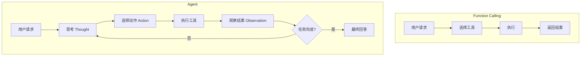

Function Calling 让 LLM 能够调用工具，但单纯的工具调用还不是 Agent。本文将介绍如何将 Function Calling 与 ReAct 等 Agent 架构结合，构建真正的智能体。

> 如果你还不了解 Function Calling 的实战技巧，建议先阅读 [Function Calling 实战：多工具编排与错误处理](/posts/function-calling-orchestration/)。

## Function Calling vs Agent

### 核心区别

| 特性 | 纯 Function Calling | Agent |
|------|-------------------|-------|
| 决策方式 | 一次性选择工具 | 多轮推理决策 |
| 推理能力 | 隐式推理 | 显式思考过程 |
| 任务复杂度 | 简单任务 | 复杂多步任务 |
| 自我反思 | 无 | 可根据结果调整策略 |

### 从工具调用到智能体



---

## ReAct 模式回顾

**ReAct**（Reasoning + Acting）是目前最常用的 Agent 架构，核心是 Thought-Action-Observation 循环。

```text
问题：北京和上海哪个城市今天更热？

Thought: 我需要分别查询北京和上海的天气来比较
Action: get_weather(location="北京")
Observation: 北京：晴，28°C

Thought: 已经知道北京的温度，现在查询上海
Action: get_weather(location="上海")
Observation: 上海：多云，32°C

Thought: 北京 28°C，上海 32°C，上海更热
Answer: 上海今天更热，气温 32°C，比北京高 4°C。
```

---

## 使用 Function Calling 实现 ReAct

### 方案一：Prompt + Function Calling

通过 Prompt 引导 LLM 按 ReAct 模式思考：

```python
from openai import OpenAI
import json

client = OpenAI()

REACT_SYSTEM_PROMPT = """你是一个智能助手，使用 ReAct 模式解决问题。

对于每个问题，你应该：
1. **Thought**: 思考当前情况，分析下一步该做什么
2. **Action**: 如果需要，调用合适的工具
3. **Observation**: 分析工具返回的结果
4. 重复以上步骤直到能够给出最终答案

在给出最终答案前，请确保你有足够的信息。"""

tools = [
    {
        "type": "function",
        "function": {
            "name": "get_weather",
            "description": "获取指定城市的当前天气和温度",
            "parameters": {
                "type": "object",
                "properties": {
                    "location": {"type": "string", "description": "城市名称"}
                },
                "required": ["location"]
            }
        }
    },
    {
        "type": "function",
        "function": {
            "name": "calculate",
            "description": "执行数学计算",
            "parameters": {
                "type": "object",
                "properties": {
                    "expression": {"type": "string", "description": "数学表达式"}
                },
                "required": ["expression"]
            }
        }
    },
    {
        "type": "function",
        "function": {
            "name": "search_web",
            "description": "搜索网络获取信息",
            "parameters": {
                "type": "object",
                "properties": {
                    "query": {"type": "string", "description": "搜索关键词"}
                },
                "required": ["query"]
            }
        }
    }
]


def execute_function(name: str, args: dict) -> str:
    if name == "get_weather":
        # 模拟天气 API
        weather_data = {
            "北京": "晴，28°C，湿度 40%",
            "上海": "多云，32°C，湿度 65%",
            "广州": "雷阵雨，30°C，湿度 80%"
        }
        return weather_data.get(args["location"], f"{args['location']}：天气数据暂无")

    elif name == "calculate":
        try:
            result = eval(args["expression"])
            return f"计算结果：{result}"
        except:
            return "计算错误"

    elif name == "search_web":
        return f"搜索 '{args['query']}' 的结果：[模拟搜索结果]"

    return f"未知函数：{name}"


def react_agent(user_message: str, max_iterations: int = 10) -> str:
    """ReAct Agent 实现"""
    messages = [
        {"role": "system", "content": REACT_SYSTEM_PROMPT},
        {"role": "user", "content": user_message}
    ]

    for i in range(max_iterations):
        response = client.chat.completions.create(
            model="gpt-4o-mini",
            messages=messages,
            tools=tools,
            tool_choice="auto"
        )

        assistant_message = response.choices[0].message

        # 如果没有工具调用，说明任务完成
        if not assistant_message.tool_calls:
            return assistant_message.content

        # 记录 LLM 的思考过程
        if assistant_message.content:
            print(f"[Thought] {assistant_message.content}")

        messages.append(assistant_message)

        # 执行所有工具调用
        for tool_call in assistant_message.tool_calls:
            func_name = tool_call.function.name
            func_args = json.loads(tool_call.function.arguments)

            print(f"[Action] {func_name}({func_args})")

            result = execute_function(func_name, func_args)

            print(f"[Observation] {result}")

            messages.append({
                "role": "tool",
                "tool_call_id": tool_call.id,
                "content": result
            })

    return "达到最大迭代次数，任务未完成"


# 测试
print("=" * 50)
answer = react_agent("北京和上海哪个城市今天更热？热多少度？")
print("=" * 50)
print(f"[Answer] {answer}")
```

### 输出示例

```text
==================================================
[Thought] 我需要分别查询北京和上海的天气来比较温度
[Action] get_weather({'location': '北京'})
[Observation] 晴，28°C，湿度 40%
[Action] get_weather({'location': '上海'})
[Observation] 多云，32°C，湿度 65%
[Thought] 现在我知道北京 28°C，上海 32°C，我来计算差值
[Action] calculate({'expression': '32 - 28'})
[Observation] 计算结果：4
==================================================
[Answer] 上海今天更热。上海气温 32°C，北京气温 28°C，上海比北京热 4°C。
```

---

## 方案二：结构化 ReAct

让 LLM 输出结构化的 ReAct 格式：

```python
import json
from typing import Optional
from pydantic import BaseModel

class ThoughtAction(BaseModel):
    thought: str
    action: Optional[str] = None
    action_input: Optional[dict] = None
    final_answer: Optional[str] = None

# 定义一个特殊的"思考"工具
react_tools = tools + [
    {
        "type": "function",
        "function": {
            "name": "think_and_act",
            "description": "记录你的思考过程，然后决定下一步行动或给出最终答案",
            "parameters": {
                "type": "object",
                "properties": {
                    "thought": {
                        "type": "string",
                        "description": "你的思考过程"
                    },
                    "next_action": {
                        "type": "string",
                        "enum": ["use_tool", "final_answer"],
                        "description": "下一步行动类型"
                    },
                    "tool_name": {
                        "type": "string",
                        "description": "要使用的工具名称（如果 next_action 是 use_tool）"
                    },
                    "tool_args": {
                        "type": "object",
                        "description": "工具参数（如果 next_action 是 use_tool）"
                    },
                    "answer": {
                        "type": "string",
                        "description": "最终答案（如果 next_action 是 final_answer）"
                    }
                },
                "required": ["thought", "next_action"]
            }
        }
    }
]


def structured_react_agent(user_message: str, max_iterations: int = 10) -> str:
    """结构化 ReAct Agent"""
    messages = [
        {
            "role": "system",
            "content": """你是一个智能助手。使用 think_and_act 工具来：
1. 记录你的思考
2. 决定使用哪个工具，或者给出最终答案

每一步都必须调用 think_and_act 来记录思考过程。"""
        },
        {"role": "user", "content": user_message}
    ]

    for i in range(max_iterations):
        response = client.chat.completions.create(
            model="gpt-4o-mini",
            messages=messages,
            tools=react_tools,
            tool_choice={"type": "function", "function": {"name": "think_and_act"}}
        )

        assistant_message = response.choices[0].message
        messages.append(assistant_message)

        if assistant_message.tool_calls:
            tool_call = assistant_message.tool_calls[0]
            args = json.loads(tool_call.function.arguments)

            print(f"[Thought] {args['thought']}")

            if args['next_action'] == 'final_answer':
                return args.get('answer', '无答案')

            elif args['next_action'] == 'use_tool':
                tool_name = args.get('tool_name')
                tool_args = args.get('tool_args', {})

                print(f"[Action] {tool_name}({tool_args})")
                result = execute_function(tool_name, tool_args)
                print(f"[Observation] {result}")

                messages.append({
                    "role": "tool",
                    "tool_call_id": tool_call.id,
                    "content": f"思考已记录。工具 {tool_name} 执行结果：{result}"
                })

    return "达到最大迭代次数"
```

---

## 添加记忆和反思

### 短期记忆

对话历史就是短期记忆，自动保留在 messages 中。

### 长期记忆

使用向量数据库存储重要信息：

```python
from typing import List
import chromadb

class AgentWithMemory:
    def __init__(self):
        self.client = OpenAI()
        self.memory = chromadb.Client()
        self.collection = self.memory.create_collection("agent_memory")
        self.memory_id = 0

    def remember(self, info: str, metadata: dict = None):
        """存储到长期记忆"""
        self.memory_id += 1
        self.collection.add(
            documents=[info],
            ids=[f"mem_{self.memory_id}"],
            metadatas=[metadata or {}]
        )

    def recall(self, query: str, n_results: int = 3) -> List[str]:
        """从长期记忆中检索"""
        results = self.collection.query(
            query_texts=[query],
            n_results=n_results
        )
        return results['documents'][0] if results['documents'] else []

    def react_with_memory(self, user_message: str) -> str:
        # 先检索相关记忆
        memories = self.recall(user_message)
        memory_context = "\n".join(memories) if memories else "无相关记忆"

        messages = [
            {
                "role": "system",
                "content": f"""你是一个有记忆能力的智能助手。

相关历史记忆：
{memory_context}

使用 ReAct 模式解决问题，并在获得重要信息后存储到记忆中。"""
            },
            {"role": "user", "content": user_message}
        ]

        # ... ReAct 循环 ...
```

### 反思机制

任务完成后进行反思：

```python
def reflect_on_task(self, task: str, result: str, steps: List[str]) -> str:
    """反思任务执行过程"""
    reflection_prompt = f"""任务：{task}

执行步骤：
{chr(10).join(steps)}

最终结果：{result}

请反思这次任务执行：
1. 哪些步骤是有效的？
2. 哪些步骤可以优化？
3. 学到了什么经验？"""

    response = self.client.chat.completions.create(
        model="gpt-4o-mini",
        messages=[{"role": "user", "content": reflection_prompt}]
    )

    reflection = response.choices[0].message.content

    # 存储反思结果
    self.remember(
        f"任务: {task}\n经验: {reflection}",
        metadata={"type": "reflection"}
    )

    return reflection
```

---

## 完整 Agent 实现

整合所有功能的完整 Agent：

```python
from dataclasses import dataclass
from typing import List, Optional
from enum import Enum

class ActionType(Enum):
    TOOL = "tool"
    ANSWER = "answer"

@dataclass
class AgentStep:
    thought: str
    action_type: ActionType
    action: Optional[str] = None
    action_input: Optional[dict] = None
    observation: Optional[str] = None
    answer: Optional[str] = None


class ReActAgent:
    def __init__(self, tools: List[dict], max_iterations: int = 10):
        self.client = OpenAI()
        self.tools = tools
        self.max_iterations = max_iterations
        self.steps: List[AgentStep] = []

    def run(self, task: str) -> str:
        """运行 Agent 完成任务"""
        self.steps = []

        messages = [
            {"role": "system", "content": self._get_system_prompt()},
            {"role": "user", "content": task}
        ]

        for i in range(self.max_iterations):
            response = self.client.chat.completions.create(
                model="gpt-4o-mini",
                messages=messages,
                tools=self.tools,
                tool_choice="auto"
            )

            assistant_message = response.choices[0].message

            # 记录思考（如果有）
            thought = assistant_message.content or ""

            if not assistant_message.tool_calls:
                # 任务完成
                step = AgentStep(
                    thought=thought,
                    action_type=ActionType.ANSWER,
                    answer=thought
                )
                self.steps.append(step)
                return thought

            messages.append(assistant_message)

            # 执行工具
            for tool_call in assistant_message.tool_calls:
                func_name = tool_call.function.name
                func_args = json.loads(tool_call.function.arguments)
                result = execute_function(func_name, func_args)

                step = AgentStep(
                    thought=thought,
                    action_type=ActionType.TOOL,
                    action=func_name,
                    action_input=func_args,
                    observation=result
                )
                self.steps.append(step)

                messages.append({
                    "role": "tool",
                    "tool_call_id": tool_call.id,
                    "content": result
                })

        return "任务未能在限定步数内完成"

    def _get_system_prompt(self) -> str:
        return """你是一个智能助手，使用 ReAct 模式解决问题。

对于复杂问题：
1. 先思考需要什么信息
2. 使用合适的工具获取信息
3. 分析结果，决定下一步
4. 重复直到能够给出答案

保持思考过程清晰，每一步都要有明确的目的。"""

    def get_trace(self) -> str:
        """获取执行轨迹"""
        trace = []
        for i, step in enumerate(self.steps, 1):
            trace.append(f"步骤 {i}:")
            trace.append(f"  思考: {step.thought}")
            if step.action_type == ActionType.TOOL:
                trace.append(f"  行动: {step.action}({step.action_input})")
                trace.append(f"  观察: {step.observation}")
            else:
                trace.append(f"  答案: {step.answer}")
        return "\n".join(trace)


# 使用
agent = ReActAgent(tools=tools)
result = agent.run("比较北京、上海、广州三个城市的天气，告诉我哪个最适合户外活动")
print(result)
print("\n执行轨迹:")
print(agent.get_trace())
```

---

## 总结

本文介绍了如何将 Function Calling 与 Agent 架构结合：

| 要点 | 说明 |
|------|------|
| ReAct 模式 | Thought-Action-Observation 循环 |
| Prompt 引导 | 通过 System Prompt 引导 ReAct 思考 |
| 结构化输出 | 使用工具强制结构化的思考过程 |
| 记忆机制 | 短期（对话历史）+ 长期（向量数据库） |
| 反思能力 | 任务完成后总结经验 |

Function Calling 是 Agent 的"手脚"，ReAct 是 Agent 的"大脑"，两者结合才能构建真正的智能体。

---

## 延伸阅读

**Function Calling 系列**：

1. [Function Calling 入门：让 LLM 结构化调用工具](/posts/function-calling-introduction/) - 基础概念
2. [Function Calling 实战：多工具编排与错误处理](/posts/function-calling-orchestration/) - 并行调用、错误处理
3. **本文**：Function Calling 与 Agent：从工具调用到智能体

**相关技术**：

- [ReAct 模式入门：让 AI 学会思考与行动](/posts/react-agent-introduction/) - ReAct 详解
- [ReAct 实战：从零构建一个能推理的 AI Agent](/posts/react-agent-implementation/) - 代码实现
- [MCP 入门：AI 工具调用的统一标准](/posts/mcp-introduction/) - 工具协议标准化
