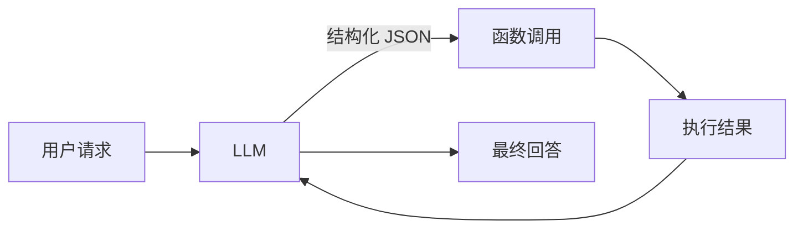
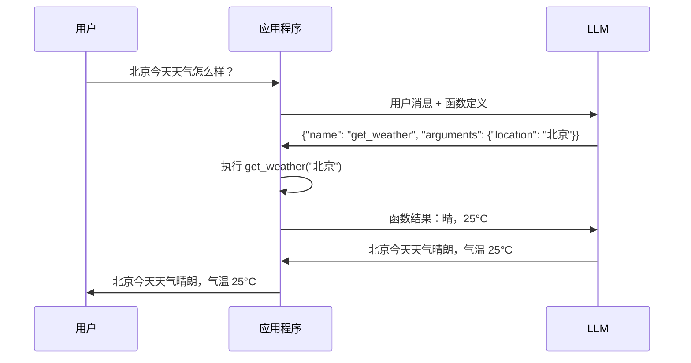

大语言模型（LLM）虽然擅长生成文本，但无法直接执行操作：查询数据库、调用 API、发送邮件。**Function Calling** 正是解决这个问题的关键技术，它让 LLM 能够以结构化的方式调用外部工具。

## 为什么需要 Function Calling？

### LLM 的局限

LLM 本质上只能生成文本，无法：

```text
❌ 查询实时天气
❌ 执行数据库操作
❌ 调用外部 API
❌ 读写文件
```

### 传统解决方案的问题

在 Function Calling 之前，让 LLM 调用工具需要：

1. 在 Prompt 中描述工具
2. 让 LLM 输出自然语言描述
3. 用正则表达式解析输出
4. 执行对应的函数

```python
# 传统方式：脆弱的字符串解析
response = "我需要调用 get_weather 函数，参数是 location=北京"

# 用正则解析（容易出错）
import re
match = re.search(r'调用 (\w+) 函数.*location=(\w+)', response)
if match:
    func_name = match.group(1)
    location = match.group(2)
```

**问题**：
- 输出格式不稳定
- 解析逻辑复杂
- 容易因格式变化而失败

---

## 什么是 Function Calling？

**Function Calling** 是 LLM 提供的一种能力：让模型以**结构化 JSON** 格式输出函数调用意图。



**核心思想**：
1. 预先定义函数的 **Schema**（名称、参数、类型）
2. LLM 根据用户请求，决定是否调用函数
3. 如果需要调用，输出结构化的 JSON
4. 应用程序执行函数，将结果返回给 LLM
5. LLM 基于结果生成最终回答

---

## Function Calling 工作流程



---

## OpenAI Function Calling 实战

### 1. 定义函数 Schema

使用 JSON Schema 格式描述函数：

```python
tools = [
    {
        "type": "function",
        "function": {
            "name": "get_weather",
            "description": "获取指定城市的当前天气",
            "parameters": {
                "type": "object",
                "properties": {
                    "location": {
                        "type": "string",
                        "description": "城市名称，如：北京、上海"
                    },
                    "unit": {
                        "type": "string",
                        "enum": ["celsius", "fahrenheit"],
                        "description": "温度单位"
                    }
                },
                "required": ["location"]
            }
        }
    }
]
```

### 2. 调用 API

```python
from openai import OpenAI

client = OpenAI()

def chat_with_tools(user_message: str):
    messages = [{"role": "user", "content": user_message}]

    # 第一次调用：让 LLM 决定是否使用工具
    response = client.chat.completions.create(
        model="gpt-4o-mini",
        messages=messages,
        tools=tools,
        tool_choice="auto"  # 自动决定是否调用
    )

    assistant_message = response.choices[0].message

    # 检查是否需要调用工具
    if assistant_message.tool_calls:
        # 处理工具调用
        tool_call = assistant_message.tool_calls[0]
        function_name = tool_call.function.name
        function_args = json.loads(tool_call.function.arguments)

        # 执行函数
        result = execute_function(function_name, function_args)

        # 将结果返回给 LLM
        messages.append(assistant_message)
        messages.append({
            "role": "tool",
            "tool_call_id": tool_call.id,
            "content": result
        })

        # 第二次调用：让 LLM 基于结果生成回答
        final_response = client.chat.completions.create(
            model="gpt-4o-mini",
            messages=messages
        )

        return final_response.choices[0].message.content

    return assistant_message.content


def execute_function(name: str, args: dict) -> str:
    """执行函数并返回结果"""
    if name == "get_weather":
        # 模拟天气 API
        return f"{args['location']}：晴，25°C，湿度 60%"
    return "未知函数"
```

### 3. 运行示例

```python
# 示例对话
print(chat_with_tools("北京今天天气怎么样？"))
# 输出：北京今天天气晴朗，气温 25°C，湿度 60%。

print(chat_with_tools("你好"))
# 输出：你好！有什么我可以帮助你的吗？（不调用工具）
```

---

## Claude Function Calling（Tool Use）

Claude 的 Function Calling 称为 **Tool Use**，API 格式略有不同。

### 定义工具

```python
tools = [
    {
        "name": "get_weather",
        "description": "获取指定城市的当前天气",
        "input_schema": {
            "type": "object",
            "properties": {
                "location": {
                    "type": "string",
                    "description": "城市名称"
                },
                "unit": {
                    "type": "string",
                    "enum": ["celsius", "fahrenheit"],
                    "description": "温度单位"
                }
            },
            "required": ["location"]
        }
    }
]
```

### 调用 API

```python
import anthropic

client = anthropic.Anthropic()

def chat_with_tools_claude(user_message: str):
    messages = [{"role": "user", "content": user_message}]

    # 第一次调用
    response = client.messages.create(
        model="claude-sonnet-4-20250514",
        max_tokens=1024,
        tools=tools,
        messages=messages
    )

    # 检查是否需要调用工具
    if response.stop_reason == "tool_use":
        # 找到工具调用块
        tool_use_block = next(
            block for block in response.content
            if block.type == "tool_use"
        )

        function_name = tool_use_block.name
        function_args = tool_use_block.input

        # 执行函数
        result = execute_function(function_name, function_args)

        # 将结果返回给 LLM
        messages.append({"role": "assistant", "content": response.content})
        messages.append({
            "role": "user",
            "content": [{
                "type": "tool_result",
                "tool_use_id": tool_use_block.id,
                "content": result
            }]
        })

        # 第二次调用
        final_response = client.messages.create(
            model="claude-sonnet-4-20250514",
            max_tokens=1024,
            tools=tools,
            messages=messages
        )

        return final_response.content[0].text

    return response.content[0].text
```

---

## OpenAI vs Claude 对比

| 特性 | OpenAI | Claude |
|------|--------|--------|
| 功能名称 | Function Calling / Tools | Tool Use |
| Schema 字段 | `parameters` | `input_schema` |
| 响应格式 | `tool_calls` 数组 | `content` 中的 `tool_use` 块 |
| 结果返回 | `role: "tool"` | `role: "user"` + `tool_result` |
| 停止原因 | `finish_reason: "tool_calls"` | `stop_reason: "tool_use"` |

**核心概念相同**：定义 Schema → LLM 决策 → 结构化输出 → 执行 → 返回结果

---

## 完整示例：多工具场景

定义多个工具，让 LLM 自动选择：

```python
tools = [
    {
        "type": "function",
        "function": {
            "name": "get_weather",
            "description": "获取指定城市的当前天气",
            "parameters": {
                "type": "object",
                "properties": {
                    "location": {"type": "string", "description": "城市名称"}
                },
                "required": ["location"]
            }
        }
    },
    {
        "type": "function",
        "function": {
            "name": "search_web",
            "description": "搜索网页获取信息",
            "parameters": {
                "type": "object",
                "properties": {
                    "query": {"type": "string", "description": "搜索关键词"}
                },
                "required": ["query"]
            }
        }
    },
    {
        "type": "function",
        "function": {
            "name": "send_email",
            "description": "发送邮件",
            "parameters": {
                "type": "object",
                "properties": {
                    "to": {"type": "string", "description": "收件人邮箱"},
                    "subject": {"type": "string", "description": "邮件主题"},
                    "body": {"type": "string", "description": "邮件正文"}
                },
                "required": ["to", "subject", "body"]
            }
        }
    }
]


def execute_function(name: str, args: dict) -> str:
    """执行函数"""
    if name == "get_weather":
        return f"{args['location']}：晴，25°C"
    elif name == "search_web":
        return f"搜索 '{args['query']}' 的结果：..."
    elif name == "send_email":
        return f"邮件已发送至 {args['to']}"
    return "未知函数"
```

```python
# LLM 会根据用户意图自动选择工具
chat_with_tools("北京天气如何？")      # → 调用 get_weather
chat_with_tools("搜索最新的 AI 新闻")   # → 调用 search_web
chat_with_tools("给 test@example.com 发一封问候邮件")  # → 调用 send_email
chat_with_tools("你好")                # → 不调用工具，直接回复
```

---

## tool_choice 参数

控制 LLM 如何选择工具：

| 值 | 含义 | 使用场景 |
|---|------|---------|
| `"auto"` | LLM 自动决定是否调用 | 默认选项，最灵活 |
| `"none"` | 禁止调用任何工具 | 只需要对话 |
| `"required"` | 必须调用某个工具 | 强制使用工具 |
| `{"type": "function", "function": {"name": "xxx"}}` | 强制调用指定工具 | 明确知道需要哪个工具 |

```python
# 强制使用工具
response = client.chat.completions.create(
    model="gpt-4o-mini",
    messages=messages,
    tools=tools,
    tool_choice="required"  # 必须调用工具
)

# 强制调用特定工具
response = client.chat.completions.create(
    model="gpt-4o-mini",
    messages=messages,
    tools=tools,
    tool_choice={"type": "function", "function": {"name": "get_weather"}}
)
```

---

## 最佳实践

### 1. 清晰的函数描述

```python
# ❌ 描述不清晰
{
    "name": "search",
    "description": "搜索"
}

# ✅ 描述清晰具体
{
    "name": "search_products",
    "description": "在商品数据库中搜索商品，支持按名称、类别、价格范围筛选"
}
```

### 2. 合理的参数设计

```python
# ❌ 参数过于宽泛
{
    "properties": {
        "data": {"type": "string", "description": "数据"}
    }
}

# ✅ 参数明确具体
{
    "properties": {
        "product_name": {"type": "string", "description": "商品名称关键词"},
        "category": {"type": "string", "enum": ["电子", "服装", "食品"]},
        "min_price": {"type": "number", "description": "最低价格"},
        "max_price": {"type": "number", "description": "最高价格"}
    }
}
```

### 3. 使用 enum 约束值

```python
{
    "unit": {
        "type": "string",
        "enum": ["celsius", "fahrenheit"],  # 限制可选值
        "description": "温度单位"
    }
}
```

### 4. 错误处理

```python
def execute_function(name: str, args: dict) -> str:
    try:
        if name == "get_weather":
            return get_weather(args["location"])
        # ...
    except KeyError as e:
        return f"参数错误：缺少 {e}"
    except Exception as e:
        return f"执行错误：{e}"
```

---

## 总结

本文介绍了 Function Calling 的核心概念：

1. **解决的问题**：让 LLM 能够结构化地调用外部工具
2. **工作流程**：定义 Schema → LLM 决策 → 结构化输出 → 执行 → 返回结果
3. **OpenAI vs Claude**：概念相同，API 格式略有差异
4. **最佳实践**：清晰的描述、合理的参数、enum 约束、错误处理

Function Calling 是构建 AI Agent 的基础设施，掌握它是迈向智能体开发的关键一步。

---

## 延伸阅读

**Function Calling 系列**：

1. **本文**：Function Calling 入门：让 LLM 结构化调用工具
2. [Function Calling 实战：多工具编排与错误处理](/posts/function-calling-orchestration/) - 并行调用、错误处理
3. [Function Calling 与 Agent：从工具调用到智能体](/posts/function-calling-agent-integration/) - 与 ReAct 结合

**相关技术**：

- [AI Agent 技术演进：从 RAG 到 MCP 的发展时间线](/posts/ai-agent-technology-timeline/) - 技术全景
- [ReAct 模式入门：让 AI 学会思考与行动](/posts/react-agent-introduction/) - Agent 架构
- [MCP 入门：AI 工具调用的统一标准](/posts/mcp-introduction/) - Function Calling 的标准化演进
