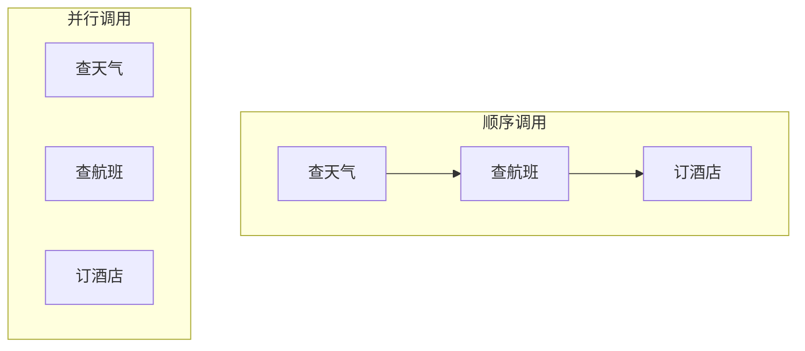
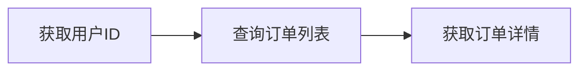

在实际应用中，一个用户请求往往需要调用多个工具，或者需要处理工具调用失败的情况。本文将深入讲解多工具编排、并行调用和错误处理的最佳实践。

> 如果你还不了解 Function Calling 的基础知识，建议先阅读 [Function Calling 入门：让 LLM 结构化调用工具](/posts/function-calling-introduction/)。

## 多工具调用场景

### 顺序调用 vs 并行调用



| 场景 | 调用方式 | 示例 |
|------|---------|------|
| 工具之间有依赖 | 顺序调用 | 先查用户信息，再查订单 |
| 工具之间无依赖 | 并行调用 | 同时查天气和新闻 |
| 需要多个信息综合 | 并行 + 汇总 | 查多个城市的天气后比较 |

---

## 并行调用实现

OpenAI 的 API 原生支持一次返回多个工具调用。

### 定义多个工具

```python
tools = [
    {
        "type": "function",
        "function": {
            "name": "get_weather",
            "description": "获取指定城市的当前天气",
            "parameters": {
                "type": "object",
                "properties": {
                    "location": {"type": "string", "description": "城市名称"}
                },
                "required": ["location"]
            }
        }
    },
    {
        "type": "function",
        "function": {
            "name": "get_news",
            "description": "获取指定话题的最新新闻",
            "parameters": {
                "type": "object",
                "properties": {
                    "topic": {"type": "string", "description": "新闻话题"}
                },
                "required": ["topic"]
            }
        }
    },
    {
        "type": "function",
        "function": {
            "name": "get_stock_price",
            "description": "获取股票价格",
            "parameters": {
                "type": "object",
                "properties": {
                    "symbol": {"type": "string", "description": "股票代码"}
                },
                "required": ["symbol"]
            }
        }
    }
]
```

### 处理多个工具调用

```python
import json
import asyncio
from concurrent.futures import ThreadPoolExecutor
from openai import OpenAI

client = OpenAI()

def execute_function(name: str, args: dict) -> str:
    """执行单个函数"""
    if name == "get_weather":
        return f"{args['location']}：晴，25°C"
    elif name == "get_news":
        return f"关于 {args['topic']} 的最新新闻：..."
    elif name == "get_stock_price":
        return f"{args['symbol']}：当前价格 $150.00"
    return f"未知函数：{name}"


def chat_with_parallel_tools(user_message: str) -> str:
    messages = [{"role": "user", "content": user_message}]

    response = client.chat.completions.create(
        model="gpt-4o-mini",
        messages=messages,
        tools=tools,
        tool_choice="auto"
    )

    assistant_message = response.choices[0].message

    # 检查是否有工具调用
    if not assistant_message.tool_calls:
        return assistant_message.content

    # 并行执行所有工具调用
    tool_results = []

    with ThreadPoolExecutor(max_workers=5) as executor:
        futures = []
        for tool_call in assistant_message.tool_calls:
            func_name = tool_call.function.name
            func_args = json.loads(tool_call.function.arguments)
            future = executor.submit(execute_function, func_name, func_args)
            futures.append((tool_call.id, future))

        # 收集结果
        for tool_call_id, future in futures:
            result = future.result()
            tool_results.append({
                "role": "tool",
                "tool_call_id": tool_call_id,
                "content": result
            })

    # 将所有结果返回给 LLM
    messages.append(assistant_message)
    messages.extend(tool_results)

    final_response = client.chat.completions.create(
        model="gpt-4o-mini",
        messages=messages
    )

    return final_response.choices[0].message.content


# 测试：LLM 会同时调用多个工具
print(chat_with_parallel_tools("告诉我北京的天气和最新的科技新闻"))
```

### 异步版本

```python
import asyncio
import aiohttp
from openai import AsyncOpenAI

async_client = AsyncOpenAI()

async def execute_function_async(name: str, args: dict) -> str:
    """异步执行函数"""
    # 模拟异步 API 调用
    await asyncio.sleep(0.1)

    if name == "get_weather":
        return f"{args['location']}：晴，25°C"
    elif name == "get_news":
        return f"关于 {args['topic']} 的最新新闻：..."
    elif name == "get_stock_price":
        return f"{args['symbol']}：当前价格 $150.00"
    return f"未知函数：{name}"


async def chat_with_parallel_tools_async(user_message: str) -> str:
    messages = [{"role": "user", "content": user_message}]

    response = await async_client.chat.completions.create(
        model="gpt-4o-mini",
        messages=messages,
        tools=tools,
        tool_choice="auto"
    )

    assistant_message = response.choices[0].message

    if not assistant_message.tool_calls:
        return assistant_message.content

    # 并行执行所有工具调用
    tasks = []
    for tool_call in assistant_message.tool_calls:
        func_name = tool_call.function.name
        func_args = json.loads(tool_call.function.arguments)
        tasks.append(execute_function_async(func_name, func_args))

    results = await asyncio.gather(*tasks)

    # 构建工具结果消息
    tool_results = []
    for tool_call, result in zip(assistant_message.tool_calls, results):
        tool_results.append({
            "role": "tool",
            "tool_call_id": tool_call.id,
            "content": result
        })

    messages.append(assistant_message)
    messages.extend(tool_results)

    final_response = await async_client.chat.completions.create(
        model="gpt-4o-mini",
        messages=messages
    )

    return final_response.choices[0].message.content


# 运行异步版本
result = asyncio.run(chat_with_parallel_tools_async("查询 AAPL 和 GOOGL 的股价"))
print(result)
```

---

## 顺序调用与工具链

当工具之间存在依赖关系时，需要顺序执行。

### 场景：查询用户订单



```python
tools = [
    {
        "type": "function",
        "function": {
            "name": "get_user_id",
            "description": "根据用户名获取用户ID",
            "parameters": {
                "type": "object",
                "properties": {
                    "username": {"type": "string"}
                },
                "required": ["username"]
            }
        }
    },
    {
        "type": "function",
        "function": {
            "name": "get_user_orders",
            "description": "根据用户ID获取订单列表",
            "parameters": {
                "type": "object",
                "properties": {
                    "user_id": {"type": "string"}
                },
                "required": ["user_id"]
            }
        }
    },
    {
        "type": "function",
        "function": {
            "name": "get_order_detail",
            "description": "获取订单详情",
            "parameters": {
                "type": "object",
                "properties": {
                    "order_id": {"type": "string"}
                },
                "required": ["order_id"]
            }
        }
    }
]


def chat_with_tool_chain(user_message: str, max_iterations: int = 5) -> str:
    """支持多轮工具调用的对话"""
    messages = [{"role": "user", "content": user_message}]

    for _ in range(max_iterations):
        response = client.chat.completions.create(
            model="gpt-4o-mini",
            messages=messages,
            tools=tools,
            tool_choice="auto"
        )

        assistant_message = response.choices[0].message

        # 如果没有工具调用，返回最终回答
        if not assistant_message.tool_calls:
            return assistant_message.content

        # 执行工具调用
        messages.append(assistant_message)

        for tool_call in assistant_message.tool_calls:
            func_name = tool_call.function.name
            func_args = json.loads(tool_call.function.arguments)
            result = execute_function(func_name, func_args)

            messages.append({
                "role": "tool",
                "tool_call_id": tool_call.id,
                "content": result
            })

    return "达到最大迭代次数"


# 示例：LLM 会自动进行多轮工具调用
print(chat_with_tool_chain("查询用户 john_doe 的最新订单详情"))
```

---

## 错误处理

### 工具执行错误

```python
def execute_function_with_error_handling(name: str, args: dict) -> dict:
    """带错误处理的函数执行"""
    try:
        if name == "get_weather":
            # 模拟可能的错误
            if args.get("location") == "unknown":
                raise ValueError("未知的城市")
            return {"success": True, "data": f"{args['location']}：晴，25°C"}

        elif name == "get_stock_price":
            # 模拟 API 超时
            import random
            if random.random() < 0.1:
                raise TimeoutError("API 请求超时")
            return {"success": True, "data": f"{args['symbol']}：$150.00"}

        return {"success": False, "error": f"未知函数：{name}"}

    except ValueError as e:
        return {"success": False, "error": f"参数错误：{str(e)}"}
    except TimeoutError as e:
        return {"success": False, "error": f"超时错误：{str(e)}"}
    except Exception as e:
        return {"success": False, "error": f"执行错误：{str(e)}"}


def format_tool_result(result: dict) -> str:
    """格式化工具结果"""
    if result["success"]:
        return result["data"]
    else:
        return f"[错误] {result['error']}"
```

### 重试机制

```python
from tenacity import retry, stop_after_attempt, wait_exponential

@retry(
    stop=stop_after_attempt(3),
    wait=wait_exponential(multiplier=1, min=1, max=10)
)
def execute_with_retry(name: str, args: dict) -> str:
    """带重试的函数执行"""
    result = execute_function_with_error_handling(name, args)
    if not result["success"]:
        raise Exception(result["error"])
    return result["data"]


def chat_with_retry(user_message: str) -> str:
    messages = [{"role": "user", "content": user_message}]

    response = client.chat.completions.create(
        model="gpt-4o-mini",
        messages=messages,
        tools=tools,
        tool_choice="auto"
    )

    assistant_message = response.choices[0].message

    if not assistant_message.tool_calls:
        return assistant_message.content

    messages.append(assistant_message)

    for tool_call in assistant_message.tool_calls:
        func_name = tool_call.function.name
        func_args = json.loads(tool_call.function.arguments)

        try:
            result = execute_with_retry(func_name, func_args)
        except Exception as e:
            result = f"工具调用失败：{str(e)}"

        messages.append({
            "role": "tool",
            "tool_call_id": tool_call.id,
            "content": result
        })

    final_response = client.chat.completions.create(
        model="gpt-4o-mini",
        messages=messages
    )

    return final_response.choices[0].message.content
```

### 优雅降级

```python
def execute_with_fallback(name: str, args: dict) -> str:
    """带降级策略的函数执行"""
    try:
        # 主要执行逻辑
        return execute_function(name, args)
    except Exception as primary_error:
        try:
            # 尝试备用方案
            return execute_fallback(name, args)
        except Exception as fallback_error:
            # 返回友好的错误信息
            return f"无法获取信息，请稍后重试。(错误：{primary_error})"


def execute_fallback(name: str, args: dict) -> str:
    """备用执行逻辑"""
    if name == "get_weather":
        # 返回缓存的天气数据
        return f"{args['location']}：天气信息暂不可用，通常为晴朗"
    elif name == "get_stock_price":
        # 返回最后已知价格
        return f"{args['symbol']}：最新价格暂不可用"
    return "备用方案不可用"
```

---

## 参数验证

在执行函数前验证参数：

```python
from pydantic import BaseModel, Field, ValidationError
from typing import Optional

class WeatherParams(BaseModel):
    location: str = Field(..., min_length=1, description="城市名称")
    unit: Optional[str] = Field("celsius", pattern="^(celsius|fahrenheit)$")

class StockParams(BaseModel):
    symbol: str = Field(..., pattern="^[A-Z]{1,5}$", description="股票代码")


def validate_and_execute(name: str, args: dict) -> str:
    """验证参数并执行函数"""
    try:
        if name == "get_weather":
            params = WeatherParams(**args)
            return f"{params.location}：晴，25°C"

        elif name == "get_stock_price":
            params = StockParams(**args)
            return f"{params.symbol}：$150.00"

        return f"未知函数：{name}"

    except ValidationError as e:
        errors = [f"{err['loc'][0]}: {err['msg']}" for err in e.errors()]
        return f"参数验证失败：{'; '.join(errors)}"
```

---

## 工具执行日志

记录工具调用用于调试和审计：

```python
import logging
from datetime import datetime
from dataclasses import dataclass, asdict
import json

logging.basicConfig(level=logging.INFO)
logger = logging.getLogger(__name__)

@dataclass
class ToolCallLog:
    timestamp: str
    function_name: str
    arguments: dict
    result: str
    duration_ms: float
    success: bool

    def to_dict(self):
        return asdict(self)


class ToolExecutor:
    def __init__(self):
        self.logs: list[ToolCallLog] = []

    def execute(self, name: str, args: dict) -> str:
        start_time = datetime.now()

        try:
            result = execute_function(name, args)
            success = True
        except Exception as e:
            result = str(e)
            success = False

        duration_ms = (datetime.now() - start_time).total_seconds() * 1000

        log = ToolCallLog(
            timestamp=start_time.isoformat(),
            function_name=name,
            arguments=args,
            result=result,
            duration_ms=duration_ms,
            success=success
        )

        self.logs.append(log)
        logger.info(f"Tool call: {json.dumps(log.to_dict(), ensure_ascii=False)}")

        return result

    def get_logs(self) -> list[dict]:
        return [log.to_dict() for log in self.logs]


# 使用
executor = ToolExecutor()
result = executor.execute("get_weather", {"location": "北京"})
print(executor.get_logs())
```

---

## 完整示例：智能助手

综合以上技术，构建一个完整的工具调用系统：

```python
class SmartAssistant:
    def __init__(self):
        self.client = OpenAI()
        self.executor = ToolExecutor()
        self.tools = self._define_tools()

    def _define_tools(self):
        return [
            # ... 工具定义
        ]

    def chat(self, user_message: str, max_iterations: int = 5) -> str:
        messages = [{"role": "user", "content": user_message}]

        for iteration in range(max_iterations):
            response = self.client.chat.completions.create(
                model="gpt-4o-mini",
                messages=messages,
                tools=self.tools,
                tool_choice="auto"
            )

            assistant_message = response.choices[0].message

            if not assistant_message.tool_calls:
                return assistant_message.content

            messages.append(assistant_message)

            # 并行执行工具调用
            tool_results = self._execute_tools_parallel(
                assistant_message.tool_calls
            )

            messages.extend(tool_results)

        return "处理超时，请简化您的请求"

    def _execute_tools_parallel(self, tool_calls) -> list[dict]:
        results = []

        with ThreadPoolExecutor(max_workers=5) as executor:
            futures = {}
            for tool_call in tool_calls:
                func_name = tool_call.function.name
                func_args = json.loads(tool_call.function.arguments)
                future = executor.submit(
                    self.executor.execute, func_name, func_args
                )
                futures[tool_call.id] = future

            for tool_call_id, future in futures.items():
                try:
                    result = future.result(timeout=30)
                except Exception as e:
                    result = f"执行错误：{str(e)}"

                results.append({
                    "role": "tool",
                    "tool_call_id": tool_call_id,
                    "content": result
                })

        return results


# 使用
assistant = SmartAssistant()
print(assistant.chat("查询北京和上海的天气，以及最新的科技新闻"))
```

---

## 总结

本文介绍了 Function Calling 的进阶技巧：

| 技术 | 应用场景 | 关键点 |
|------|---------|-------|
| 并行调用 | 多个独立工具 | ThreadPoolExecutor / asyncio |
| 顺序调用 | 工具有依赖 | 多轮对话循环 |
| 错误处理 | 工具可能失败 | 重试、降级、日志 |
| 参数验证 | 防止无效调用 | Pydantic 验证 |

---

## 延伸阅读

**Function Calling 系列**：

1. [Function Calling 入门：让 LLM 结构化调用工具](/posts/function-calling-introduction/) - 基础概念
2. **本文**：Function Calling 实战：多工具编排与错误处理
3. [Function Calling 与 Agent：从工具调用到智能体](/posts/function-calling-agent-integration/) - 与 ReAct 结合

**相关技术**：

- [ReAct 模式入门](/posts/react-agent-introduction/) - 思考+行动循环
- [MCP 入门：AI 工具调用的统一标准](/posts/mcp-introduction/) - 标准化协议
