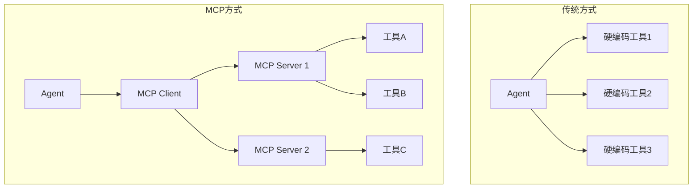

MCP 不仅定义了工具协议，还支持动态发现工具。本文将介绍如何构建一个 MCP Client，让 Agent 能够动态连接 MCP Server 并使用其工具。

> 如果你还不了解如何开发 MCP Server，建议先阅读 [MCP 实战：用 Python 开发你的第一个 MCP Server](/posts/mcp-server-development/)。

## 为什么需要 MCP Client？

### 传统方式 vs MCP 方式



**MCP 方式的优势**：
- 动态发现工具，无需重新部署 Agent
- 工具可插拔，灵活扩展
- 工具与 Agent 解耦

---

## 构建 MCP Client

### 基础 Client 实现

```python
# mcp_client.py
import asyncio
import json
from contextlib import asynccontextmanager
from mcp import ClientSession
from mcp.client.stdio import stdio_client, StdioServerParameters


class MCPClient:
    """MCP Client 封装"""

    def __init__(self):
        self.sessions: dict[str, ClientSession] = {}
        self.tools: dict[str, dict] = {}  # 工具名 -> 工具信息

    async def connect(self, name: str, command: str, args: list[str] = None):
        """连接到 MCP Server"""
        server_params = StdioServerParameters(
            command=command,
            args=args or []
        )

        # 启动 Server 进程并建立连接
        stdio_transport = await stdio_client(server_params)
        read, write = stdio_transport

        session = ClientSession(read, write)
        await session.initialize()

        self.sessions[name] = session

        # 发现并缓存工具
        await self._discover_tools(name, session)

        print(f"已连接到 {name}，发现 {len(self.tools)} 个工具")

    async def _discover_tools(self, server_name: str, session: ClientSession):
        """发现 Server 提供的工具"""
        result = await session.list_tools()

        for tool in result.tools:
            self.tools[tool.name] = {
                "server": server_name,
                "session": session,
                "name": tool.name,
                "description": tool.description,
                "inputSchema": tool.inputSchema
            }

    async def call_tool(self, name: str, arguments: dict) -> str:
        """调用工具"""
        if name not in self.tools:
            raise ValueError(f"未知工具：{name}")

        tool_info = self.tools[name]
        session = tool_info["session"]

        result = await session.call_tool(name, arguments)

        # 提取文本内容
        texts = []
        for content in result.content:
            if hasattr(content, 'text'):
                texts.append(content.text)

        return "\n".join(texts)

    def get_tools_schema(self) -> list[dict]:
        """获取所有工具的 Schema（用于 LLM）"""
        return [
            {
                "type": "function",
                "function": {
                    "name": tool["name"],
                    "description": tool["description"],
                    "parameters": tool["inputSchema"]
                }
            }
            for tool in self.tools.values()
        ]

    async def close(self):
        """关闭所有连接"""
        for session in self.sessions.values():
            await session.close()
        self.sessions.clear()
        self.tools.clear()
```

### 使用 Client

```python
async def main():
    client = MCPClient()

    # 连接到多个 MCP Server
    await client.connect(
        "weather",
        "python",
        ["path/to/weather_server.py"]
    )

    await client.connect(
        "calculator",
        "python",
        ["path/to/calculator_server.py"]
    )

    # 查看可用工具
    print("可用工具：")
    for name, tool in client.tools.items():
        print(f"  - {name}: {tool['description']}")

    # 调用工具
    result = await client.call_tool("get_weather", {"city": "北京"})
    print(f"天气结果：{result}")

    await client.close()


asyncio.run(main())
```

---

## 集成到 ReAct Agent

### 完整实现

```python
# mcp_agent.py
import asyncio
import json
from openai import OpenAI
from mcp_client import MCPClient


class MCPReActAgent:
    """集成 MCP 的 ReAct Agent"""

    def __init__(self):
        self.llm = OpenAI()
        self.mcp_client = MCPClient()
        self.system_prompt = """你是一个智能助手，使用 ReAct 模式解决问题。

对于每个问题：
1. Thought: 思考需要什么信息
2. Action: 调用合适的工具
3. Observation: 分析工具结果
4. 重复直到能给出答案

只在有足够信息时给出最终答案。"""

    async def connect_servers(self, servers: list[dict]):
        """连接到 MCP Servers"""
        for server in servers:
            await self.mcp_client.connect(
                server["name"],
                server["command"],
                server.get("args", [])
            )

    async def run(self, task: str, max_iterations: int = 10) -> str:
        """运行 Agent 完成任务"""
        tools = self.mcp_client.get_tools_schema()

        messages = [
            {"role": "system", "content": self.system_prompt},
            {"role": "user", "content": task}
        ]

        for i in range(max_iterations):
            response = self.llm.chat.completions.create(
                model="gpt-4o-mini",
                messages=messages,
                tools=tools if tools else None,
                tool_choice="auto" if tools else None
            )

            assistant_message = response.choices[0].message

            # 打印思考过程
            if assistant_message.content:
                print(f"[Thought] {assistant_message.content}")

            # 如果没有工具调用，任务完成
            if not assistant_message.tool_calls:
                return assistant_message.content

            messages.append(assistant_message)

            # 执行所有工具调用
            for tool_call in assistant_message.tool_calls:
                func_name = tool_call.function.name
                func_args = json.loads(tool_call.function.arguments)

                print(f"[Action] {func_name}({func_args})")

                try:
                    result = await self.mcp_client.call_tool(func_name, func_args)
                except Exception as e:
                    result = f"工具调用失败：{e}"

                print(f"[Observation] {result}")

                messages.append({
                    "role": "tool",
                    "tool_call_id": tool_call.id,
                    "content": result
                })

        return "任务未能在限定步数内完成"

    async def close(self):
        await self.mcp_client.close()


# 使用示例
async def main():
    agent = MCPReActAgent()

    # 连接到 MCP Servers
    await agent.connect_servers([
        {
            "name": "weather",
            "command": "python",
            "args": ["servers/weather_server.py"]
        },
        {
            "name": "calculator",
            "command": "python",
            "args": ["servers/calculator_server.py"]
        }
    ])

    # 运行任务
    result = await agent.run("北京和上海哪个城市更热？热多少度？")
    print(f"\n最终答案：{result}")

    await agent.close()


if __name__ == "__main__":
    asyncio.run(main())
```

### 运行效果

```text
[Thought] 我需要分别查询北京和上海的天气来比较温度
[Action] get_weather({'city': '北京'})
[Observation] 北京：晴，25°C
[Action] get_weather({'city': '上海'})
[Observation] 上海：多云，28°C
[Thought] 现在我知道北京 25°C，上海 28°C，我来计算差值
[Action] calculate({'expression': '28 - 25'})
[Observation] 28 - 25 = 3

最终答案：上海更热，气温 28°C，比北京高 3°C。
```

---

## 动态工具发现

### 热更新工具

当 MCP Server 添加新工具时，Agent 可以动态发现：

```python
class MCPClient:
    # ... 其他代码 ...

    async def refresh_tools(self, server_name: str = None):
        """刷新工具列表"""
        if server_name:
            # 刷新指定 Server
            session = self.sessions.get(server_name)
            if session:
                # 清除该 Server 的旧工具
                self.tools = {
                    k: v for k, v in self.tools.items()
                    if v["server"] != server_name
                }
                await self._discover_tools(server_name, session)
        else:
            # 刷新所有
            self.tools.clear()
            for name, session in self.sessions.items():
                await self._discover_tools(name, session)

        print(f"工具列表已更新，共 {len(self.tools)} 个工具")
```

### 工具变更通知

MCP 支持 Server 主动通知工具变更：

```python
# 在 MCP Server 中
@server.tools_changed()
async def notify_tools_changed():
    """工具列表发生变化时调用"""
    pass  # SDK 会自动发送通知

# 在 Client 中处理通知
async def handle_tools_changed(self, server_name: str):
    """处理工具变更通知"""
    await self.refresh_tools(server_name)
    print(f"Server {server_name} 的工具列表已更新")
```

---

## 多 Agent 协作

多个 Agent 共享 MCP Client：

```python
class AgentPool:
    """Agent 池，共享 MCP Client"""

    def __init__(self):
        self.mcp_client = MCPClient()
        self.agents: list[MCPReActAgent] = []

    async def add_agent(self, name: str) -> MCPReActAgent:
        agent = MCPReActAgent()
        agent.mcp_client = self.mcp_client  # 共享 Client
        agent.name = name
        self.agents.append(agent)
        return agent

    async def run_parallel(self, tasks: list[str]) -> list[str]:
        """并行运行多个任务"""
        results = await asyncio.gather(*[
            agent.run(task)
            for agent, task in zip(self.agents, tasks)
        ])
        return results


async def main():
    pool = AgentPool()

    # 连接共享的 MCP Servers
    await pool.mcp_client.connect("weather", "python", ["weather_server.py"])

    # 创建多个 Agent
    agent1 = await pool.add_agent("Agent-1")
    agent2 = await pool.add_agent("Agent-2")

    # 并行执行任务
    tasks = [
        "北京今天天气怎么样？",
        "上海今天天气怎么样？"
    ]
    results = await pool.run_parallel(tasks)

    for task, result in zip(tasks, results):
        print(f"任务: {task}")
        print(f"结果: {result}\n")
```

---

## 资源管理

Agent 也可以读取 MCP Server 提供的资源：

```python
class MCPClient:
    # ... 其他代码 ...

    async def list_resources(self, server_name: str = None) -> list[dict]:
        """列出可用资源"""
        resources = []

        sessions_to_check = (
            [(server_name, self.sessions[server_name])]
            if server_name
            else self.sessions.items()
        )

        for name, session in sessions_to_check:
            try:
                result = await session.list_resources()
                for resource in result.resources:
                    resources.append({
                        "server": name,
                        "uri": str(resource.uri),
                        "name": resource.name,
                        "mimeType": resource.mimeType
                    })
            except Exception as e:
                print(f"获取 {name} 的资源列表失败：{e}")

        return resources

    async def read_resource(self, uri: str) -> str:
        """读取资源内容"""
        # 找到对应的 Server
        for name, session in self.sessions.items():
            try:
                result = await session.read_resource(uri)
                texts = []
                for content in result.contents:
                    if hasattr(content, 'text'):
                        texts.append(content.text)
                return "\n".join(texts)
            except Exception:
                continue

        raise ValueError(f"无法读取资源：{uri}")
```

### 在 Agent 中使用资源

```python
class MCPReActAgent:
    # ... 其他代码 ...

    async def run_with_context(self, task: str, resource_uris: list[str] = None):
        """带上下文资源运行"""
        context = ""

        if resource_uris:
            # 读取资源作为上下文
            for uri in resource_uris:
                try:
                    content = await self.mcp_client.read_resource(uri)
                    context += f"\n--- 资源: {uri} ---\n{content}\n"
                except Exception as e:
                    print(f"读取资源 {uri} 失败：{e}")

        # 将上下文加入任务
        if context:
            task = f"""参考以下资源信息：
{context}

任务：{task}"""

        return await self.run(task)
```

---

## 完整示例

```python
# complete_example.py
import asyncio
from mcp_agent import MCPReActAgent


async def main():
    agent = MCPReActAgent()

    # 连接多个 MCP Servers
    await agent.connect_servers([
        {"name": "weather", "command": "python", "args": ["servers/weather.py"]},
        {"name": "calculator", "command": "python", "args": ["servers/calc.py"]},
        {"name": "knowledge", "command": "python", "args": ["servers/knowledge.py"]}
    ])

    # 查看可用工具
    print("可用工具：")
    for name, tool in agent.mcp_client.tools.items():
        print(f"  - {name}: {tool['description']}")

    # 查看可用资源
    resources = await agent.mcp_client.list_resources()
    print("\n可用资源：")
    for r in resources:
        print(f"  - {r['name']} ({r['uri']})")

    # 运行复杂任务
    print("\n" + "="*50)
    result = await agent.run(
        "查询北京、上海、广州的天气，找出最热的城市，并计算它比最冷的城市高多少度"
    )
    print("="*50)
    print(f"\n最终答案：{result}")

    await agent.close()


if __name__ == "__main__":
    asyncio.run(main())
```

---

## 总结

本文介绍了 MCP 与 Agent 的集成方式：

| 功能 | 实现 |
|------|------|
| MCP Client | 连接和管理 MCP Servers |
| 动态工具发现 | `list_tools()` + 缓存 |
| 工具调用 | `call_tool()` |
| ReAct 集成 | 将 MCP 工具转换为 LLM tools |
| 资源访问 | `list_resources()` + `read_resource()` |
| 多 Agent | 共享 MCP Client |

---

## 延伸阅读

**MCP 系列**：

1. [MCP 入门：AI 工具调用的统一标准](/posts/mcp-introduction/) - 基础概念
2. [MCP 实战：用 Python 开发你的第一个 MCP Server](/posts/mcp-server-development/) - Server 开发
3. **本文**：MCP 与 Agent 集成：让 Agent 动态发现和调用工具
4. [MCP 实战：用 OpenAI Agents SDK 快速构建 Agent](/posts/mcp-openai-agents-sdk/) - SDK 集成（推荐）

**相关技术**：

- [Function Calling 与 Agent：从工具调用到智能体](/posts/function-calling-agent-integration/) - Agent 架构
- [ReAct 模式入门](/posts/react-agent-introduction/) - 思考+行动循环
