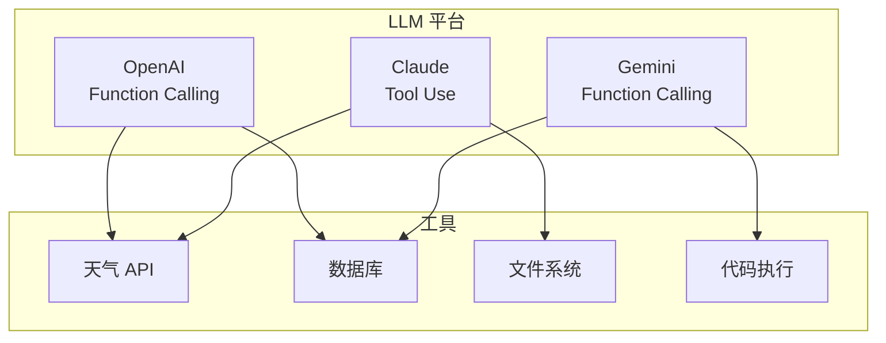
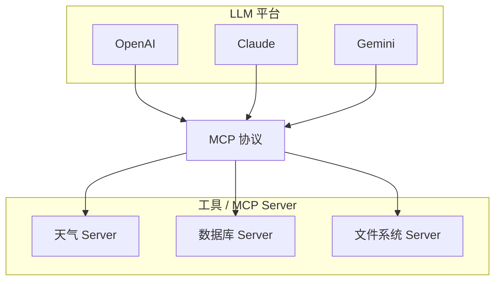
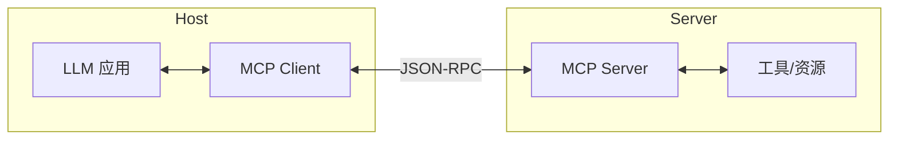

不同的 LLM 有不同的工具调用 API，不同的工具有不同的接入方式。**MCP**（Model Context Protocol）正是为了解决这个碎片化问题而诞生的统一标准。

## 工具调用的碎片化问题

### 现状

每个 LLM 平台都有自己的工具调用 API：



**问题**：
- 每个工具需要为每个 LLM 平台单独适配
- M 个 LLM × N 个工具 = M×N 种实现
- 开发成本高，维护困难

### MCP 的解决方案



**优势**：
- 统一的协议标准
- 工具只需实现一次，所有 LLM 都能用
- 生态共享，社区贡献

---

## 什么是 MCP？

**MCP**（Model Context Protocol，模型上下文协议）是 Anthropic 在 2024 年 11 月发布的开放标准，定义了 AI 应用与工具之间的通信协议。

### 核心概念

| 概念           | 说明                                           |
| -------------- | ---------------------------------------------- |
| **MCP Host**   | 运行 LLM 的应用（如 Claude Desktop、IDE 插件） |
| **MCP Client** | Host 中负责与 Server 通信的组件                |
| **MCP Server** | 提供工具、资源、提示词的服务端                 |
| **Transport**  | 通信方式（stdio、HTTP+SSE）                    |

### 架构图



---

## MCP 提供的能力

MCP Server 可以向 Host 提供三种类型的能力：

### 1. Tools（工具）

让 LLM 执行操作，如查询数据库、调用 API。

```json
{
  "name": "get_weather",
  "description": "获取城市天气",
  "inputSchema": {
    "type": "object",
    "properties": {
      "city": {"type": "string"}
    },
    "required": ["city"]
  }
}
```

### 2. Resources（资源）

向 LLM 暴露数据，如文件内容、数据库记录。

```json
{
  "uri": "file:///path/to/document.md",
  "name": "项目文档",
  "mimeType": "text/markdown"
}
```

### 3. Prompts（提示词模板）

预定义的提示词，用于特定场景。

```json
{
  "name": "code_review",
  "description": "代码审查模板",
  "arguments": [
    {"name": "code", "description": "要审查的代码"}
  ]
}
```

---

## MCP 通信协议

MCP 使用 **JSON-RPC 2.0** 作为消息格式，支持两种传输方式：

| 方式         | 描述                       | 适用场景     |
| ------------ | -------------------------- | ------------ |
| **stdio**    | 标准输入输出               | 本地进程通信 |
| **HTTP+SSE** | HTTP 请求 + 服务器推送事件 | 远程服务     |

---

## MCP 协议方法

MCP Client 与 Server 通过以下 JSON-RPC 方法进行交互：

| 方法             | 用途                                     |
| ---------------- | ---------------------------------------- |
| `initialize`     | 握手阶段，协商协议版本和能力             |
| `tools/list`     | 询问 Server 有哪些可用工具               |
| `tools/call`     | 调用 Server 的某个工具执行操作           |
| `resources/list` | 询问 Server 有哪些可读取的资源           |
| `resources/read` | 读取 Server 暴露的某个资源内容           |
| `prompts/list`   | 询问 Server 有哪些预定义提示词模板       |
| `prompts/get`    | 获取某个提示词模板的具体内容             |

---

## MCP 与 Function Calling 的关系

| 维度   | Function Calling    | MCP                  |
| ------ | ------------------- | -------------------- |
| 定位   | LLM 平台的 API 特性 | 跨平台通信协议       |
| 范围   | 工具调用            | 工具 + 资源 + 提示词 |
| 标准化 | 各平台不同          | 统一标准             |
| 实现方 | LLM 提供商          | 社区 / 第三方        |

**关系**：MCP 可以看作 Function Calling 的**标准化和扩展**。

> **延伸**：MCP 解决的是 **Agent ↔ 工具**的连接（垂直整合），而 Google 的 **A2A**（Agent-to-Agent）协议解决的是 **Agent ↔ Agent** 的通信（水平协作）。两者定位不同，互为补充。

---

## MCP 生态系统

### 官方 SDK

| 语言       | 包名                        | 用途                   |
| ---------- | --------------------------- | ---------------------- |
| Python     | `mcp`                       | 开发 MCP Server/Client |
| TypeScript | `@modelcontextprotocol/sdk` | 开发 MCP Server/Client |

### 官方 MCP Servers

Anthropic 提供了多个官方 MCP Server：

| Server                                    | 功能              |
| ----------------------------------------- | ----------------- |
| `@modelcontextprotocol/server-filesystem` | 文件系统操作      |
| `@modelcontextprotocol/server-github`     | GitHub API        |
| `@modelcontextprotocol/server-postgres`   | PostgreSQL 数据库 |
| `@modelcontextprotocol/server-sqlite`     | SQLite 数据库     |
| `@modelcontextprotocol/server-puppeteer`  | 网页自动化        |

### 社区 Servers

社区贡献了大量 MCP Server，覆盖：
- 云服务（AWS、Google Cloud）
- 开发工具（Docker、Kubernetes）
- 数据源（各类数据库、API）
- 生产力工具（Notion、Slack）

查看完整列表：[MCP Servers](https://github.com/modelcontextprotocol/servers)

---

## 总结

本文介绍了 MCP 的核心概念：

| 要点       | 说明                      |
| ---------- | ------------------------- |
| 解决的问题 | LLM 工具调用的碎片化      |
| 核心组件   | Host、Client、Server      |
| 提供的能力 | Tools、Resources、Prompts |
| 通信协议   | JSON-RPC 2.0              |
| 传输方式   | stdio、HTTP+SSE           |

MCP 是 AI 工具生态的重要基础设施，掌握它可以让你的 Agent 接入丰富的工具生态。

---

## 延伸阅读

**MCP 系列**：

1. **本文**：MCP 入门：AI 工具调用的统一标准
2. [MCP 实战：用 Python 开发你的第一个 MCP Server](/posts/mcp-server-development/) - Server 开发
3. [MCP 与 Agent 集成：让 Agent 动态发现和调用工具](/posts/mcp-agent-integration/) - 手动实现
4. [MCP 实战：用 OpenAI Agents SDK 快速构建 Agent](/posts/mcp-openai-agents-sdk/) - SDK 集成

**相关技术**：

- [Function Calling 入门：让 LLM 结构化调用工具](/posts/function-calling-introduction/) - 工具调用基础
- [AI Agent 技术演进：从 RAG 到 MCP 的发展时间线](/posts/ai-agent-technology-timeline/) - 技术全景

**官方资源**：

- [MCP 官方文档](https://modelcontextprotocol.io/)
- [MCP GitHub](https://github.com/modelcontextprotocol)
