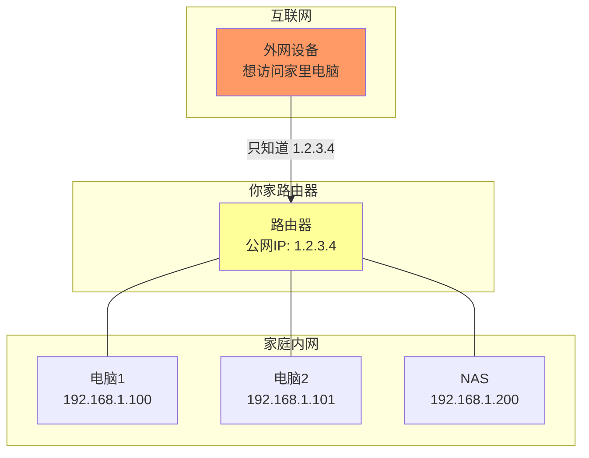
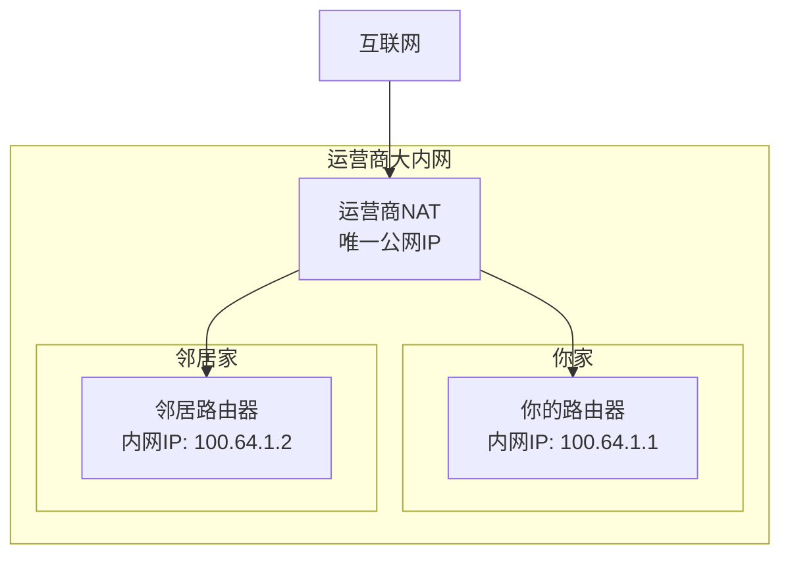
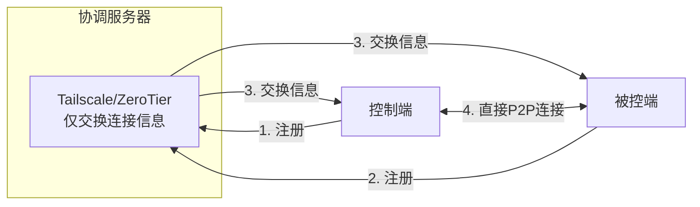
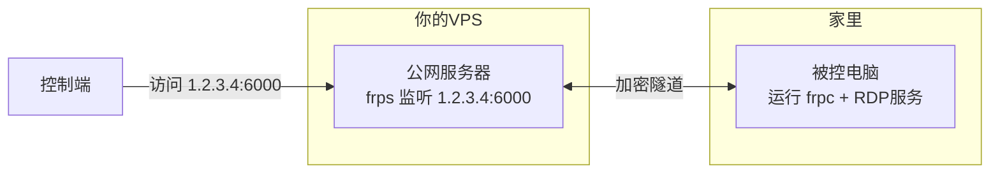
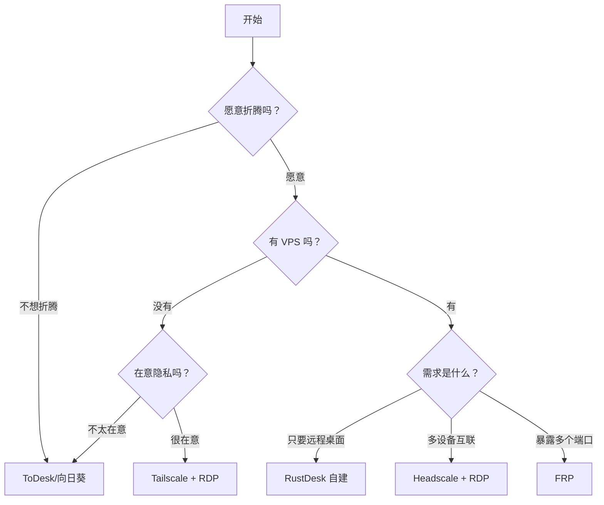

出门在外，突然需要访问家里电脑上的文件；父母电脑出了问题，你想远程帮忙看看；或者你想在公司摸鱼时连回家里的游戏主机……这些场景都需要**远程控制**。

但问题来了：**为什么不能像访问网站一样，直接连接家里的电脑呢？**

## 什么是远程控制

远程控制，简单说就是通过网络操作另一台电脑。你在控制端看到被控端的屏幕，鼠标键盘的操作实时传输过去。

**典型应用场景**：
- **远程办公**：在家访问公司电脑
- **技术支持**：远程帮父母/朋友修电脑
- **文件访问**：取家里电脑上忘带的文件
- **HomeLab**：管理家里的服务器、NAS
- **游戏串流**：用手机/笔记本玩家里的游戏主机

## 为什么外网访问这么难

### 内网 vs 外网：快递地址的比喻

想象你住在一个大型小区里：

- **内网地址**（如 `192.168.1.100`）：就像你的门牌号「3栋502」
- **外网地址**（公网 IP）：就像小区的地址「XX市XX路XX号」

快递员送快递时：
1. 先找到小区地址（公网 IP）
2. 再根据门牌号找到你（内网地址）

**问题是**：快递员（外网请求）只知道小区地址，不知道你的门牌号！

### NAT：小区门卫大爷

**NAT**（网络地址转换）就像小区门卫大爷：

- **出去时**：你告诉门卫「我去 XX 公司办事」，门卫记下「3栋502 去 XX 公司了」
- **回来时**：XX 公司派人来访，门卫查记录「3栋502 刚去过 XX 公司」，放行并指路

但如果外面有人直接来找你呢？

> "你找谁？3栋502？我这没他出门的记录，不让进！" —— NAT 门卫

这就是为什么**外网无法直接访问内网设备**的原因。

### 公网 IP：越来越稀缺

IPv4 地址只有约 43 亿个，早就不够用了。现在大多数家庭宽带都是「大内网」：

**如何判断你有没有公网 IP**：
1. 浏览器搜索「我的IP」，记下结果（如 `1.2.3.4`）
2. 登录路由器后台，查看 WAN 口 IP
3. 如果两者一致 → 恭喜，你有公网 IP
4. 如果不一致 → 你在运营商的大内网里

> 没有公网 IP 也不用担心，后面的方案都能解决。

## 解决方案分类

既然直接访问行不通，我们需要「曲线救国」。根据原理不同，主要有三类方案：

### 方案一：中继服务（商业软件）

**原理**：双方都连接到一个公网服务器，由服务器转发数据。

**代表软件**：ToDesk、向日葵、TeamViewer、RustDesk

**优点**：
- 开箱即用，无需配置
- 不需要公网 IP
- 对小白友好

**缺点**：
- 数据经过第三方服务器（隐私风险）
- 免费版有限制（时长、画质、水印）
- 依赖服务商（服务器挂了就用不了）

### 方案二：P2P 打洞（虚拟组网）

**原理**：两台设备通过「打洞」技术直接建立连接，像在同一个局域网一样。

**代表软件**：Tailscale、ZeroTier、EasyTier

**优点**：
- P2P 直连，延迟低
- 直连成功时，数据不经过第三方
- 组成虚拟局域网，可以用系统自带的远程桌面

**缺点**：
- 打洞可能失败（需要中继备用）
- 有一定学习成本
- 国内直连率不高（需自建中继）

### 方案三：内网穿透（端口映射）

**原理**：租一台有公网 IP 的服务器，把内网端口「映射」出去。

**代表软件**：FRP、NPS、花生壳、Cloudflare Tunnel

**优点**：
- 完全自主可控
- 可穿透各种端口（SSH、Web、数据库等）
- 一次配置，永久使用

**缺点**：
- 需要有一台 VPS（有成本）
- 配置相对复杂
- 速度受限于 VPS 带宽

## 如何选择适合你的方案

根据你的情况，选择最合适的方案：

### 快速推荐

| 你的情况 | 推荐方案 | 文章链接 |
|----------|----------|----------|
| 小白，不想折腾 | ToDesk / 向日葵 | [商业工具对比]() |
| 在意隐私，有 VPS | RustDesk 自建 | [RustDesk 自建]() |
| 多设备互联 | Tailscale / Headscale | [Tailscale]() / [Headscale]() |
| 需要暴露多个端口 | FRP | [FRP 内网穿透]() |

## 系列文章导航

本系列共 7 篇文章，从入门到进阶，覆盖主流方案：

1. **远程控制入门**（本文）- 概念和方案选择
2. [商业工具对比]() - ToDesk/向日葵/RustDesk 实测
3. [RustDesk 自建]() - 10分钟拥有私有远程桌面
4. [Tailscale 入门]() - 把所有设备连成局域网
5. [Headscale 自建]() - 完全自主的 Tailscale
6. [FRP 内网穿透]() - 传统但可靠的方案
7. [安全最佳实践]() - 保护你的远程连接

**阅读建议**：

- **小白用户**：本文 → [商业工具对比]() →（满足需求则止步）
- **注重隐私**：本文 → [RustDesk 自建]() → [安全最佳实践]()
- **多设备互联**：本文 → [Tailscale 入门]() → [Headscale 自建]()
- **技术爱好者**：全部按顺序阅读

## 小结

- 外网无法直接访问内网，是因为 **NAT** 和 **公网 IP 稀缺**
- 解决方案主要有三类：**中继服务**、**P2P 打洞**、**内网穿透**
- 选择方案时，考虑：是否愿意折腾、是否有 VPS、是否在意隐私

下一篇，我们来实际对比几款主流远程控制软件的使用体验。
