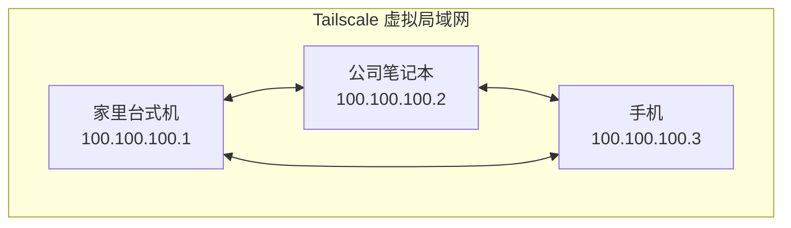
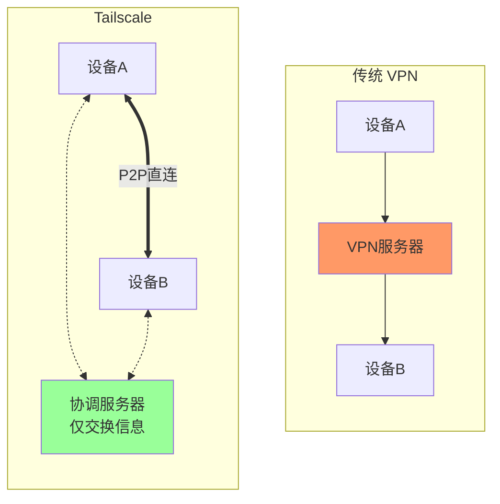
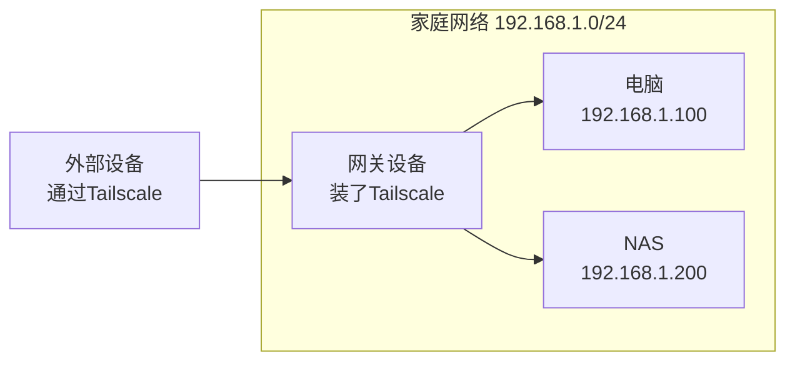

前几篇介绍了专门的远程桌面软件。本篇介绍另一种思路：**虚拟组网**。使用 Tailscale 把你的所有设备连成一个虚拟局域网，然后用系统自带的远程桌面（Windows RDP、VNC 等）连接。

## 什么是 Tailscale

### 虚拟局域网

想象你有这些设备：
- 家里的台式机（北京）
- 公司的笔记本（上海）
- 随身携带的手机（任何地方）

它们分散在不同网络，原本互相无法访问。

**Tailscale 做的事**：把它们组成一个虚拟局域网，每台设备获得一个 `100.x.x.x` 的内网 IP，可以像在同一个局域网一样直接互访。



### 与传统 VPN 的区别

**传统 VPN**（如 OpenVPN）：
- 所有流量都经过 VPN 服务器
- 服务器成为瓶颈和单点故障
- 延迟高

**Tailscale**（基于 WireGuard）：
- 设备之间 **P2P 直连**
- 协调服务器只用于交换连接信息
- 延迟低，不受服务器带宽限制



### WireGuard 协议

Tailscale 底层使用 **WireGuard** 协议，这是目前最先进的 VPN 协议之一：

- **性能极佳**：比 OpenVPN 快 3-4 倍
- **代码精简**：仅约 4000 行代码（OpenVPN 有数十万行）
- **现代加密**：使用 Curve25519、ChaCha20、Poly1305
- **连接快速**：毫秒级建立连接

## 快速上手

### 步骤 1：注册账号

1. 访问 [Tailscale 官网](https://tailscale.com/)
2. 点击 **Get Started**
3. 使用 Google/Microsoft/GitHub 账号登录

> Tailscale 免费版支持 **100 台设备**，个人使用完全够用。

### 步骤 2：安装客户端

#### Windows

1. 下载 [Windows 客户端](https://tailscale.com/download/windows)
2. 运行安装程序
3. 系统托盘会出现 Tailscale 图标
4. 点击图标 → **Log in** → 浏览器登录

#### macOS

```bash
# 方式一：官网下载
# 访问 https://tailscale.com/download/mac

# 方式二：Homebrew
brew install --cask tailscale
```

安装后在菜单栏找到 Tailscale 图标，点击登录。

#### Linux

```bash
# Ubuntu/Debian
curl -fsSL https://tailscale.com/install.sh | sh

# 启动并登录
sudo tailscale up
```

执行后会输出一个 URL，在浏览器打开完成登录。

#### iOS / Android

在 App Store 或 Google Play 搜索 **Tailscale**，安装后登录同一账号。

### 步骤 3：验证连接

登录后，每台设备会获得一个 `100.x.x.x` 的 IP 地址。

**查看设备 IP**：

- **网页控制台**：登录 [Tailscale Admin](https://login.tailscale.com/admin/machines)
- **命令行**：`tailscale ip`
- **客户端界面**：点击托盘图标查看

**测试连通性**：

```bash
# 在设备 A 上 ping 设备 B
ping 100.100.100.2
```

如果能 ping 通，说明虚拟局域网已经建立成功！

## 搭配 Windows 远程桌面

这是 Tailscale 最常见的使用场景：用系统自带的远程桌面（RDP）连接。

### 为什么比专门软件更好

| 对比项 | 专门软件 (ToDesk等) | Tailscale + RDP |
|--------|---------------------|-----------------|
| 画质 | 取决于软件 | 原生画质 |
| 延迟 | 经服务器中转 | P2P 直连 |
| 功能 | 仅远程桌面 | 完整局域网体验 |
| 成本 | 可能收费 | 免费 |

### 配置步骤

#### 1. 被控端：开启远程桌面

**Windows 专业版/企业版**：

1. 右键「此电脑」→「属性」
2. 点击「远程桌面」
3. 打开「启用远程桌面」

**Windows 家庭版**：

家庭版不支持远程桌面服务端，需要使用第三方工具如 [RDP Wrapper](https://github.com/stascorp/rdpwrap)。

#### 2. 控制端：连接

1. 按 `Win + R`，输入 `mstsc`，打开远程桌面连接
2. 在「计算机」栏输入被控端的 **Tailscale IP**（如 `100.100.100.1`）
3. 点击「连接」
4. 输入被控端的 Windows 用户名和密码

```
┌─────────────────────────────────────┐
│  远程桌面连接                        │
├─────────────────────────────────────┤
│  计算机: [100.100.100.1        ]    │
│                                     │
│  [显示选项] [连接] [帮助]            │
└─────────────────────────────────────┘
```

#### 3. 优化设置

为获得最佳体验，可以调整远程桌面设置：

- **显示**：根据网络状况选择分辨率
- **本地资源**：可以映射本地磁盘、剪贴板
- **体验**：根据网络质量选择效果

## 实用功能

### Exit Node（出口节点）

将某台设备设为「出口节点」，其他设备的网络流量可以通过它出去。

**使用场景**：
- 在外面时，通过家里的网络访问局域网资源
- 使用家里的宽带 IP 访问地区限制的内容

**配置方法**：

```bash
# 在出口节点设备上（如家里的电脑）
sudo tailscale up --advertise-exit-node

# 在控制台中批准该出口节点
# https://login.tailscale.com/admin/machines

# 在需要使用的设备上
tailscale up --exit-node=<出口节点IP>
```

### Subnet Router（子网路由）

如果家里有多台设备但不想每台都装 Tailscale，可以用子网路由。

**原理**：一台设备充当网关，暴露整个子网。



**配置方法**：

```bash
# 在网关设备上
sudo tailscale up --advertise-routes=192.168.1.0/24

# 在控制台中批准路由
# 其他设备现在可以访问 192.168.1.x 网段
```

### MagicDNS

Tailscale 提供内置 DNS，可以用设备名代替 IP 访问。

```bash
# 不用记 IP，直接用设备名
ping my-desktop
ssh my-server
```

在控制台的 **DNS** 设置中启用 **MagicDNS**。

## 国内使用优化

Tailscale 的协调服务器在海外，国内用户可能遇到：
- 登录慢
- P2P 打洞失败率高
- 需要走中继时延迟高

### 解决方案

#### 1. 使用 DERP 中继

当 P2P 打洞失败时，Tailscale 会使用 DERP 服务器中继流量。官方的 DERP 服务器在海外，延迟高。

解决方法：自建国内 DERP 服务器（见下一篇 Headscale 教程）。

#### 2. 改善打洞成功率

确保路由器开启 **UPnP** 功能，提高 NAT 打洞成功率：

- 登录路由器后台
- 找到 UPnP 设置并启用

#### 3. 使用 Headscale

如果对 Tailscale 的依赖和延迟不满意，可以自建 **Headscale**（Tailscale 协调服务器的开源实现），详见下一篇。

## 免费版限制

Tailscale 免费版（Personal）：

| 项目 | 限制 |
|------|------|
| 设备数 | 100 台 |
| 用户数 | 1 人 |
| 子网路由 | 支持 |
| 出口节点 | 支持 |
| MagicDNS | 支持 |
| ACL | 基础 |

对于个人用户，免费版完全够用。如果需要团队协作或更高级的访问控制，可以考虑付费版或自建 Headscale。

## 小结

本文介绍了 Tailscale 的基本使用：

- **核心概念**：虚拟局域网、P2P 直连、WireGuard
- **快速上手**：注册、安装、登录
- **搭配 RDP**：用系统远程桌面获得最佳体验
- **高级功能**：出口节点、子网路由、MagicDNS

Tailscale 的优势在于：
- 组成虚拟局域网后，不仅仅能远程桌面，还能访问 NAS、SSH、各种服务
- P2P 直连延迟低
- 配置简单，跨平台支持好

如果你想**完全自主控制**，或者解决国内使用的延迟问题，请继续阅读下一篇：Headscale 自建。

---

## 系列文章导航

1. [远程控制入门]() - 概念和方案选择
2. [商业工具对比]() - ToDesk/向日葵/RustDesk 实测
3. [RustDesk 自建]() - 10分钟拥有私有远程桌面
4. **Tailscale 入门**（本文）- 把所有设备连成局域网
5. [Headscale 自建]() - 完全自主的 Tailscale
6. [FRP 内网穿透]() - 传统但可靠的方案
7. [安全最佳实践]() - 保护你的远程连接
