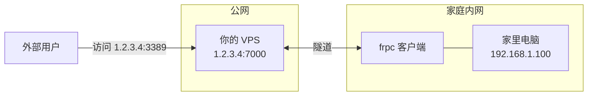

前几篇介绍了专门的远程桌面软件和虚拟组网方案。本篇介绍一种更底层的方案：**内网穿透**。使用 FRP 将内网端口映射到公网，不仅可以实现远程桌面，还能穿透任意 TCP/UDP 端口。

## 什么是 FRP

**FRP**（Fast Reverse Proxy）是一款高性能的反向代理应用，可以将内网服务暴露到公网。

### 工作原理



**核心概念**：
- **frps**：服务端，运行在有公网 IP 的 VPS 上
- **frpc**：客户端，运行在内网设备上
- **隧道**：frpc 主动连接 frps，建立加密隧道
- **端口映射**：外部访问 VPS 的端口，流量转发到内网设备

### 与其他方案的对比

| 方案 | 延迟 | 灵活性 | 复杂度 | 适用场景 |
|------|------|--------|--------|----------|
| RustDesk | 低 | 仅远程桌面 | 简单 | 远程桌面 |
| Tailscale | 最低(P2P) | 虚拟局域网 | 中等 | 多设备互联 |
| **FRP** | 中等 | **任意端口** | 较复杂 | 各种服务 |

**FRP 的优势**：不仅仅是远程桌面，可以穿透任何 TCP/UDP 端口。

## 准备工作

### 服务器要求

| 项目 | 要求 |
|------|------|
| VPS | 有公网 IP |
| 带宽 | 至少 1Mbps |
| 系统 | Linux (推荐 Ubuntu) |

### 下载 FRP

从 [GitHub Release](https://github.com/fatedier/frp/releases) 下载最新版本。

```bash
# 在 VPS 和内网设备上都需要下载
VERSION=0.60.0  # 替换为最新版本

# Linux AMD64
wget https://github.com/fatedier/frp/releases/download/v${VERSION}/frp_${VERSION}_linux_amd64.tar.gz
tar -xzf frp_${VERSION}_linux_amd64.tar.gz
cd frp_${VERSION}_linux_amd64

# 服务端只需要 frps 和 frps.toml
# 客户端只需要 frpc 和 frpc.toml
```

## 部署服务端（frps）

### 步骤 1：配置 frps

在 VPS 上创建配置文件 `/opt/frp/frps.toml`：

```toml
# frps.toml - FRP 服务端配置

# 服务端监听端口
bindPort = 7000

# Dashboard 管理面板（可选）
webServer.addr = "0.0.0.0"
webServer.port = 7500
webServer.user = "admin"
webServer.password = "你的密码"

# 认证配置
auth.method = "token"
auth.token = "你的安全令牌"

# 日志配置
log.to = "/var/log/frps.log"
log.level = "info"
log.maxDays = 7
```

> **重要**：`auth.token` 用于客户端认证，请设置一个强密码。

### 步骤 2：创建 Systemd 服务

```bash
sudo cat > /etc/systemd/system/frps.service << 'EOF'
[Unit]
Description=FRP Server
After=network.target

[Service]
Type=simple
ExecStart=/opt/frp/frps -c /opt/frp/frps.toml
Restart=on-failure
RestartSec=5s

[Install]
WantedBy=multi-user.target
EOF
```

### 步骤 3：启动服务

```bash
sudo systemctl daemon-reload
sudo systemctl enable frps
sudo systemctl start frps

# 检查状态
sudo systemctl status frps
```

### 步骤 4：开放防火墙端口

```bash
# 服务端口
sudo ufw allow 7000/tcp

# Dashboard 端口（可选）
sudo ufw allow 7500/tcp

# 预留端口范围（用于端口映射）
sudo ufw allow 6000:6100/tcp
```

> 云厂商安全组也需要开放相应端口。

## 部署客户端（frpc）

### 场景一：远程桌面穿透

将家里电脑的 RDP 端口（3389）映射到公网。

**客户端配置** `frpc.toml`：

```toml
# frpc.toml - FRP 客户端配置

# 服务端地址
serverAddr = "你的VPS公网IP"
serverPort = 7000

# 认证
auth.method = "token"
auth.token = "你的安全令牌"  # 与服务端一致

# 远程桌面穿透
[[proxies]]
name = "rdp"
type = "tcp"
localIP = "127.0.0.1"
localPort = 3389
remotePort = 6001  # 公网访问端口
```

**启动客户端**：

```bash
./frpc -c frpc.toml
```

**连接远程桌面**：

使用 Windows 远程桌面连接 `你的VPS:6001`

### 场景二：SSH 穿透

将家里 Linux 服务器的 SSH 穿透出去。

```toml
[[proxies]]
name = "ssh"
type = "tcp"
localIP = "127.0.0.1"
localPort = 22
remotePort = 6002
```

连接：`ssh -p 6002 user@你的VPS`

### 场景三：Web 服务穿透

将家里的 Web 服务（如 NAS 管理面板）穿透出去。

```toml
[[proxies]]
name = "nas-web"
type = "tcp"
localIP = "192.168.1.200"  # NAS 的内网 IP
localPort = 5000
remotePort = 6003
```

访问：`http://你的VPS:6003`

### 场景四：HTTP/HTTPS 穿透（使用域名）

如果有域名，可以使用 HTTP 类型，配合虚拟主机。

**服务端配置**添加：

```toml
# frps.toml
vhostHTTPPort = 80
vhostHTTPSPort = 443
```

**客户端配置**：

```toml
[[proxies]]
name = "web"
type = "http"
localIP = "127.0.0.1"
localPort = 8080
customDomains = ["home.你的域名.com"]
```

将 `home.你的域名.com` 解析到 VPS IP 后，访问该域名即可。

## 完整配置示例

### 服务端（frps.toml）

```toml
# FRP 服务端完整配置

bindPort = 7000
vhostHTTPPort = 80
vhostHTTPSPort = 443

# Dashboard
webServer.addr = "0.0.0.0"
webServer.port = 7500
webServer.user = "admin"
webServer.password = "secure_password_here"

# 认证
auth.method = "token"
auth.token = "your_secure_token_here"

# 日志
log.to = "/var/log/frps.log"
log.level = "info"
log.maxDays = 7

# 允许的端口范围（安全考虑）
allowPorts = [
    { start = 6000, end = 6100 },
]
```

### 客户端（frpc.toml）

```toml
# FRP 客户端完整配置

serverAddr = "1.2.3.4"  # 替换为 VPS IP
serverPort = 7000

auth.method = "token"
auth.token = "your_secure_token_here"

# 日志
log.to = "./frpc.log"
log.level = "info"
log.maxDays = 3

# 远程桌面
[[proxies]]
name = "rdp"
type = "tcp"
localIP = "127.0.0.1"
localPort = 3389
remotePort = 6001

# SSH
[[proxies]]
name = "ssh"
type = "tcp"
localIP = "127.0.0.1"
localPort = 22
remotePort = 6002

# NAS Web
[[proxies]]
name = "nas"
type = "tcp"
localIP = "192.168.1.200"
localPort = 5000
remotePort = 6003

# 网站（使用域名）
[[proxies]]
name = "blog"
type = "http"
localIP = "127.0.0.1"
localPort = 8080
customDomains = ["home.example.com"]
```

## 安全加固

### 1. 使用 TLS 加密

**服务端**：

```toml
# frps.toml
transport.tls.force = true
```

**客户端**：

```toml
# frpc.toml
transport.tls.enable = true
```

### 2. 端口白名单

限制客户端可以使用的端口范围：

```toml
# frps.toml
allowPorts = [
    { start = 6000, end = 6100 },
]
```

### 3. 强 Token

使用足够复杂的 token：

```bash
# 生成随机 token
openssl rand -base64 32
```

### 4. 启用 STCP（加密 P2P）

对于敏感服务，可以使用 STCP 类型，需要访问端也运行 frpc：

**被访问端**：

```toml
[[proxies]]
name = "secret_ssh"
type = "stcp"
secretKey = "shared_secret"
localIP = "127.0.0.1"
localPort = 22
```

**访问端**：

```toml
[[visitors]]
name = "secret_ssh_visitor"
type = "stcp"
serverName = "secret_ssh"
secretKey = "shared_secret"
bindAddr = "127.0.0.1"
bindPort = 6022
```

访问：`ssh -p 6022 user@127.0.0.1`

## 客户端开机自启

### Windows

1. 创建批处理文件 `start_frpc.bat`：
   ```batch
   @echo off
   cd /d C:\frp
   frpc.exe -c frpc.toml
   ```

2. 将批处理文件放入启动文件夹：
   按 `Win + R`，输入 `shell:startup`，将批处理文件复制进去

### Linux

创建 Systemd 服务：

```bash
sudo cat > /etc/systemd/system/frpc.service << 'EOF'
[Unit]
Description=FRP Client
After=network.target

[Service]
Type=simple
ExecStart=/opt/frp/frpc -c /opt/frp/frpc.toml
Restart=on-failure
RestartSec=5s

[Install]
WantedBy=multi-user.target
EOF

sudo systemctl daemon-reload
sudo systemctl enable frpc
sudo systemctl start frpc
```

### macOS

创建 LaunchAgent：

```bash
cat > ~/Library/LaunchAgents/com.frpc.plist << 'EOF'
<?xml version="1.0" encoding="UTF-8"?>
<!DOCTYPE plist PUBLIC "-//Apple//DTD PLIST 1.0//EN" "http://www.apple.com/DTDs/PropertyList-1.0.dtd">
<plist version="1.0">
<dict>
    <key>Label</key>
    <string>com.frpc</string>
    <key>ProgramArguments</key>
    <array>
        <string>/opt/frp/frpc</string>
        <string>-c</string>
        <string>/opt/frp/frpc.toml</string>
    </array>
    <key>RunAtLoad</key>
    <true/>
    <key>KeepAlive</key>
    <true/>
</dict>
</plist>
EOF

launchctl load ~/Library/LaunchAgents/com.frpc.plist
```

## 常见问题

### Q: 连接不上服务端？

1. **检查防火墙**：确保 VPS 的 7000 端口开放
2. **检查 token**：客户端和服务端的 token 必须一致
3. **检查网络**：`telnet VPS_IP 7000` 测试连通性

### Q: 远程桌面连接失败？

1. **确认端口映射**：检查 Dashboard（`VPS_IP:7500`）查看隧道状态
2. **确认本地服务**：确保本机 RDP 服务已开启
3. **确认映射端口**：使用正确的公网端口（如 6001）

### Q: 连接速度慢？

- FRP 的速度取决于 VPS 的带宽
- 考虑使用 XTCP（P2P）模式：打洞成功时直连，失败时走服务器

### Q: 如何查看连接状态？

访问 Dashboard：`http://VPS_IP:7500`，使用配置的用户名密码登录。

## 小结

本文介绍了 FRP 内网穿透的部署和使用：

- **核心原理**：客户端主动连接服务端，建立隧道
- **典型场景**：远程桌面、SSH、Web 服务穿透
- **安全加固**：TLS 加密、端口白名单、强 Token
- **开机自启**：各平台的配置方法

FRP 是一个**灵活且可靠**的内网穿透方案，不仅限于远程桌面，任何 TCP/UDP 端口都可以穿透。

---

## 系列文章导航

1. [远程控制入门]() - 概念和方案选择
2. [商业工具对比]() - ToDesk/向日葵/RustDesk 实测
3. [RustDesk 自建]() - 10分钟拥有私有远程桌面
4. [Tailscale 入门]() - 把所有设备连成局域网
5. [Headscale 自建]() - 完全自主的 Tailscale
6. **FRP 内网穿透**（本文）- 传统但可靠的方案
7. [安全最佳实践]() - 保护你的远程连接
