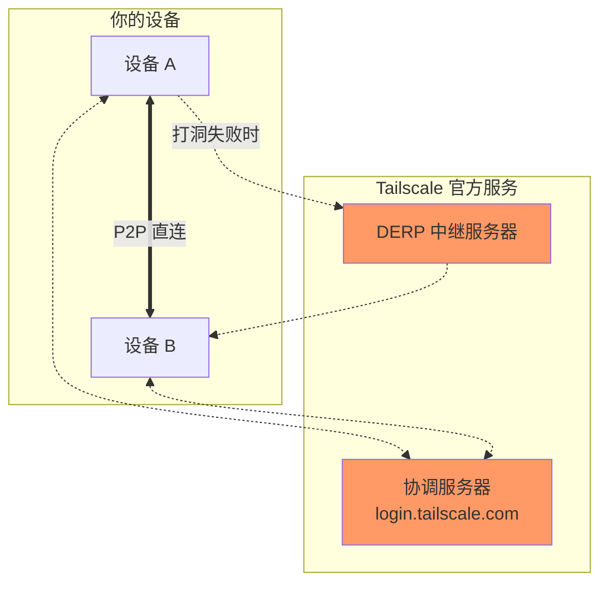
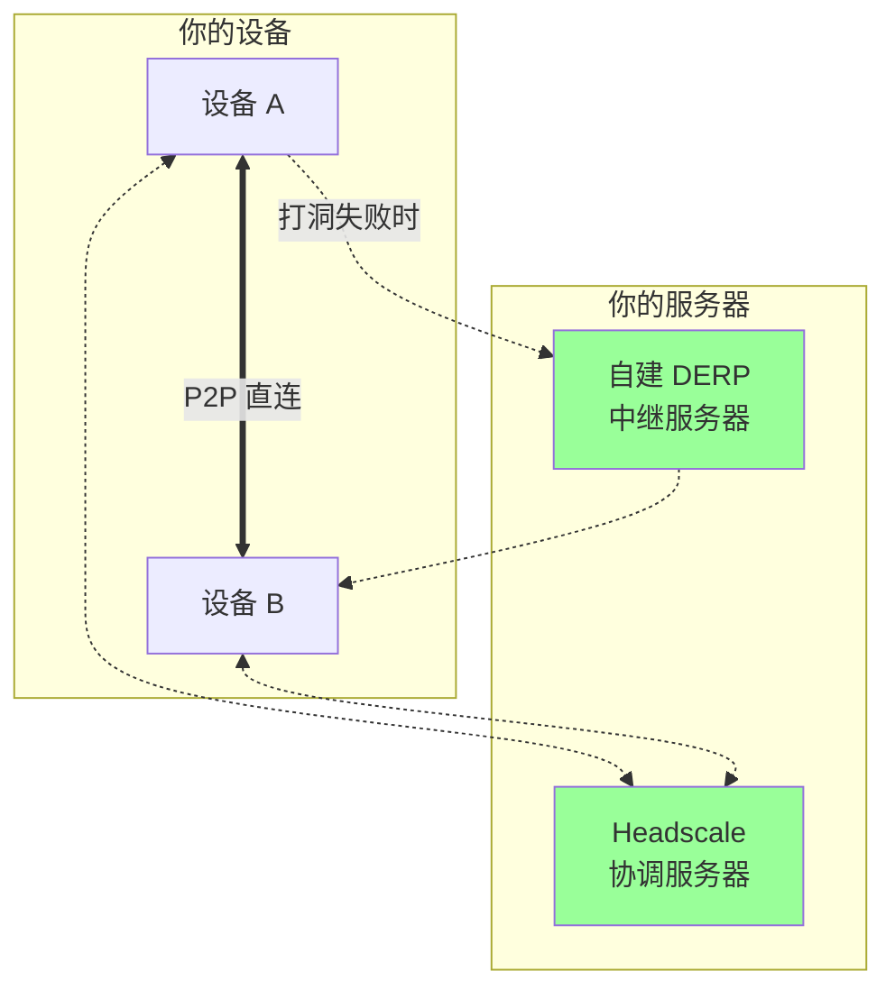

上一篇介绍了 Tailscale 的使用。如果你想**完全自主控制**协调服务器，或者解决国内使用的延迟问题，可以自建 **Headscale**——Tailscale 协调服务器的开源实现。

## 为什么选择 Headscale

### Tailscale 的架构



**问题**：
1. 协调服务器在国外，登录和同步状态慢
2. DERP 服务器在国外，中继时延迟高
3. 免费版有 100 设备限制
4. 数据（设备信息、网络状态）存储在 Tailscale

### Headscale 的优势



| 对比项   | Tailscale 官方   | Headscale 自建     |
| -------- | ---------------- | ------------------ |
| 设备数量 | 100 台           | **无限制**         |
| 数据存储 | Tailscale 服务器 | **你的服务器**     |
| 国内延迟 | 高               | **低（国内 VPS）** |
| 登录速度 | 慢               | **快**             |
| 自定义   | 有限             | **完全自定义**     |

## 准备工作

### 服务器要求

| 配置项 | 最低要求      | 推荐配置     |
| ------ | ------------- | ------------ |
| CPU    | 1核           | 2核          |
| 内存   | 512MB         | 1GB          |
| 系统   | Ubuntu 20.04+ | Ubuntu 22.04 |
| 域名   | 生产环境推荐  | 必须         |

> **重要**：
> - **生产环境强烈建议**使用域名 + HTTPS（特别是启用 DERP 服务器时必须使用 HTTPS）
> - 仅测试环境可使用 IP + HTTP，但功能和性能受限
> - 国内服务器使用域名需要备案，或考虑使用境外服务器 + 免费域名（如 DuckDNS）

### 需要开放的端口

| 端口  | 协议 | 用途                   |
| ----- | ---- | ---------------------- |
| 443   | TCP  | HTTPS（Headscale API） |
| 3478  | UDP  | STUN（NAT 打洞）       |
| 50443 | TCP  | DERP（可选，内置中继） |

## 部署 Headscale

### 方式一：Docker Compose（推荐）

#### 步骤 1：安装 Docker

```bash
curl -fsSL https://get.docker.com | sh
sudo systemctl enable docker
```

#### 步骤 2：创建目录和配置

```bash
# 创建目录
sudo mkdir -p /opt/headscale/config
sudo mkdir -p /opt/headscale/data
cd /opt/headscale

# 下载示例配置文件
sudo wget -O config/config.yaml \
  https://raw.githubusercontent.com/juanfont/headscale/main/config-example.yaml
```

#### 步骤 3：修改配置文件

编辑 `/opt/headscale/config/config.yaml`：

```yaml
# 服务器 URL（必须是 HTTPS）
server_url: https://hs.你的域名.com

# 监听地址
listen_addr: 0.0.0.0:8080
metrics_listen_addr: 0.0.0.0:9090

# 数据库（SQLite）
database:
  type: sqlite
  sqlite:
    path: /var/lib/headscale/db.sqlite

# 关闭 MagicDNS（如果不需要）
dns:
  magic_dns: false
  base_domain: example.com
  nameservers:
    global:
      - 223.5.5.5
      - 8.8.8.8

# DERP 配置（使用内置 DERP）
derp:
  server:
    enabled: true
    region_id: 900
    region_code: "cn"
    region_name: "China"
    stun_listen_addr: 0.0.0.0:3478

# IP 地址池
prefixes:
  v4: 100.64.0.0/10
  v6: fd7a:115c:a1e0::/48

# 随机化客户端端口（提高打洞成功率）
randomize_client_port: true
```

#### 步骤 4：创建 Docker Compose 文件

```bash
sudo cat > docker-compose.yml << 'EOF'
version: '3'

services:
  headscale:
    image: headscale/headscale:latest
    container_name: headscale
    restart: unless-stopped
    ports:
      - "8080:8080"      # HTTP API
      - "9090:9090"      # Metrics
      - "3478:3478/udp"  # STUN
    volumes:
      - ./config:/etc/headscale
      - ./data:/var/lib/headscale
    command: serve
EOF
```

#### 步骤 5：启动服务

```bash
sudo docker compose up -d

# 查看日志
sudo docker compose logs -f
```

## 配置 HTTPS 反向代理

Headscale 需要 HTTPS，推荐使用 Nginx + Let's Encrypt。

### 安装 Nginx 和 Certbot

```bash
sudo apt install nginx certbot python3-certbot-nginx -y
```

### 配置 Nginx

```bash
sudo cat > /etc/nginx/sites-available/headscale << 'EOF'
server {
    listen 80;
    server_name hs.你的域名.com;

    location / {
        proxy_pass http://127.0.0.1:8080;
        proxy_http_version 1.1;
        proxy_set_header Upgrade $http_upgrade;
        proxy_set_header Connection "upgrade";
        proxy_set_header Host $host;
        proxy_set_header X-Real-IP $remote_addr;
        proxy_set_header X-Forwarded-For $proxy_add_x_forwarded_for;
        proxy_set_header X-Forwarded-Proto $scheme;
        proxy_buffering off;
        proxy_read_timeout 86400s;
        proxy_send_timeout 86400s;
    }
}
EOF

sudo ln -s /etc/nginx/sites-available/headscale /etc/nginx/sites-enabled/
sudo nginx -t
sudo systemctl reload nginx
```

### 获取 SSL 证书

```bash
sudo certbot --nginx -d hs.你的域名.com
```

## 创建用户和管理

### 创建用户（namespace）

Headscale 使用「用户」来组织设备：

```bash
# 进入容器执行命令
sudo docker exec headscale headscale users create myuser

# 或创建别名简化命令
alias headscale='sudo docker exec headscale headscale'
headscale users create myuser
```

### 生成注册密钥

客户端需要使用注册密钥（Pre-Auth Key）来加入网络：

```bash
# 创建密钥（有效期 24 小时，可重复使用）
headscale preauthkeys create --user myuser --reusable --expiration 24h
```

输出类似：
```
hs-preauthkey:abcd1234efgh5678...
```

**保存这个密钥**，客户端配置需要用到。

### 查看已注册设备

```bash
headscale nodes list
```

## 配置客户端

### Windows / macOS

1. 安装官方 Tailscale 客户端
2. **不要登录**官方账号
3. 使用命令行连接到自建服务器：

**Windows**（以管理员身份运行 PowerShell）：

```powershell
tailscale login --login-server https://hs.你的域名.com --authkey hs-preauthkey:abcd1234...
```

**macOS**：

```bash
tailscale login --login-server https://hs.你的域名.com --authkey hs-preauthkey:abcd1234...
```

### Linux

```bash
sudo tailscale up --login-server https://hs.你的域名.com --authkey hs-preauthkey:abcd1234...
```

### iOS

1. 安装 Tailscale 客户端
2. **反复快速点击**右上角的「三个点」菜单（约 5-7 次）
3. 出现 **Change server** 选项
4. 选择 **Add Account...**
5. 输入 Headscale 服务器地址
6. 使用预认证密钥登录

### Android

1. 安装 Tailscale 客户端（1.30.0 以上版本）
2. 类似 iOS，反复点击打开隐藏菜单
3. 选择 **Change server**
4. 输入自建服务器地址

### 验证连接

```bash
# 查看 Tailscale 状态
tailscale status

# 查看分配的 IP
tailscale ip

# 测试连通性
ping 100.64.0.x
```

## 自建 DERP 中继

当 P2P 打洞失败时，流量需要通过 DERP 服务器中继。Headscale 内置了 DERP 功能，但你也可以单独部署。

### 使用内置 DERP

在 `config.yaml` 中已启用：

```yaml
derp:
  server:
    enabled: true
    region_id: 900
    region_code: "cn"
    region_name: "China"
    stun_listen_addr: 0.0.0.0:3478
```

### 独立部署 DERP

如果需要更好的性能或多个 DERP 节点：

```bash
# 拉取镜像
docker pull ghcr.io/yangchuansheng/derper

# 运行
docker run -d \
  --name derper \
  -p 443:443 \
  -p 3478:3478/udp \
  -e DERP_DOMAIN=derp.你的域名.com \
  -e DERP_CERT_MODE=letsencrypt \
  -e DERP_VERIFY_CLIENTS=false \
  ghcr.io/yangchuansheng/derper
```

然后在 Headscale 配置中添加自定义 DERP：

```yaml
derp:
  urls: []  # 不使用官方 DERP
  paths:
    - /etc/headscale/derp.yaml
```

创建 `derp.yaml`：

```yaml
regions:
  900:
    regionid: 900
    regioncode: cn
    regionname: China
    nodes:
      - name: cn-derp
        regionid: 900
        hostname: derp.你的域名.com
        stunport: 3478
        stunonly: false
        derpport: 443
```

## 管理命令速查

```bash
# 用户管理
headscale users list
headscale users create <username>
headscale users delete <username>

# 预认证密钥
headscale preauthkeys list --user <username>
headscale preauthkeys create --user <username> --reusable --expiration 24h

# 设备管理
headscale nodes list
headscale nodes delete -i <node_id>
headscale nodes rename -i <node_id> <new_name>

# 路由管理
headscale routes list
headscale routes enable -r <route_id>
```

## 常见问题

### Q: 客户端连接失败？

1. **检查 HTTPS 配置**：确保证书有效，可以用浏览器访问 `https://hs.你的域名.com`
2. **检查防火墙**：确保 443、3478 端口开放
3. **检查密钥**：确保使用正确的预认证密钥

### Q: 设备之间无法连通？

1. **检查设备是否在同一用户下**：不同用户默认隔离
2. **等待几秒钟**：首次连接需要交换密钥
3. **检查路由**：子网路由需要手动批准

### Q: 如何更新 Headscale？

```bash
cd /opt/headscale
sudo docker compose pull
sudo docker compose up -d
```

## 小结

本文介绍了 Headscale 的部署和配置：

- **为什么自建**：无设备限制、数据自主、国内低延迟
- **部署服务**：Docker Compose + Nginx 反向代理
- **配置客户端**：使用 `--login-server` 参数连接自建服务器
- **DERP 中继**：解决 P2P 打洞失败的情况

自建 Headscale 后，你就拥有了一个**完全私有**的虚拟组网服务，结合 Windows RDP 或其他服务，可以实现低延迟的远程访问。

---

## 系列文章导航

1. [远程控制入门]() - 概念和方案选择
2. [商业工具对比]() - ToDesk/向日葵/RustDesk 实测
3. [RustDesk 自建]() - 10分钟拥有私有远程桌面
4. [Tailscale 入门]() - 把所有设备连成局域网
5. **Headscale 自建**（本文）- 完全自主的 Tailscale
6. [FRP 内网穿透]() - 传统但可靠的方案
7. [安全最佳实践]() - 保护你的远程连接
