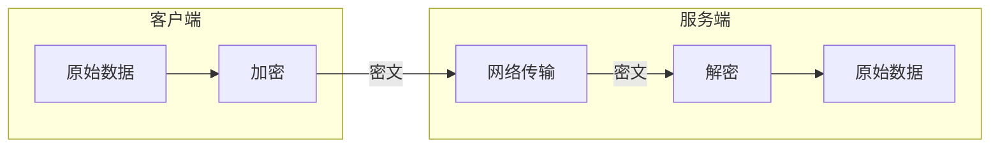

远程控制虽然方便，但也带来安全风险。本篇介绍远程控制场景下的安全最佳实践，帮你保护设备和数据安全。

## 常见安全风险

### 风险 1：弱密码

**场景**：使用简单密码（如 `123456`、`admin`）或默认密码。

**后果**：
- 暴力破解攻击
- 字典攻击
- 设备被入侵，沦为肉鸡


### 风险 2：端口暴露

**场景**：将敏感端口（如 RDP 3389、SSH 22）直接暴露到公网。

**后果**：
- 被扫描器发现
- 遭受持续攻击
- 零日漏洞利用

### 风险 3：中间人攻击

**场景**：使用未加密的连接。

**后果**：
- 流量被窃听
- 密码被截获
- 会话被劫持

### 风险 4：软件漏洞

**场景**：使用旧版本软件，未修复已知漏洞。

**后果**：
- 被远程代码执行
- 权限提升攻击

## 认证加固

### 使用强密码

**强密码标准**：
- 至少 12 位
- 包含大小写字母、数字、特殊字符
- 不使用个人信息（生日、姓名等）
- 不使用常见词汇

**生成强密码**：

```bash
# Linux/macOS
openssl rand -base64 16

# 输出示例: K3mP9xNvQwR5yZ2h
```

**密码管理**：使用密码管理器（如 Bitwarden、1Password）存储和生成密码。

### 启用双因素认证（2FA）

2FA 在密码之外增加第二层验证，即使密码泄露，攻击者也无法登录。

#### ToDesk 启用 2FA

1. 打开 ToDesk → 设置 → 安全设置
2. 启用「二次验证」
3. 使用手机扫码绑定

#### 向日葵启用 2FA

1. 登录向日葵账号
2. 进入安全设置
3. 开启「登录验证」

#### Windows RDP 启用 2FA

Windows 原生不支持 2FA，可以使用第三方方案：

**方案一：Duo Security**
- 免费版支持 10 用户
- 安装 Duo Authentication for Windows Logon

**方案二：通过 Tailscale**
- Tailscale 本身支持 SSO/2FA
- 先登录 Tailscale，再连接 RDP

### 使用密钥认证（SSH）

对于 SSH 连接，密钥认证比密码更安全：

```bash
# 生成密钥对
ssh-keygen -t ed25519 -C "your_email@example.com"

# 将公钥复制到服务器
ssh-copy-id user@server

# 禁用密码登录（编辑 /etc/ssh/sshd_config）
PasswordAuthentication no
```

## 网络层防护

### IP 白名单

只允许特定 IP 访问敏感服务。

**UFW 配置**：

```bash
# 只允许特定 IP 访问 SSH
sudo ufw allow from 1.2.3.4 to any port 22

# 拒绝其他 IP
sudo ufw deny 22
```

**FRP 配置**：

```toml
# frpc.toml - 添加 IP 白名单插件
[[proxies]]
name = "ssh"
type = "tcp"
localIP = "127.0.0.1"
localPort = 22
remotePort = 6002
[proxies.plugin]
type = "ip_whitelist"
allowIPs = ["1.2.3.4", "5.6.7.8"]
```

### 更改默认端口

将默认端口改为非标准端口，可以避开大部分扫描器。

**Windows RDP**：

1. 打开注册表编辑器
2. 导航到 `HKEY_LOCAL_MACHINE\System\CurrentControlSet\Control\Terminal Server\WinStations\RDP-Tcp`
3. 修改 `PortNumber` 值
4. 重启远程桌面服务

**SSH**：

```bash
# 编辑 /etc/ssh/sshd_config
Port 22222  # 改为非标准端口

sudo systemctl restart sshd
```

> 注意：更改端口后，防火墙规则也需要相应调整。

### 端口敲门（Port Knocking）

端口敲门是一种隐藏端口的技术：只有按特定顺序「敲」一系列端口后，真正的服务端口才会打开。

**安装 knockd**：

```bash
sudo apt install knockd
```

**配置 /etc/knockd.conf**：

```ini
[options]
    UseSyslog

[openSSH]
    sequence    = 7000,8000,9000
    seq_timeout = 5
    command     = /sbin/iptables -A INPUT -s %IP% -p tcp --dport 22 -j ACCEPT
    tcpflags    = syn

[closeSSH]
    sequence    = 9000,8000,7000
    seq_timeout = 5
    command     = /sbin/iptables -D INPUT -s %IP% -p tcp --dport 22 -j ACCEPT
    tcpflags    = syn
```

**使用**：

```bash
# 敲门打开端口
knock server_ip 7000 8000 9000

# 连接 SSH
ssh user@server_ip

# 敲门关闭端口
knock server_ip 9000 8000 7000
```

### Fail2Ban 防暴力破解

Fail2Ban 会监控登录失败，自动封禁恶意 IP。

**安装**：

```bash
sudo apt install fail2ban
```

**配置 SSH 防护**：

```bash
sudo cat > /etc/fail2ban/jail.local << 'EOF'
[sshd]
enabled = true
port = ssh
filter = sshd
logpath = /var/log/auth.log
maxretry = 3
bantime = 3600
findtime = 600

[rdp]
enabled = true
port = 3389
filter = rdp
logpath = /var/log/auth.log
maxretry = 3
bantime = 3600
EOF

sudo systemctl restart fail2ban
```

**查看封禁状态**：

```bash
sudo fail2ban-client status sshd
```

## 加密通信

### 强制 TLS/SSL

确保所有远程连接都使用加密。

**RustDesk**：

```yaml
# docker-compose.yml
environment:
  - ENCRYPTED_ONLY=1  # 强制加密
```

**FRP**：

```toml
# frps.toml
transport.tls.force = true
```

### 端到端加密原理



端到端加密意味着数据在传输过程中始终保持加密状态，即使中间服务器被攻破，也无法获取原始数据。

**支持端到端加密的方案**：
- RustDesk（自建服务器）
- Tailscale/WireGuard
- ToDesk

### WireGuard 加密

Tailscale 使用的 WireGuard 协议采用现代加密算法：

| 功能 | 算法 |
|------|------|
| 密钥交换 | Curve25519 |
| 数据加密 | ChaCha20 |
| 消息认证 | Poly1305 |
| 哈希 | BLAKE2s |

这些算法都是目前公认的安全算法。

## 监控和审计

### 启用日志记录

**RustDesk 服务器日志**：

```bash
# 查看日志
sudo docker compose logs -f
```

**SSH 登录日志**：

```bash
# 查看最近登录记录
last

# 查看失败的登录尝试
sudo grep "Failed" /var/log/auth.log
```

**Windows RDP 日志**：

1. 打开「事件查看器」
2. 导航到「应用程序和服务日志」→「Microsoft」→「Windows」→「TerminalServices-LocalSessionManager」
3. 查看「Operational」日志

### 设置异常告警

使用简单脚本监控异常登录并发送通知：

```bash
#!/bin/bash
# /opt/scripts/login_alert.sh

# 检查最近 10 分钟的登录失败
FAILED=$(grep "Failed password" /var/log/auth.log | grep "$(date +'%b %d %H')" | wc -l)

if [ $FAILED -gt 5 ]; then
    # 发送告警（这里用 Telegram Bot 示例）
    curl -s -X POST "https://api.telegram.org/bot<TOKEN>/sendMessage" \
        -d chat_id="<CHAT_ID>" \
        -d text="警告: 检测到 $FAILED 次登录失败尝试"
fi
```

添加到 crontab：

```bash
# 每 10 分钟检查一次
*/10 * * * * /opt/scripts/login_alert.sh
```

### 定期安全检查

创建检查清单，定期执行：

**每周检查**：
- [ ] 查看登录日志，是否有异常 IP
- [ ] 检查 Fail2Ban 封禁列表
- [ ] 确认软件版本是最新

**每月检查**：
- [ ] 审查开放的端口
- [ ] 检查用户权限
- [ ] 更新密码（如有必要）

**每季度检查**：
- [ ] 全面安全审计
- [ ] 测试备份恢复
- [ ] 评估安全策略

## 安全检查清单

### 商业软件（ToDesk/向日葵）

- [ ] 启用双因素认证
- [ ] 使用强密码
- [ ] 定期更新软件
- [ ] 限制连接权限（如仅允许特定设备）
- [ ] 开启连接通知

### RustDesk 自建

- [ ] 使用 `ENCRYPTED_ONLY=1` 强制加密
- [ ] 设置强密钥
- [ ] 定期更新 Docker 镜像
- [ ] 配置防火墙，只开放必要端口
- [ ] 备份服务器密钥

### Tailscale/Headscale

- [ ] 启用 Tailscale 的 2FA/SSO
- [ ] 配置 ACL 访问控制
- [ ] 定期审查设备列表
- [ ] 移除不再使用的设备
- [ ] 使用 HTTPS（Headscale）

### FRP

- [ ] 使用强 Token
- [ ] 启用 TLS 加密
- [ ] 配置端口白名单
- [ ] 启用 Dashboard 并设置强密码
- [ ] 定期查看连接日志

### Windows RDP

- [ ] 更改默认端口
- [ ] 使用网络级别身份验证（NLA）
- [ ] 限制可远程登录的用户
- [ ] 启用账户锁定策略
- [ ] 考虑使用 2FA 方案

## 小结

远程控制的安全可以从多个层面加强：

| 层面 | 措施 |
|------|------|
| 认证 | 强密码、2FA、密钥认证 |
| 网络 | IP 白名单、端口敲门、Fail2Ban |
| 传输 | TLS 加密、端到端加密 |
| 监控 | 日志记录、异常告警 |

**核心原则**：
1. **最小权限**：只开放必要的端口和权限
2. **纵深防御**：多层安全措施
3. **定期更新**：及时修复漏洞
4. **监控审计**：及时发现异常

---

## 系列文章总结

本系列从入门到进阶，覆盖了远程控制的主流方案：

| # | 文章 | 适合人群 |
|---|------|----------|
| 1 | [远程控制入门]() | 所有人 |
| 2 | [商业工具对比]() | 小白用户 |
| 3 | [RustDesk 自建]() | 注重隐私 |
| 4 | [Tailscale 入门]() | 多设备互联 |
| 5 | [Headscale 自建]() | 高级用户 |
| 6 | [FRP 内网穿透]() | 灵活需求 |
| 7 | **安全最佳实践**（本文） | 所有人 |

希望这个系列能帮助你找到适合的远程控制方案，安全、便捷地访问你的设备。
